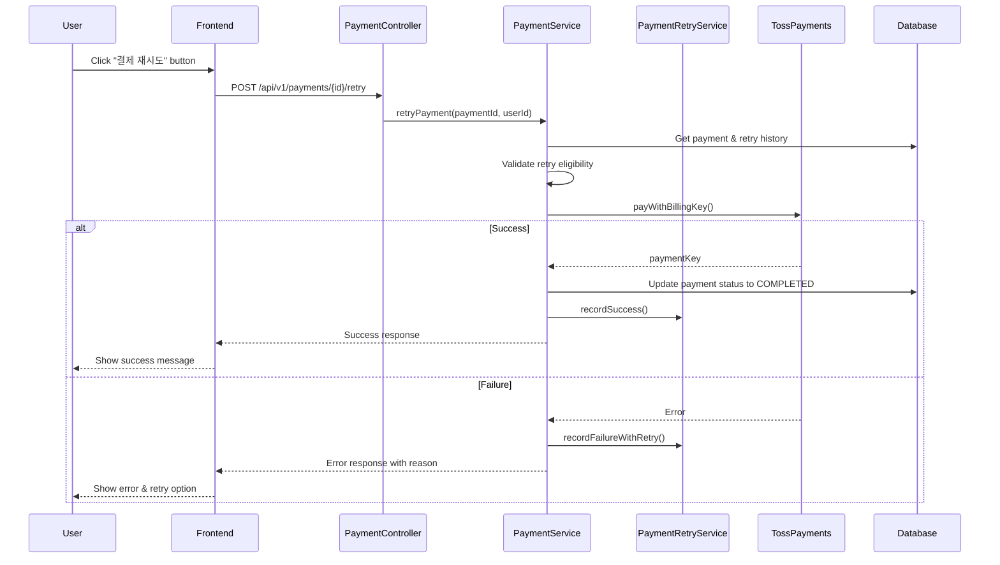

# Design Document: Payment Retry and Party Date Auto-Calculation

## Overview

이 설계 문서는 MOA 플랫폼의 두 가지 핵심 기능을 다룹니다:
1. **결제 재시도 기능**: 파티장/파티원이 실패한 결제를 수동으로 재시도할 수 있는 기능
2. **파티 기간 자동 계산**: 개월 수 선택 시 시작일/종료일 자동 계산

### 현재 상태 분석
- 백엔드: `PaymentRetryHistory` 테이블과 `PaymentRetryService`가 존재하지만 수동 재시도 API 없음
- 프론트엔드: 결제 상세 모달에 재시도 정보 표시는 있으나 재시도 버튼 없음
- 파티 생성: 개월 수 선택 UI는 구현되어 있으나 날짜 계산 로직 개선 필요

## Architecture



## Components and Interfaces

### Backend Components

#### 1. PaymentRestController (수정)
```java
// 새로운 엔드포인트 추가
@PostMapping("/{paymentId}/retry")
public ApiResponse<PaymentDetailResponse> retryPayment(@PathVariable Integer paymentId);

@PostMapping("/deposit/{partyId}/retry")
public ApiResponse<PartyResponse> retryDepositPayment(
    @PathVariable Integer partyId,
    @RequestBody PaymentRequest request);
```

#### 2. PaymentService (수정)
```java
// 새로운 메서드 추가
PaymentDetailResponse retryFailedPayment(Integer paymentId, String userId);
boolean canRetryPayment(Integer paymentId);
int getRetryAttemptCount(Integer paymentId);
```

#### 3. PartyService (수정)
```java
// 보증금 재결제 메서드 추가
Party retryLeaderDeposit(Integer partyId, String userId, PaymentRequest request);
```

### Frontend Components

#### 1. PaymentDetailModal.jsx (수정)
- 결제 실패 시 "결제 재시도" 버튼 추가
- 재시도 횟수 4회 초과 시 고객센터 안내 표시

#### 2. PartyDetailPage.jsx (수정)
- PENDING_PAYMENT 상태에서 파티장에게 "보증금 재결제" 버튼 표시

#### 3. PartyCreatePage.jsx (수정)
- 날짜 계산 로직은 이미 구현됨 - 검증 및 개선만 필요

#### 4. paymentApi.js (수정)
```javascript
// 새로운 API 함수 추가
export const retryPayment = async (paymentId) => { ... };
export const retryDepositPayment = async (partyId, paymentData) => { ... };
```

## Data Models

### PaymentRetryHistory (기존)
```sql
CREATE TABLE PAYMENT_RETRY_HISTORY (
    RETRY_ID INT PRIMARY KEY AUTO_INCREMENT,
    PAYMENT_ID INT NOT NULL,
    PARTY_ID INT NOT NULL,
    PARTY_MEMBER_ID INT NOT NULL,
    ATTEMPT_NUMBER INT NOT NULL,
    ATTEMPT_DATE DATETIME NOT NULL,
    RETRY_REASON VARCHAR(500),
    RETRY_STATUS VARCHAR(20) NOT NULL, -- SUCCESS, FAILED
    NEXT_RETRY_DATE DATETIME,
    ERROR_CODE VARCHAR(50),
    ERROR_MESSAGE VARCHAR(500),
    CREATED_AT DATETIME DEFAULT CURRENT_TIMESTAMP
);
```

### PaymentDetailResponse (수정)
```java
// 기존 필드에 추가
private boolean canRetry;        // 재시도 가능 여부
private int maxRetryAttempts;    // 최대 재시도 횟수 (4)
```

## Correctness Properties

*A property is a characteristic or behavior that should hold true across all valid executions of a system-essentially, a formal statement about what the system should do. 
Properties serve as the bridge between human-readable specifications and machine-verifiable correctness guarantees.*

### Property 1: Retry Button Visibility
*For any* payment with status FAILED and attemptNumber < 4, the UI SHALL display a retry button.
*For any* party with status PENDING_PAYMENT, the party leader SHALL see a deposit retry button.
**Validates: Requirements 1.1, 2.1**

### Property 2: Successful Retry State Transition
*For any* failed payment that succeeds on retry, the payment status SHALL transition to COMPLETED and a SUCCESS record SHALL be created in retry history.
*For any* party deposit retry that succeeds, the party status SHALL transition from PENDING_PAYMENT to RECRUITING.
**Validates: Requirements 1.3, 2.3**

### Property 3: Failed Retry Handling
*For any* retry attempt that fails, the attempt count SHALL increment by 1 and the failure reason SHALL be recorded in retry history.
**Validates: Requirements 1.4, 2.4**

### Property 4: Max Retry Limit Enforcement
*For any* payment with attemptNumber >= 4, manual retry SHALL be disabled and a customer support message SHALL be displayed.
**Validates: Requirements 2.5**

### Property 5: Date Calculation Correctness
*For any* user-selected start date and subscription period of N months (1-12), the calculated end date SHALL equal startDate + N months - 1 day.
**Validates: Requirements 3.1, 3.3**

### Property 6: Date Format Consistency
*For any* calculated date, the displayed format SHALL match the pattern YYYY-MM-DD.
**Validates: Requirements 3.4**

### Property 7: Period Range Enforcement
*For any* party creation, the selectable subscription period SHALL be between 1 and 12 months inclusive.
**Validates: Requirements 3.5**

### Property 8: Button State Based on Selection
*For any* state where start date OR subscription period is not selected, the "다음" button SHALL be disabled.
**Validates: Requirements 3.6**

### Property 9: Retry History Display Completeness
*For any* payment with retry history, the UI SHALL display: attempt number, next retry date (if applicable), and failure reason.
*For any* payment without retry history, the retry information section SHALL NOT be displayed.
**Validates: Requirements 4.1, 4.2, 4.3, 4.4**

### Property 10: Payment Timeout Cancellation
*For any* party in PENDING_PAYMENT status where createdAt + 30 minutes < currentTime, the party status SHALL be updated to CANCELLED.
**Validates: Requirements 5.1, 5.2**

### Property 11: Timeout Check Scheduling
*For any* scheduled timeout check execution, all parties matching the timeout criteria SHALL be processed.
**Validates: Requirements 5.3, 5.5**

## Error Handling

### Backend Error Codes
| Code | Message | Description |
|------|---------|-------------|
| PAY404 | 결제 정보를 찾을 수 없습니다 | Payment not found |
| PAY409 | 이미 완료된 결제입니다 | Payment already completed |
| PAY501 | 결제 재시도에 실패했습니다 | Retry payment failed |
| PAY502 | 최대 재시도 횟수를 초과했습니다 | Max retry attempts exceeded |
| PAY503 | 재시도 정보를 찾을 수 없습니다 | Retry info not found |

### Frontend Error Handling
- API 호출 실패 시 toast 메시지로 에러 표시
- 네트워크 오류 시 재시도 안내
- 최대 재시도 초과 시 고객센터 연락처 표시

## Testing Strategy

### Unit Tests
- PaymentService.retryFailedPayment() 성공/실패 케이스
- PaymentService.canRetryPayment() 조건 검증
- Date calculation utility functions

### Property-Based Tests
Property-based testing library: **fast-check** (JavaScript/TypeScript)

각 property test는 최소 100회 반복 실행하여 다양한 입력에 대한 정확성을 검증합니다.

#### Test 1: Date Calculation Property
```javascript
// **Feature: payment-retry-and-party-date, Property 5: Date Calculation Correctness**
fc.assert(
  fc.property(
    fc.integer({ min: 1, max: 24 }), // months
    fc.date({ min: new Date(), max: new Date(2030, 11, 31) }), // today
    (months, today) => {
      const { startDate, endDate } = calculateDates(months, today);
      const expectedStart = addDays(today, 1);
      const expectedEnd = subDays(addMonths(expectedStart, months), 1);
      return isEqual(startDate, expectedStart) && isEqual(endDate, expectedEnd);
    }
  ),
  { numRuns: 100 }
);
```

#### Test 2: Retry Eligibility Property
```javascript
// **Feature: payment-retry-and-party-date, Property 4: Max Retry Limit Enforcement**
fc.assert(
  fc.property(
    fc.integer({ min: 0, max: 10 }), // attemptNumber
    (attemptNumber) => {
      const canRetry = attemptNumber < 4;
      return canRetryPayment({ attemptNumber }) === canRetry;
    }
  ),
  { numRuns: 100 }
);
```

### Integration Tests
- 결제 재시도 API 전체 플로우 테스트
- 파티 상태 전이 테스트
