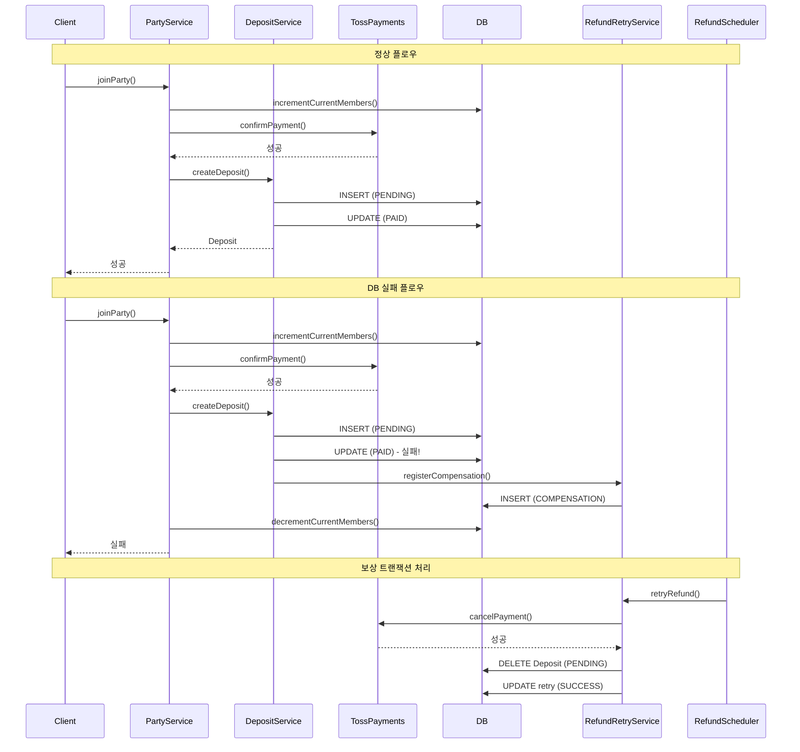

# Design Document

## Overview

MOA 플랫폼의 트랜잭션 관리 개선을 위한 설계 문서입니다. Toss Payments API와 DB 간의 데이터 일관성을 보장하기 위해 2단계 저장 패턴과 보상 트랜잭션 메커니즘을 도입합니다.

### 핵심 설계 원칙
1. **2단계 저장 패턴**: PENDING → PAID 상태 전환으로 외부 API 실패 시 복구 가능
2. **REQUIRES_NEW 트랜잭션**: 실패 이력이 부모 트랜잭션 롤백에 영향받지 않음
3. **기존 인프라 활용**: RefundRetryHistory, RefundScheduler 재사용
4. **최종 일관성**: 30시간 이내 자동 복구 보장 (재시도 4회: 1h, 4h, 24h)

## Architecture



## Components and Interfaces

### 1. RefundRetryService (확장)

```java
public interface RefundRetryService {
    // 기존 메서드
    List<RefundRetryHistory> findPendingRetries();
    void retryRefund(RefundRetryHistory retry);
    LocalDateTime calculateNextRetryDate(int attemptNumber);
    
    // 신규 메서드
    void recordFailure(Deposit deposit, Exception e, String reason);
    void registerCompensation(Integer depositId, String tossPaymentKey, 
                              Integer amount, String reason);
}
```

### 2. DepositService (수정)

```java
public interface DepositService {
    // 수정: 2단계 저장 패턴 적용
    Deposit createDeposit(Integer partyId, Integer partyMemberId, 
                          String userId, Integer amount, PaymentRequest request);
    
    // 수정: REQUIRES_NEW로 실패 이력 분리
    void refundDeposit(Integer depositId, String reason);
    
    // 수정: 환불 정책 간소화
    void processWithdrawalRefund(Integer depositId, Party party);
    
    // 삭제 예정
    // void partialRefundDeposit(Integer depositId, double rate, String reason);
}
```

### 3. DepositDao (확장)

```java
@Mapper
public interface DepositDao {
    // 기존 메서드...
    
    // 신규 메서드
    void deleteById(@Param("depositId") Integer depositId);
    void deleteStalePendingRecords(@Param("cutoffTime") LocalDateTime cutoffTime);
    List<Deposit> findStalePendingDeposits(@Param("cutoffTime") LocalDateTime cutoffTime);
}
```

### 4. PartyServiceImpl (수정)

```java
// joinParty() 메서드 수정
public PartyMemberResponse joinParty(Integer partyId, String userId, 
                                      PaymentRequest paymentRequest) {
    // 1. 정원 증가 (Toss 호출 전)
    int updatedRows = partyDao.incrementCurrentMembers(partyId);
    if (updatedRows == 0) {
        throw new BusinessException(ErrorCode.PARTY_FULL);
    }
    
    try {
        // 2. Toss 결제
        tossPaymentService.confirmPayment(...);
    } catch (Exception e) {
        // Toss 실패 → 정원 복구
        partyDao.decrementCurrentMembers(partyId);
        throw e;
    }
    
    try {
        // 3. DB 저장
        Deposit deposit = depositService.createDeposit(...);
        // ...
    } catch (Exception e) {
        // DB 실패 → 보상 트랜잭션 등록 + 정원 복구
        refundRetryService.registerCompensation(...);
        partyDao.decrementCurrentMembers(partyId);
        throw e;
    }
}

```

### 5. SettlementServiceImpl (수정)

```java
// createMonthlySettlement() 정산 기간 계산 수정
// 기존: targetMonth의 billingDay ~ 다음달 billingDay-1 (미래 포함 문제)
// 수정: 이전 완료된 billing cycle만 정산

// 예: 파티 시작일 15일, 현재 2월 1일, targetMonth = "2025-01"
// 기존: 1월 15일 ~ 2월 14일 (2월 14일은 미래)
// 수정: 12월 15일 ~ 1월 14일 (완료된 cycle)

int billingDay = partyStartDate.getDayOfMonth();
LocalDate today = LocalDate.now();

// 가장 최근 완료된 billing cycle 계산
LocalDate lastBillingDate;
if (today.getDayOfMonth() >= billingDay) {
    lastBillingDate = today.withDayOfMonth(billingDay);
} else {
    lastBillingDate = today.minusMonths(1).withDayOfMonth(billingDay);
}

LocalDateTime settlementEndDate = lastBillingDate.minusDays(1).atTime(23, 59, 59);
LocalDateTime settlementStartDate = lastBillingDate.minusMonths(1).atStartOfDay();
```

## Data Models

### RefundRetryHistory (확장)

```sql
ALTER TABLE REFUND_RETRY_HISTORY
ADD COLUMN retry_type VARCHAR(20) DEFAULT 'REFUND'
COMMENT 'REFUND: 환불 재시도, COMPENSATION: 보상 트랜잭션';

-- 인덱스 추가
CREATE INDEX idx_retry_type_status 
ON REFUND_RETRY_HISTORY(retry_type, retry_status, next_retry_date);
```

```java
@Getter @Setter @Builder
public class RefundRetryHistory {
    private Integer retryId;
    private Integer depositId;
    private Integer attemptNumber;
    private LocalDateTime attemptDate;
    private String retryStatus;      // PENDING, FAILED, SUCCESS
    private LocalDateTime nextRetryDate;
    private String errorCode;
    private String errorMessage;
    private Integer refundAmount;
    private String refundReason;
    private String retryType;        // 신규: REFUND, COMPENSATION
    private LocalDateTime createdAt;
    private LocalDateTime updatedAt;
}
```

### DepositStatus (확장)

```java
public enum DepositStatus {
    PENDING("결제대기"),    // 신규
    PAID("결제완료"),
    REFUNDED("환불완료"),
    FORFEITED("몰수");
}
```

## Correctness Properties

*A property is a characteristic or behavior that should hold true across all valid executions of a system-essentially, a formal statement about what the system should do. Properties serve as the bridge between human-readable specifications and machine-verifiable correctness guarantees.*


### Property 1: 2단계 저장 패턴 - PENDING 상태 생성
*For any* 보증금 결제 요청, createDeposit 호출 시 Toss API 호출 전에 PENDING 상태의 Deposit 레코드가 DB에 저장되어야 한다
**Validates: Requirements 1.1**

### Property 2: 2단계 저장 패턴 - PAID 상태 전환
*For any* Toss 결제 승인 성공 후, Deposit 상태가 PENDING에서 PAID로 업데이트되어야 한다
**Validates: Requirements 1.2**

### Property 3: DB 실패 시 보상 트랜잭션 등록
*For any* Toss 성공 후 DB 업데이트 실패 시, COMPENSATION 타입의 RefundRetryHistory 레코드가 생성되어야 한다
**Validates: Requirements 1.3**

### Property 4: COMPENSATION 재시도 시 Toss 취소 호출
*For any* COMPENSATION 타입 재시도 실행 시, Toss cancelPayment API가 호출되어야 한다
**Validates: Requirements 1.4**

### Property 5: 환불 실패 이력 트랜잭션 독립성
*For any* 환불 실패 후 부모 트랜잭션이 롤백되더라도, RefundRetryHistory 레코드는 DB에 보존되어야 한다
**Validates: Requirements 2.1, 2.2**

### Property 6: 정원 증가 우선 실행
*For any* 파티 가입 요청, incrementCurrentMembers가 Toss confirmPayment보다 먼저 호출되어야 한다
**Validates: Requirements 3.1**

### Property 7: 만석 시 Toss 미호출
*For any* 이미 만석인 파티에 가입 시도 시, Toss API가 호출되지 않고 예외가 발생해야 한다
**Validates: Requirements 3.2**

### Property 8: Toss 실패 시 정원 복구
*For any* Toss 결제 실패 시, 이전에 증가시킨 정원이 다시 감소되어야 한다
**Validates: Requirements 3.3**

### Property 9: DB 실패 시 정원 복구 및 보상 등록
*For any* Toss 성공 후 DB 저장 실패 시, 보상 트랜잭션이 등록되고 정원이 감소되어야 한다
**Validates: Requirements 3.4**

### Property 10: 환불 정책 - 날짜 기반 분기
*For any* 파티 탈퇴 시, 파티 시작일 기준 2일 전까지는 전액 환불, 1일 전부터는 전액 몰수되어야 한다
**Validates: Requirements 4.1, 4.2**

### Property 11: retryType 분기 처리
*For any* RefundRetryHistory 재시도 시, retryType이 COMPENSATION이면 Toss 취소 후 Deposit 삭제, REFUND이면 기존 환불 로직을 수행해야 한다
**Validates: Requirements 5.2, 5.3, 5.4**

### Property 12: PENDING 상태 정리
*For any* 24시간 이상 PENDING 상태인 Deposit, 정리 스케줄러가 해당 레코드를 삭제해야 한다
**Validates: Requirements 6.2**

### Property 13: 4회 실패 시 관리자 알림
*For any* 보상 트랜잭션이 4회 재시도 후에도 실패하면, depositId, 금액, 실패 사유를 포함한 관리자 알림이 발송되어야 한다
**Validates: Requirements 8.1, 8.2**

### Property 14: 정산 기간 정확성
*For any* 정산 실행 시, 정산 기간의 종료일은 현재 날짜 이전이어야 하며, 완료된 billing cycle만 포함해야 한다
**Validates: Requirements 9.1, 9.2, 9.3**

## Error Handling

### 1. Toss API 실패
- **처리**: 예외 발생 → 트랜잭션 롤백 → 정원 복구 (가입 시)
- **재시도**: 사용자가 수동으로 재시도

### 2. DB 저장 실패 (Toss 성공 후)
- **처리**: COMPENSATION 타입 RefundRetryHistory 등록
- **재시도**: RefundScheduler가 1시간 후 자동 재시도 (최대 4회)
- **최종 실패**: 관리자 알림 발송

### 3. 환불 실패
- **처리**: REQUIRES_NEW로 RefundRetryHistory 저장 (롤백 방지)
- **재시도**: RefundScheduler가 자동 재시도 (1h, 4h, 24h)
- **최종 실패**: 관리자 알림 발송

### 4. 정원 초과 (동시성)
- **처리**: Toss 호출 전 정원 증가로 사전 차단
- **복구**: 실패 시 자동 정원 감소

## Testing Strategy

### 단위 테스트
- RefundRetryService.recordFailure() - REQUIRES_NEW 트랜잭션 확인
- RefundRetryService.registerCompensation() - COMPENSATION 타입 저장 확인
- DepositService.createDeposit() - 2단계 저장 패턴 확인
- DepositService.processWithdrawalRefund() - 환불 정책 분기 확인

### Property-Based Testing (JUnit + jqwik)
- **라이브러리**: jqwik (Java Property-Based Testing)
- **최소 실행 횟수**: 100회
- **테스트 대상**:
  - Property 5: 트랜잭션 롤백 후 이력 보존
  - Property 10: 다양한 날짜 조합에서 환불 정책 검증
  - Property 11: retryType별 분기 처리 검증

### 통합 테스트
- Toss 성공 → DB 실패 → 보상 트랜잭션 등록 → 스케줄러 처리 → Toss 취소
- 파티 가입 동시성 테스트 (10명 동시 가입 → 정원 3명)

### 프론트엔드 테스트
- LeavePartyWarningModal 환불 정책 안내 텍스트 검증
