# 4beans-moa 파이널 프로젝트 보고서

> **OTT 구독 공유 서비스 플랫폼**
> 개발 기간: 2024.11 - 2024.12
> 작성일: 2024.12.15

---

## 📑 목차

1. [프로젝트 개요](#1-프로젝트-개요)
2. [기술 스택](#2-기술-스택)
3. [시스템 아키텍처](#3-시스템-아키텍처)
4. [핵심 기능 구현](#4-핵심-기능-구현)
   - 4.1 자동 결제 시스템
   - 4.2 정산 시스템
   - 4.3 보증금 시스템
   - 4.4 인증 시스템
   - 4.5 스케줄러 실행 타임라인
   - 4.6 로깅 및 모니터링 시스템
   - 4.7 프론트엔드 구현
     - 4.7.1 React 컴포넌트 아키텍처
     - 4.7.2 상태 관리 (Zustand)
     - 4.7.3 API 연동 및 인터셉터
     - 4.7.4 AI 기반 디자인 시스템 개발
5. [기술적 도전과 해결](#5-기술적-도전과-해결)
6. [성과 및 개선 사항](#6-성과-및-개선-사항)
7. [결론](#7-결론)

---

## 🎯 한눈에 보는 프로젝트

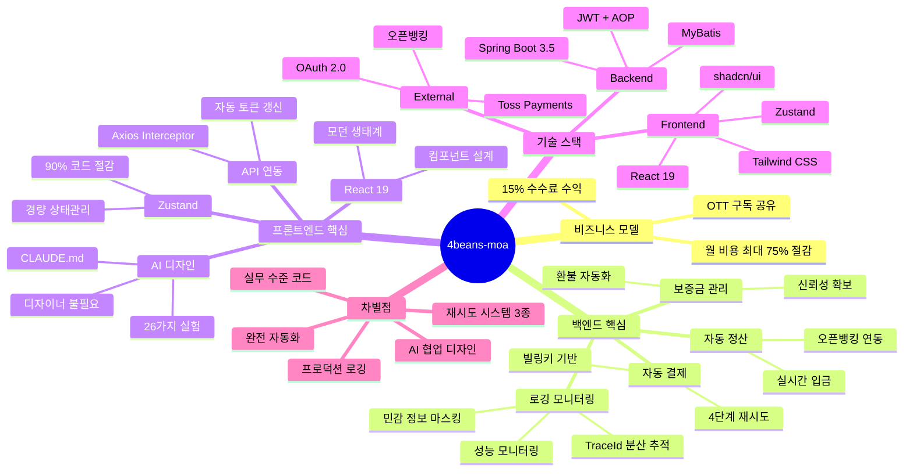
```mermaid
mindmap
  root((4beans-moa))
    비즈니스 모델
      OTT 구독 공유
      월 비용 최대 75% 절감
      15% 수수료 수익
    백엔드 핵심
      자동 결제
        빌링키 기반
        4단계 재시도
      자동 정산
        오픈뱅킹 연동
        실시간 입금
      보증금 관리
        신뢰성 확보
        환불 자동화
      로깅 모니터링
        TraceId 분산 추적
        민감 정보 마스킹
        성능 모니터링
    프론트엔드 핵심
      React 19
        컴포넌트 설계
        모던 생태계
      Zustand
        경량 상태관리
        90% 코드 절감
      AI 디자인
        26가지 실험
        CLAUDE.md
        디자이너 불필요
      API 연동
        Axios Interceptor
        자동 토큰 갱신
    기술 스택
      Frontend
        React 19
        Zustand
        Tailwind CSS
        shadcn/ui
      Backend
        Spring Boot 3.5
        MyBatis
        JWT + AOP
      External
        Toss Payments
        오픈뱅킹
        OAuth 2.0
    차별점
      완전 자동화
      재시도 시스템 3종
      프로덕션 로깅
      AI 협업 디자인
      실무 수준 코드
```

**핵심 성과:**

**백엔드:**
- ✅ **완전 자동화**: 결제/정산/환불 모두 스케줄러로 자동 처리
- ✅ **재시도 시스템**: 결제/정산/환불 실패 시 자동 재시도
- ✅ **실시간 금융**: 오픈뱅킹 API로 즉시 정산
- ✅ **견고한 설계**: 동시성 문제, 멱등성, 에러 분류 모두 해결
- ✅ **프로덕션 로깅**: TraceId 분산 추적 + 민감 정보 자동 마스킹

**프론트엔드:**
- ✅ **현대적 스택**: React 19 + Zustand + Vite (Redux 대비 90% 코드 절감)
- ✅ **AI 디자인 시스템**: Claude Code로 26가지 변형 실험, 디자이너 불필요
- ✅ **체계적 협업**: CLAUDE.md 가이드라인으로 팀 협업 및 AI 협업
- ✅ **자동 토큰 갱신**: Axios Interceptor로 끊김 없는 사용자 경험
- ✅ **일관된 디자인**: shadcn/ui + Tailwind로 프로덕션 수준 UI/UX

---

## 1. 프로젝트 개요

### 1.1 서비스 소개

**4beans-moa**는 여러 사용자가 Netflix, Disney+, Wavve 등의 OTT 서비스를 공유하여 월 비용을 절감할 수 있도록 돕는 구독 공유 플랫폼입니다.

**핵심 가치:**
- 💰 **비용 절감**: 개인 구독 대비 최대 75% 절감
- 🤝 **신뢰성**: 보증금 시스템으로 불성실 이용 방지
- ⚡ **자동화**: 결제부터 정산까지 완전 자동화
- 🔒 **보안**: 금융 거래 수준의 보안 처리

### 1.2 비즈니스 모델

```
[파티장] ──────────────────────┐
  │                            │
  ├─ OTT 계정 제공             │
  ├─ 정산 수익 획득            │
  │  (월회비 - 15% 수수료)     │
  └─────────────────────────┐  │
                            │  │
[파티원] ──────────────────┐ │  │
  │                        │ │  │
  ├─ 월회비 결제 (자동)    │ │  │
  ├─ 보증금 예치           │ │  │
  └─ OTT 계정 공유 이용   ─┼─┼──┤
                           │ │  │
[플랫폼] ─────────────────┘ │  │
  │                          │  │
  ├─ 결제 자동화             │  │
  ├─ 정산 자동화             │  │
  └─ 15% 수수료 수익 ────────┴──┘
```

### 1.3 팀 구성

- **Frontend**: React + Vite + Tailwind CSS
- **Backend**: Spring Boot + MyBatis
- **Database**: MySQL 8.0
- **Infra**: AWS (예정)

### 1.4 사용자 여정 (User Journey)

**일반인을 위한 설명:**
4beans-moa를 처음 사용하는 사람이 어떤 과정을 거치는지 한눈에 보여드립니다.

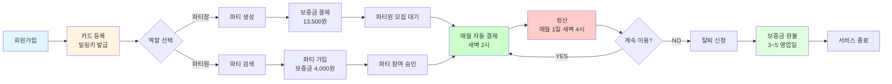
```mermaid
graph LR
    A[회원가입] --> B[카드 등록<br/>빌링키 발급]
    B --> C{역할 선택}

    C -->|파티장| D1[파티 생성]
    C -->|파티원| D2[파티 검색]

    D1 --> E1[보증금 결제<br/>13,500원]
    D2 --> E2[파티 가입<br/>보증금 4,000원]

    E1 --> F1[파티원 모집 대기]
    E2 --> F2[파티 참여 승인]

    F1 --> G[매월 자동 결제<br/>새벽 2시]
    F2 --> G

    G --> H[정산<br/>매월 1일 새벽 4시]

    H --> I{계속 이용?}

    I -->|YES| G
    I -->|NO| J[탈퇴 신청]

    J --> K[보증금 환불<br/>3~5 영업일]

    K --> L[서비스 종료]

    style A fill:#e1f5ff
    style B fill:#fff4e1
    style G fill:#ccffcc
    style H fill:#ffcccc
    style K fill:#e1ffe1
```

**단계별 설명:**

| 단계 | 역할 | 소요 시간 | 자동/수동 |
|------|------|----------|-----------|
| 1. 회원가입 | 공통 | 3분 | 수동 |
| 2. 카드 등록 | 공통 | 2분 | 수동 (최초 1회) |
| 3. 역할 선택 | 공통 | - | 수동 |
| 4-1. 파티 생성 | 파티장 | 5분 | 수동 |
| 4-2. 파티 가입 | 파티원 | 2분 | 수동 |
| 5. 보증금 결제 | 공통 | 즉시 | 자동 (토스 결제) |
| 6. **매월 자동 결제** | 파티원 | 즉시 | **✅ 완전 자동** |
| 7. **정산** | 파티장 | 즉시 | **✅ 완전 자동** |
| 8. 보증금 환불 | 공통 | 3~5일 | **✅ 자동 (탈퇴 시)** |

**핵심 포인트:**
- 🎯 **최초 설정만 5분**: 카드 등록 후 모든 게 자동
- 🤖 **사람이 할 일 없음**: 결제/정산/환불 모두 자동화
- 💰 **투명한 돈의 흐름**: 모든 거래 내역 실시간 확인 가능
- 🔒 **안전한 탈퇴**: 언제든 탈퇴 가능, 보증금 자동 환불

---

## 2. 기술 스택

### 2.1 Frontend

```javascript
{
  "core": {
    "React": "19.x",        // UI 라이브러리
    "Vite": "7.x",          // 빌드 도구
    "React Router": "7.x"   // SPA 라우팅
  },
  "state": {
    "Zustand": "5.x"        // 경량 상태 관리
  },
  "styling": {
    "Tailwind CSS": "4.x",  // 유틸리티 CSS
    "shadcn/ui": "latest",  // Radix 기반 컴포넌트
    "Framer Motion": "12.x" // 애니메이션
  },
  "http": {
    "Axios": "1.x"          // API 통신
  }
}
```

### 2.2 Backend

```yaml
Framework: Spring Boot 3.5.5
Language: Java 17
ORM: MyBatis 3.x
Security: Spring Security 6.x + JWT
Validation: Bean Validation
API Docs: SpringDoc (Swagger)
Payment: Toss Payments API
Banking: 오픈뱅킹 API
```

### 2.3 Database

**MySQL 8.0 설계 특징:**
- 외래키 제약조건 분리 (순환참조 방지)
- 재시도 이력 테이블 완비
- DATETIME 타입으로 정밀도 향상
- Virtual Column 활용 (BLACKLIST)

```sql
-- 예시: 중복 결제 방지
CONSTRAINT UQ_PAYMENT_MEMBER_MONTH
    UNIQUE (PARTY_MEMBER_ID, TARGET_MONTH)

-- 예시: 재시도 이력 추적
CREATE TABLE PAYMENT_RETRY_HISTORY (
    RETRY_ID INT PRIMARY KEY AUTO_INCREMENT,
    PAYMENT_ID INT NOT NULL,
    ATTEMPT_NUMBER INT NOT NULL,
    NEXT_RETRY_DATE DATETIME,
    ERROR_CODE VARCHAR(50),
    ...
)
```

### 2.4 기술 선택 이유

| 기술 | 선택 이유 |
|------|-----------|
| **MyBatis** | 복잡한 정산 쿼리에 유리, 동적 쿼리 작성 편리 |
| **Zustand** | Redux보다 간단, 보일러플레이트 최소화 |
| **Tailwind** | 빠른 UI 개발, 일관된 디자인 시스템 |
| **JWT** | Stateless 인증, 확장성 우수 |

---

## 3. 시스템 아키텍처

### 3.1 전체 아키텍처

```
┌─────────────────────────────────────────────────────────┐
│                     Client Layer                        │
│  ┌───────────────────────────────────────────────┐     │
│  │         React SPA (Vite)                      │     │
│  │  Zustand + Axios + React Router + Tailwind    │     │
│  └───────────────────────────────────────────────┘     │
└─────────────────────────────────────────────────────────┘
                        │ HTTPS / REST API
                        ▼
┌─────────────────────────────────────────────────────────┐
│                    Server Layer                         │
│  ┌───────────────────────────────────────────────┐     │
│  │       Spring Boot Application                 │     │
│  │  Controller → Service → MyBatis Mapper        │     │
│  │  JWT Auth + Scheduler + WebClient            │     │
│  └───────────────────────────────────────────────┘     │
└─────────────────────────────────────────────────────────┘
                        │
                        ▼
┌─────────────────────────────────────────────────────────┐
│                    Data Layer                           │
│  MySQL (RDS) + Redis (Cache) + S3 (Storage)            │
└─────────────────────────────────────────────────────────┘
                        │
                        ▼
┌─────────────────────────────────────────────────────────┐
│                 External Services                       │
│  Toss Payments + 오픈뱅킹 + Kakao/Google OAuth         │
└─────────────────────────────────────────────────────────┘
```

**일반인을 위한 상세 아키텍처 다이어그램:**

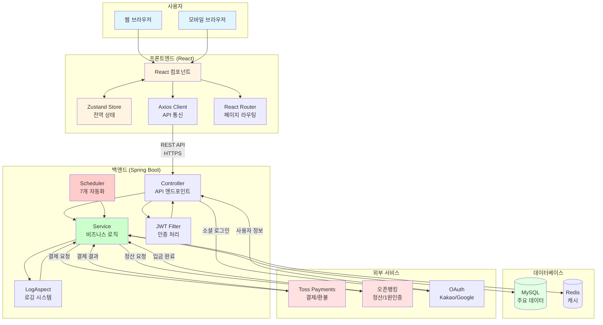
```mermaid
graph TB
    subgraph "사용자"
        U1[웹 브라우저]
        U2[모바일 브라우저]
    end

    subgraph "프론트엔드 (React)"
        F1[React 컴포넌트]
        F2[Zustand Store<br/>전역 상태]
        F3[Axios Client<br/>API 통신]
        F4[React Router<br/>페이지 라우팅]
    end

    subgraph "백엔드 (Spring Boot)"
        B1[Controller<br/>API 엔드포인트]
        B2[Service<br/>비즈니스 로직]
        B3[Scheduler<br/>7개 자동화]
        B4[LogAspect<br/>로깅 시스템]
        B5[JWT Filter<br/>인증 처리]
    end

    subgraph "데이터베이스"
        D1[(MySQL<br/>주요 데이터)]
        D2[(Redis<br/>캐시)]
    end

    subgraph "외부 서비스"
        E1[Toss Payments<br/>결제/환불]
        E2[오픈뱅킹<br/>정산/1원인증]
        E3[OAuth<br/>Kakao/Google]
    end

    U1 --> F1
    U2 --> F1
    F1 <--> F2
    F1 --> F3
    F1 --> F4
    F3 -->|REST API<br/>HTTPS| B1

    B1 --> B5
    B5 --> B1
    B1 --> B2
    B2 --> B4
    B4 --> B2
    B2 <--> D1
    B2 <--> D2
    B3 --> B2

    B2 -->|결제 요청| E1
    E1 -->|결제 결과| B2
    B2 -->|정산 요청| E2
    E2 -->|입금 완료| B2
    B1 -->|소셜 로그인| E3
    E3 -->|사용자 정보| B1

    style U1 fill:#e1f5ff
    style U2 fill:#e1f5ff
    style F1 fill:#fff4e1
    style F2 fill:#fff4e1
    style B2 fill:#ccffcc
    style B3 fill:#ffcccc
    style D1 fill:#e1ffe1
    style E1 fill:#ffe1e1
    style E2 fill:#ffe1e1
```

**각 계층의 역할:**

| 계층 | 주요 기술 | 역할 | 예시 |
|------|----------|------|------|
| **사용자** | 웹/모바일 브라우저 | 서비스 접근 | Chrome, Safari |
| **프론트엔드** | React 19 + Zustand | UI 렌더링, 상태 관리 | 파티 목록 표시, 결제 버튼 |
| **백엔드** | Spring Boot 3.5 | 비즈니스 로직, 자동화 | 자동 결제, 정산 계산 |
| **데이터베이스** | MySQL + Redis | 데이터 저장, 캐시 | 파티 정보, 결제 내역 |
| **외부 서비스** | Toss, 오픈뱅킹 | 결제, 정산 처리 | 카드 결제, 계좌 이체 |

**데이터 흐름 예시 (결제):**

```
1. 사용자: "파티 가입" 버튼 클릭
   ↓
2. React: 결제 요청 API 호출
   ↓
3. Spring Boot Controller: 요청 받음
   ↓
4. JWT Filter: 토큰 검증 (본인 확인)
   ↓
5. Service: 결제 로직 실행
   ↓
6. Toss Payments: 실제 카드 결제
   ↓
7. MySQL: 결제 내역 저장
   ↓
8. LogAspect: 로그 기록
   ↓
9. Controller: 성공 응답
   ↓
10. React: "결제 완료" 화면 표시
```

### 3.2 데이터베이스 ERD (핵심 테이블)

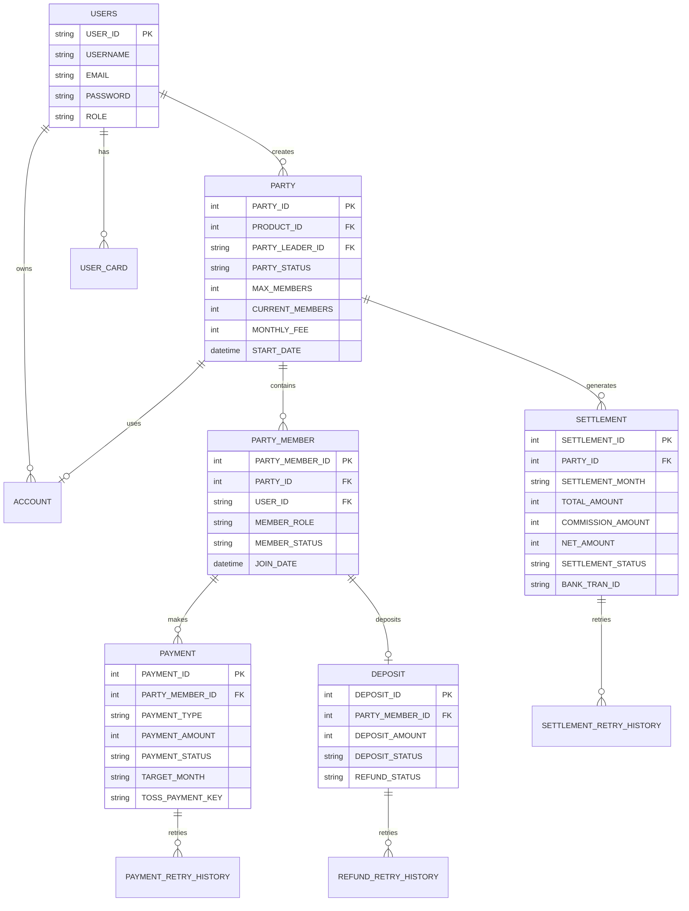
```mermaid
erDiagram
    USERS ||--o{ PARTY : creates
    USERS ||--o{ ACCOUNT : owns
    USERS ||--o{ USER_CARD : has

    PARTY ||--o{ PARTY_MEMBER : contains
    PARTY ||--o{ SETTLEMENT : generates
    PARTY ||--o| ACCOUNT : uses

    PARTY_MEMBER ||--o{ PAYMENT : makes
    PARTY_MEMBER ||--o| DEPOSIT : deposits

    PAYMENT ||--o{ PAYMENT_RETRY_HISTORY : retries
    SETTLEMENT ||--o{ SETTLEMENT_RETRY_HISTORY : retries
    DEPOSIT ||--o{ REFUND_RETRY_HISTORY : retries

    USERS {
        string USER_ID PK
        string USERNAME
        string EMAIL
        string PASSWORD
        string ROLE
    }

    PARTY {
        int PARTY_ID PK
        int PRODUCT_ID FK
        string PARTY_LEADER_ID FK
        string PARTY_STATUS
        int MAX_MEMBERS
        int CURRENT_MEMBERS
        int MONTHLY_FEE
        datetime START_DATE
    }

    PARTY_MEMBER {
        int PARTY_MEMBER_ID PK
        int PARTY_ID FK
        string USER_ID FK
        string MEMBER_ROLE
        string MEMBER_STATUS
        datetime JOIN_DATE
    }

    PAYMENT {
        int PAYMENT_ID PK
        int PARTY_MEMBER_ID FK
        string PAYMENT_TYPE
        int PAYMENT_AMOUNT
        string PAYMENT_STATUS
        string TARGET_MONTH
        string TOSS_PAYMENT_KEY
    }

    SETTLEMENT {
        int SETTLEMENT_ID PK
        int PARTY_ID FK
        string SETTLEMENT_MONTH
        int TOTAL_AMOUNT
        int COMMISSION_AMOUNT
        int NET_AMOUNT
        string SETTLEMENT_STATUS
        string BANK_TRAN_ID
    }

    DEPOSIT {
        int DEPOSIT_ID PK
        int PARTY_MEMBER_ID FK
        int DEPOSIT_AMOUNT
        string DEPOSIT_STATUS
        string REFUND_STATUS
    }
```

**주요 관계:**
- USERS : PARTY = 1 : N (한 사용자가 여러 파티 생성 가능)
- PARTY : PARTY_MEMBER = 1 : N (한 파티에 여러 멤버)
- PARTY_MEMBER : PAYMENT = 1 : N (멤버별 월간 결제 이력)
- PARTY : SETTLEMENT = 1 : N (파티별 월간 정산)

### 3.3 주요 테이블 상세

#### PARTY (파티)
```sql
CREATE TABLE PARTY (
    PARTY_ID INT PRIMARY KEY AUTO_INCREMENT,
    PRODUCT_ID INT NOT NULL,
    PARTY_LEADER_ID VARCHAR(50) NOT NULL,
    PARTY_STATUS VARCHAR(20) NOT NULL,  -- 핵심!
    MAX_MEMBERS INT NOT NULL,
    CURRENT_MEMBERS INT NOT NULL DEFAULT 1,
    MONTHLY_FEE INT NOT NULL,
    OTT_ID VARCHAR(100),
    OTT_PASSWORD VARCHAR(255),  -- 암호화
    ACCOUNT_ID INT,  -- 정산 계좌
    START_DATE DATETIME NOT NULL,
    ...
)
```

**PARTY_STATUS 상태 전환:**

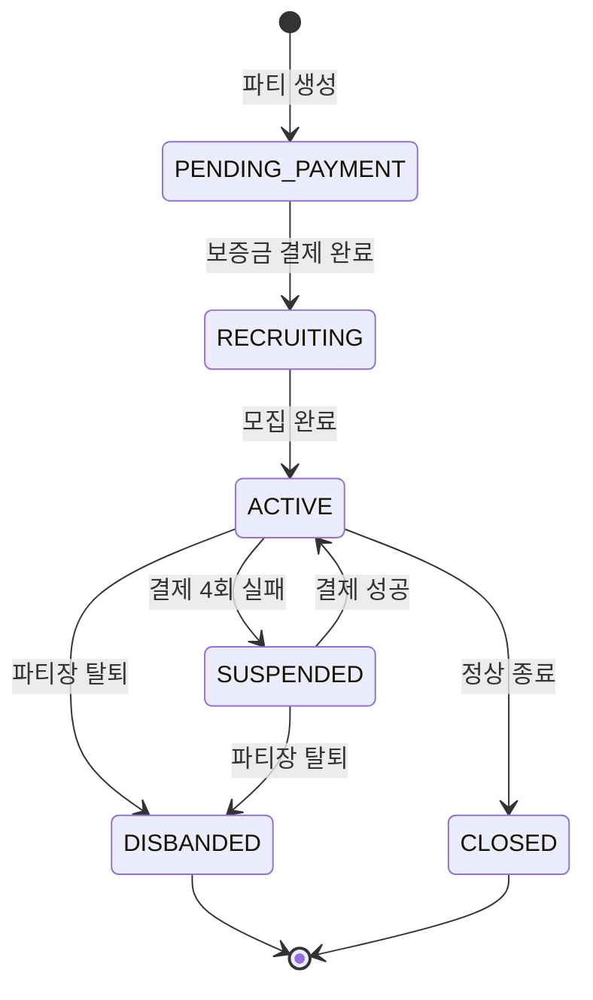
```mermaid
stateDiagram-v2
    [*] --> PENDING_PAYMENT: 파티 생성
    PENDING_PAYMENT --> RECRUITING: 보증금 결제 완료
    RECRUITING --> ACTIVE: 모집 완료
    ACTIVE --> SUSPENDED: 결제 4회 실패
    SUSPENDED --> ACTIVE: 결제 성공
    ACTIVE --> CLOSED: 정상 종료
    ACTIVE --> DISBANDED: 파티장 탈퇴
    SUSPENDED --> DISBANDED: 파티장 탈퇴
    DISBANDED --> [*]
    CLOSED --> [*]
```

#### PAYMENT (결제)
```sql
CREATE TABLE PAYMENT (
    PAYMENT_ID INT PRIMARY KEY AUTO_INCREMENT,
    PARTY_MEMBER_ID INT NOT NULL,
    PAYMENT_TYPE VARCHAR(20) NOT NULL,  -- INITIAL/MONTHLY
    PAYMENT_AMOUNT INT NOT NULL,
    PAYMENT_STATUS VARCHAR(20) NOT NULL,
    TARGET_MONTH VARCHAR(7) NOT NULL,   -- yyyy-MM
    TOSS_PAYMENT_KEY VARCHAR(255),
    ORDER_ID VARCHAR(100),

    -- 중복 결제 방지
    CONSTRAINT UQ_PAYMENT_MEMBER_MONTH
        UNIQUE (PARTY_MEMBER_ID, TARGET_MONTH)
)
```

#### SETTLEMENT (정산)
```sql
CREATE TABLE SETTLEMENT (
    SETTLEMENT_ID INT PRIMARY KEY AUTO_INCREMENT,
    PARTY_ID INT NOT NULL,
    PARTY_LEADER_ID VARCHAR(50) NOT NULL,
    ACCOUNT_ID INT,
    SETTLEMENT_MONTH VARCHAR(7) NOT NULL,
    TOTAL_AMOUNT INT NOT NULL,          -- 총 수입
    COMMISSION_RATE DECIMAL(3,2),       -- 0.15 (15%)
    COMMISSION_AMOUNT INT NOT NULL,      -- 수수료
    NET_AMOUNT INT NOT NULL,            -- 순 정산액
    SETTLEMENT_STATUS VARCHAR(20),
    BANK_TRAN_ID VARCHAR(20),           -- 오픈뱅킹 거래번호
    ...
)
```

---

## 4. 핵심 기능 구현

### 4.1 자동 결제 시스템 ⭐

**가장 핵심적인 기능으로, 완전 자동화된 월간 구독료 결제 시스템**

#### 🌟 일반인을 위한 쉬운 설명

**"자동 결제가 왜 중요할까요?"**

여러분이 Netflix나 Youtube Premium을 사용할 때를 생각해보세요. 매월 직접 카드 번호를 입력하고 결제하지 않아도, 자동으로 요금이 빠져나가죠? 이것이 바로 **자동 결제 시스템**입니다.

4beans-moa에서는 이 자동 결제가 특히 중요합니다. 왜냐하면:

1. **파티원이 많을 수 있어요**: 한 파티에 최대 4명까지 참여 가능
2. **매달 정확한 날짜에 결제해야 해요**: 한 명이라도 밀리면 OTT 서비스가 중단될 수 있어요
3. **사람이 일일이 확인할 수 없어요**: 파티가 100개라면 매달 400건의 결제를 확인해야 합니다

따라서 **컴퓨터가 자동으로 결제를 진행하고, 실패하면 다시 시도하고, 그래도 안 되면 알려주는 시스템**이 필수적입니다.

**"빌링키가 뭔가요?"**

빌링키(Billing Key)는 일종의 **결제 비밀번호**라고 생각하면 됩니다.

- **일반 결제**: 매번 카드 번호(1234-5678-9012-3456), CVV, 비밀번호를 입력
- **빌링키 결제**: 처음 한 번만 카드 정보를 등록하면, 이후엔 "KEY12345"라는 코드만으로 결제 가능

실생활 비유:
```
일반 결제 = 매번 집 열쇠를 직접 들고 다니며 문을 열기
빌링키 = 지문 인식기 등록 후 손가락만 대면 문이 열림
```

**보안은 안전한가요?**
- 빌링키는 **토스페이먼츠**라는 신뢰할 수 있는 결제 대행사가 관리합니다
- 우리 서버에는 실제 카드 번호가 저장되지 않습니다 (PCI-DSS 보안 표준)
- 빌링키는 암호화된 코드일 뿐, 이것만으로는 카드 정보를 알 수 없습니다

**"결제가 실패하면 어떻게 되나요?"**

현실에서는 여러 이유로 결제가 실패할 수 있습니다:
- 카드 한도 초과
- 잔액 부족
- 카드 분실 신고
- 일시적인 은행 시스템 오류

4beans-moa는 이런 경우를 대비해 **4단계 재시도 시스템**을 구축했습니다:

```
1차 실패 → 즉시 재시도
2차 실패 → 다음 날 재시도
3차 실패 → 2일 후 재시도
4차 실패 → 3일 후 최종 재시도
모두 실패 → 파티 일시정지 + 푸시 알림
```

이는 마치 **택배 배송**과 비슷합니다:
- 1차 방문: 부재중
- 2차 방문: 다음 날 재방문
- 3차 방문: 이틀 후 재방문
- 최종: 보관함에 보관 + 문자 알림

**"언제 결제가 진행되나요?"**

- **시간**: 매일 새벽 2시 (사용자가 잠든 시간, 서버 부하 최소화)
- **날짜**: 파티 시작일 기준
  - 예: 1월 15일에 파티 시작 → 매월 15일 새벽 2시에 결제
  - 예: 1월 31일에 파티 시작 → 2월에는 28일(윤년 29일), 3월에는 31일
    - (월마다 일수가 다른 문제를 자동으로 해결!)

**"시스템이 얼마나 정확한가요?"**

- 모든 결제 시도는 데이터베이스에 기록됩니다
- 성공/실패 여부, 실패 이유, 재시도 횟수 모두 추적 가능
- 관리자가 대시보드에서 실시간으로 모니터링할 수 있습니다

---

#### 4.1.1 빌링키 기반 자동결제

```java
// PaymentServiceImpl.java
@Override
public Payment createMonthlyPayment(
    Integer partyId,
    Integer partyMemberId,
    String userId,
    Integer amount,
    String targetMonth
) {
    // 1. 빌링키 조회
    UserCard userCard = userCardDao.findByUserId(userId)
        .orElseThrow(() -> new BusinessException(
            ErrorCode.BILLING_KEY_NOT_FOUND));

    // 2. 주문 ID 생성
    String orderId = "MONTHLY_" + partyId + "_" +
                     partyMemberId + "_" +
                     System.currentTimeMillis();

    // 3. Toss Payments 빌링키 결제 요청
    String paymentKey = tossPaymentService.payWithBillingKey(
        userCard.getBillingKey(),
        orderId,
        amount,
        "MOA 월 구독료 (" + targetMonth + ")"
    );

    // 4. Payment 엔티티 생성 및 저장
    Payment payment = Payment.builder()
        .paymentType("MONTHLY")
        .paymentAmount(amount)
        .paymentStatus(PaymentStatus.COMPLETED)
        .targetMonth(targetMonth)
        .tossPaymentKey(paymentKey)
        .build();

    paymentDao.insertPayment(payment);
    return payment;
}
```

**설계 포인트:**
- 최초 1회만 사용자가 카드 등록 (빌링키 발급)
- 이후 매월 자동으로 결제 진행
- 사용자 편의성 극대화

**자동결제 시퀀스 다이어그램:**

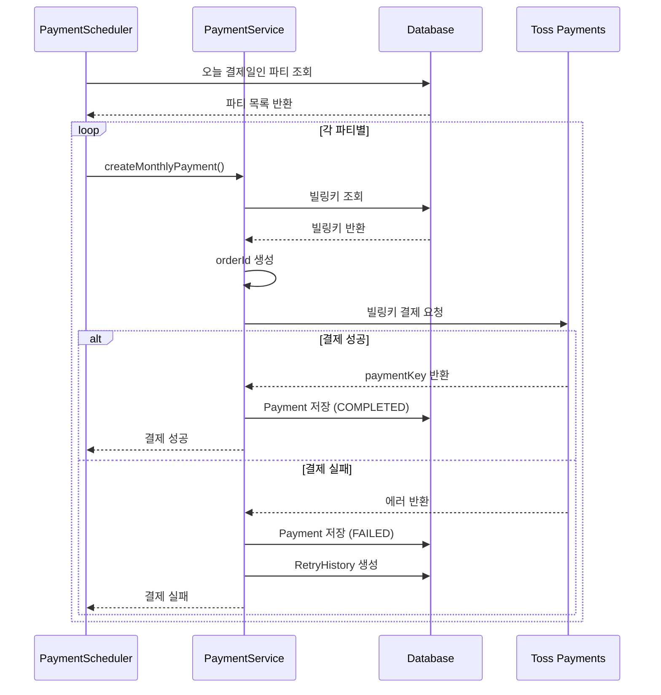
```mermaid
sequenceDiagram
    participant S as PaymentScheduler
    participant PS as PaymentService
    participant DB as Database
    participant T as Toss Payments

    S->>DB: 오늘 결제일인 파티 조회
    DB-->>S: 파티 목록 반환

    loop 각 파티별
        S->>PS: createMonthlyPayment()
        PS->>DB: 빌링키 조회
        DB-->>PS: 빌링키 반환
        PS->>PS: orderId 생성
        PS->>T: 빌링키 결제 요청
        alt 결제 성공
            T-->>PS: paymentKey 반환
            PS->>DB: Payment 저장 (COMPLETED)
            PS-->>S: 결제 성공
        else 결제 실패
            T-->>PS: 에러 반환
            PS->>DB: Payment 저장 (FAILED)
            PS->>DB: RetryHistory 생성
            PS-->>S: 결제 실패
        end
    end
```

#### 4.1.2 PaymentScheduler - 매일 새벽 2시 실행

```java
@Scheduled(cron = "0 0 2 * * *", zone = "Asia/Seoul")
public void runDailyPayments() {
    LocalDate today = LocalDate.now();
    String targetMonth = today.format(
        DateTimeFormatter.ofPattern("yyyy-MM"));

    // 1. 신규 월회비 결제
    processNewMonthlyPayments(today, targetMonth);

    // 2. 재시도 결제
    processRetryPayments(today, targetMonth);
}
```

**결제일 계산 로직:**
```java
private void processNewMonthlyPayments(LocalDate today, String targetMonth) {
    int currentDay = today.getDayOfMonth();
    int lastDayOfMonth = today.lengthOfMonth();

    // 파티 시작일 기준으로 결제일 자동 계산
    // 예: 1월 15일 시작 → 매월 15일 결제
    // 29/30/31일 문제 해결: 월말이면 해당 월의 마지막 날
    List<Party> parties = partyDao.findPartiesByPaymentDay(
        currentDay, lastDayOfMonth);

    for (Party party : parties) {
        // 파티 상태 검증: ACTIVE만 결제 진행
        if (!isPartyPaymentEligible(party)) {
            continue;
        }

        processPartyPayments(party, targetMonth);
    }
}
```

**핵심 개념:**
- 파티 시작일을 기준으로 billing cycle 자동 계산
- 29/30/31일 문제: 해당 월의 마지막 날로 처리
- 예: 1/31 시작 → 2월은 2/28, 3월은 3/31

#### 4.1.3 결제 재시도 메커니즘 ⭐

**4단계 재시도 전략:**

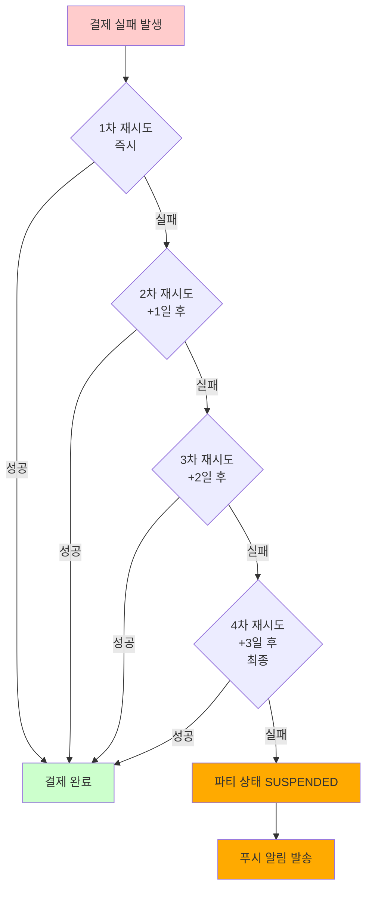
```mermaid
flowchart TD
    A[결제 실패 발생] --> B{1차 재시도<br/>즉시}
    B -->|성공| Z[결제 완료]
    B -->|실패| C{2차 재시도<br/>+1일 후}
    C -->|성공| Z
    C -->|실패| D{3차 재시도<br/>+2일 후}
    D -->|성공| Z
    D -->|실패| E{4차 재시도<br/>+3일 후<br/>최종}
    E -->|성공| Z
    E -->|실패| F[파티 상태 SUSPENDED]
    F --> G[푸시 알림 발송]

    style A fill:#ffcccc
    style Z fill:#ccffcc
    style F fill:#ffaa00
    style G fill:#ffaa00
```

**재시도 이력 추적:**

```java
// PaymentRetryServiceImpl.java
@Override
public void retryPayment(
    PaymentRetryHistory retry,
    String targetMonth
) {
    // 1. 현재 시도 횟수 확인
    int currentAttempt = retry.getAttemptNumber();

    try {
        // 2. 결제 재시도
        paymentService.processMonthlyPayment(...);

        // 3. 성공 시 재시도 이력 SUCCESS로 업데이트
        updateRetryStatus(retry.getRetryId(), "SUCCESS");

    } catch (Exception e) {
        // 4. 실패 시
        if (currentAttempt >= MAX_RETRY_ATTEMPTS) {
            // 4회 실패 → 파티 일시정지
            suspendParty(retry.getPartyId());

            // 푸시 알림 발송
            sendPartySuspendedNotification(retry.getPartyId());
        } else {
            // 다음 재시도 일정 생성
            scheduleNextRetry(retry, currentAttempt + 1);
        }
    }
}
```

**PAYMENT_RETRY_HISTORY 테이블:**
```sql
CREATE TABLE PAYMENT_RETRY_HISTORY (
    RETRY_ID INT PRIMARY KEY AUTO_INCREMENT,
    PAYMENT_ID INT NOT NULL,
    ATTEMPT_NUMBER INT NOT NULL,  -- 1, 2, 3, 4
    ATTEMPT_DATE DATETIME NOT NULL,
    RETRY_REASON VARCHAR(500),
    RETRY_STATUS VARCHAR(20),     -- SUCCESS/FAILED
    NEXT_RETRY_DATE DATETIME,
    ERROR_CODE VARCHAR(50),
    ERROR_MESSAGE VARCHAR(500),
    ...
)
```

**장점:**
- 모든 재시도 이력 추적 가능
- 디버깅 용이
- 통계 분석 가능

### 4.2 정산 시스템 ⭐

**파티장에게 월간 수익을 자동으로 지급하는 시스템**

#### 🌟 일반인을 위한 쉬운 설명

**"정산이 뭔가요?"**

정산(Settlement)은 **"돈을 계산해서 지급하는 것"**을 의미합니다.

실생활 예시를 들어볼까요?
- **배달 라이더**: 한 달 동안 배달한 건수를 계산해서 월급 지급
- **유튜버**: 광고 수익을 계산해서 구글로부터 정산금 받기
- **배민 사장님**: 한 달치 주문 금액에서 수수료를 뺀 금액을 받기

4beans-moa에서는 **파티장**이 바로 이런 역할입니다:

```
파티장 역할:
1. 자신의 Netflix 계정을 다른 사람들과 공유
2. 파티원들이 매달 월회비 결제
3. 플랫폼이 자동으로 수익 계산
4. 파티장의 계좌로 수익 입금
```

**"얼마를 받나요?"**

계산 공식:
```
총 수입 = (파티원들이 낸 월회비) + (몰수된 보증금)
플랫폼 수수료 = 월회비의 15%
파티장 순수익 = 총 수입 - 수수료
```

실제 예시:
```
Netflix 베이직 파티 (4명)
- 월 구독료: 13,500원
- 1인당 월회비: 4,000원
- 파티원 3명 × 4,000원 = 12,000원 (월회비 총액)

정산 계산:
1. 총 수입: 12,000원
2. 수수료 (15%): 1,800원
3. 순 정산액: 10,200원 ← 파티장이 받는 금액

파티장 수익 분석:
- OTT 구독료: -13,500원 (파티장이 Netflix에 직접 지불)
- 정산금: +10,200원
- 실질 부담: -3,300원 (원래 13,500원에서 75% 할인!)
```

**왜 몰수된 보증금이 포함되나요?**

파티원이 규칙을 어기고 탈퇴하면 보증금이 몰수됩니다. 이때:
- **몰수 보증금은 수수료 없이 100% 파티장에게 지급**
- 이는 파티장의 피해를 보상하기 위함입니다

예시:
```
파티원이 한 달 만에 탈퇴 (보증금 5,000원 몰수)

이번 달 정산:
1. 월회비: 12,000원 → 수수료 1,800원 차감
2. 몰수 보증금: 5,000원 → 수수료 없음!
3. 총 정산액: (12,000 - 1,800) + 5,000 = 15,200원
```

**"돈은 어떻게 흘러가나요?" (돈의 흐름 다이어그램)**

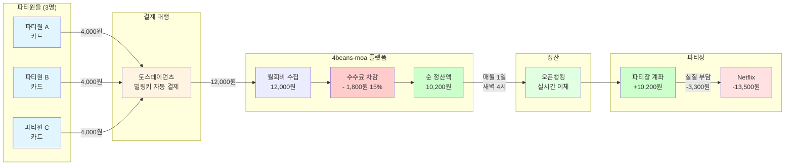
```mermaid
graph LR
    subgraph "파티원들 (3명)"
        P1[파티원 A<br/>카드]
        P2[파티원 B<br/>카드]
        P3[파티원 C<br/>카드]
    end

    subgraph "결제 대행"
        T[토스페이먼츠<br/>빌링키 자동 결제]
    end

    subgraph "4beans-moa 플랫폼"
        M1[월회비 수집<br/>12,000원]
        M2[수수료 차감<br/>- 1,800원 15%]
        M3[순 정산액<br/>10,200원]
    end

    subgraph "정산"
        O[오픈뱅킹<br/>실시간 이체]
    end

    subgraph "파티장"
        L[파티장 계좌<br/>+10,200원]
        N[Netflix<br/>-13,500원]
    end

    P1 -->|4,000원| T
    P2 -->|4,000원| T
    P3 -->|4,000원| T
    T -->|12,000원| M1
    M1 --> M2
    M2 --> M3
    M3 -->|매월 1일<br/>새벽 4시| O
    O --> L
    L -->|실질 부담<br/>-3,300원| N

    style P1 fill:#e1f5ff
    style P2 fill:#e1f5ff
    style P3 fill:#e1f5ff
    style T fill:#fff4e1
    style M2 fill:#ffcccc
    style M3 fill:#ccffcc
    style O fill:#e1ffe1
    style L fill:#ccffcc
    style N fill:#ffe1e1
```

**흐름 단계별 설명:**

| 단계 | 주체 | 금액 | 설명 |
|------|------|------|------|
| 1 | 파티원 3명 | 각 4,000원 | 매월 자동 결제 (빌링키) |
| 2 | 토스페이먼츠 | 12,000원 | 결제 대행 및 4beans에 입금 |
| 3 | 4beans 플랫폼 | - 1,800원 | 수수료 15% 차감 |
| 4 | 4beans 플랫폼 | 10,200원 | 순 정산액 계산 |
| 5 | 오픈뱅킹 | 10,200원 | 파티장 계좌로 즉시 이체 |
| 6 | 파티장 | + 10,200원 | 정산금 수령 |
| 7 | 파티장 | - 13,500원 | Netflix 구독료 지불 |
| **최종** | **파티장** | **- 3,300원** | **실질 부담 (75% 할인!)** |

**핵심 포인트:**
- 💳 **자동 결제**: 파티원 카드에서 자동으로 빠져나감
- 🏦 **실시간 정산**: 오픈뱅킹으로 매월 1일 즉시 입금
- 💰 **수수료**: 월회비의 15%만 (몰수 보증금은 0%)
- ✅ **투명성**: 모든 거래 내역 실시간 확인 가능

**"언제 돈을 받나요?"**

- **정산일**: 매월 1일 새벽 4시 자동 계산
- **입금 방식**: 오픈뱅킹 API로 즉시 입금
- **정산 기간**: 파티 시작일 기준 1개월

예시:
```
파티 시작일: 1월 15일
정산 주기:
- 1차 정산 (2월 1일): 1월 15일 ~ 2월 14일 수익
- 2차 정산 (3월 1일): 2월 15일 ~ 3월 14일 수익
- 3차 정산 (4월 1일): 3월 15일 ~ 4월 14일 수익
```

**"오픈뱅킹이 뭔가요?"**

오픈뱅킹(Open Banking)은 **은행들이 공동으로 만든 계좌이체 시스템**입니다.

장점:
- **실시간 입금**: 정산 완료 즉시 계좌 입금 (3~5 영업일 대기 없음)
- **수수료 저렴**: 건당 10~50원 수준 (기존 계좌이체 수수료보다 훨씬 저렴)
- **모든 은행 지원**: 국민/신한/우리/하나 등 모든 은행 연동 가능

비유하자면:
```
기존 방식 = 각 은행마다 별도로 이체 신청
오픈뱅킹 = 하나의 앱으로 모든 은행 이체 가능 (토스, 카카오페이처럼)
```

**"정산이 실패하면?"**

은행 시스템 오류 등으로 입금이 실패할 수 있습니다. 이때:

```
재시도 시스템:
1차 실패 → 1시간 후 재시도
2차 실패 → 3시간 후 재시도
3차 실패 → 6시간 후 재시도
4차 실패 → 관리자에게 알림 + 수동 처리
```

**"투명하게 확인할 수 있나요?"**

파티장은 마이페이지에서 다음을 확인할 수 있습니다:
- 이번 달 예상 정산금
- 정산 내역 상세 (결제 건별, 몰수 보증금 내역)
- 정산 완료 시 푸시 알림 수신
- 거래 ID로 은행 입금 내역 대조 가능

---

**정산 프로세스 전체 플로우:**

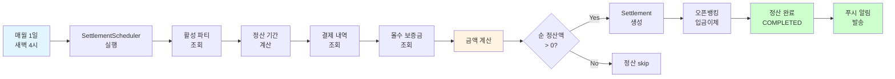
```mermaid
flowchart LR
    A[매월 1일<br/>새벽 4시] --> B[SettlementScheduler<br/>실행]
    B --> C[활성 파티<br/>조회]
    C --> D[정산 기간<br/>계산]
    D --> E[결제 내역<br/>조회]
    E --> F[몰수 보증금<br/>조회]
    F --> G[금액 계산]
    G --> H{순 정산액<br/> > 0?}
    H -->|Yes| I[Settlement<br/>생성]
    H -->|No| J[정산 skip]
    I --> K[오픈뱅킹<br/>입금이체]
    K --> L[정산 완료<br/>COMPLETED]
    L --> M[푸시 알림<br/>발송]

    style A fill:#e1f5ff
    style G fill:#fff4e1
    style L fill:#ccffcc
    style M fill:#ccffcc
```

#### 4.2.1 정산 계산 로직

```java
// SettlementServiceImpl.java
@Override
public Settlement createMonthlySettlement(
    Integer partyId,
    String targetMonth
) {
    // 1. 정산 기간 계산 (파티 시작일 기준)
    Party party = partyDao.findById(partyId).orElseThrow();
    LocalDateTime partyStartDate = party.getStartDate();
    int billingDay = partyStartDate.getDayOfMonth();

    // 예: 1/15 시작 → 2/15~3/14가 정산 기간
    LocalDateTime settlementStartDate =
        calculateBillingCycleStart(targetMonth, billingDay);
    LocalDateTime settlementEndDate =
        settlementStartDate.plusMonths(1).minusDays(1);

    // 2. 해당 기간의 결제 내역 조회
    List<PaymentResponse> targetPayments = payments.stream()
        .filter(p -> "COMPLETED".equals(p.getPaymentStatus()))
        .filter(p -> isInPeriod(p, settlementStartDate, settlementEndDate))
        .collect(Collectors.toList());

    // 3. 몰수 보증금 조회
    List<Deposit> forfeitedDeposits =
        depositDao.findForfeitedByPartyIdAndPeriod(
            partyId, settlementStartDate, settlementEndDate);

    // 4. 금액 계산
    int paymentTotal = targetPayments.stream()
        .mapToInt(PaymentResponse::getPaymentAmount).sum();
    int forfeitedAmount = forfeitedDeposits.stream()
        .mapToInt(Deposit::getDepositAmount).sum();

    // 총 수입 = 월회비 + 몰수 보증금
    int totalAmount = paymentTotal + forfeitedAmount;

    // 수수료 = 월회비의 15% (몰수 보증금은 수수료 없음!)
    int commissionAmount = (int) (paymentTotal * 0.15);

    // 순 정산액 = 총 수입 - 수수료
    int netAmount = totalAmount - commissionAmount;

    // 5. Settlement 생성
    Settlement settlement = Settlement.builder()
        .totalAmount(totalAmount)
        .commissionAmount(commissionAmount)
        .netAmount(netAmount)
        .settlementStatus(SettlementStatus.PENDING)
        .build();

    settlementDao.insertSettlement(settlement);
    return settlement;
}
```

**정산 예시:**
```
월회비 수입: 12,000원 (3명 × 4,000원)
몰수 보증금: 5,000원 (강제 탈퇴 1명)
─────────────────────────────
총 수입: 17,000원
수수료 (15%): 1,800원 (12,000원의 15%)
순 정산액: 15,200원
```

**핵심 설계:**
- 몰수 보증금은 수수료 없이 100% 파티장에게 지급
- 공정한 수익 구조

#### 4.2.2 SettlementScheduler - 매월 1일 새벽 4시

```java
@Scheduled(cron = "0 0 4 1 * *", zone = "Asia/Seoul")
public void runMonthlySettlement() {
    // 1. 정산 대상 월 계산 (전월)
    LocalDate lastMonth = LocalDate.now().minusMonths(1);
    String targetMonth = lastMonth.format(
        DateTimeFormatter.ofPattern("yyyy-MM"));

    // 2. 활성 파티 조회
    List<Party> activeParties = partyDao.findActiveParties();

    for (Party party : activeParties) {
        try {
            // 3. 정산 생성
            Settlement settlement =
                settlementService.createMonthlySettlement(
                    party.getPartyId(), targetMonth);

            if (settlement == null) {
                continue; // 정산할 내역 없음
            }

            // 4. 정산 완료 (오픈뱅킹 입금이체)
            settlementService.completeSettlement(
                settlement.getSettlementId());

            // 5. 이벤트 발행 (푸시 알림)
            eventPublisher.publishEvent(
                new SettlementCompletedEvent(
                    party.getPartyId(),
                    settlement.getNetAmount(),
                    party.getPartyLeaderId()));

        } catch (Exception e) {
            log.error("정산 실패: partyId={}", party.getPartyId(), e);
            // 개별 파티 실패가 전체에 영향 없음 (격리)
        }
    }
}
```

#### 4.2.3 오픈뱅킹 연동

```java
// SettlementServiceImpl.completeSettlement()
@Override
public void completeSettlement(Integer settlementId) {
    Settlement settlement = settlementDao.findById(settlementId)
        .orElseThrow();

    // 계좌 정보 조회
    Account account = accountDao.findById(settlement.getAccountId())
        .orElseThrow();

    // 오픈뱅킹 입금이체 요청
    String bankTranId = openBankingService.depositToUser(
        account.getBankCode(),
        account.getAccountNumber(),
        account.getAccountHolder(),
        settlement.getNetAmount(),
        "MOA 정산 (" + settlement.getSettlementMonth() + ")"
    );

    // 정산 완료 처리
    settlementDao.updateSettlementStatus(
        settlementId,
        SettlementStatus.COMPLETED.name(),
        bankTranId
    );
}
```

**오픈뱅킹 특징:**
- 실시간 계좌 이체
- 1원 인증으로 계좌 검증
- 핀테크이용번호 활용

### 4.3 보증금 시스템

#### 🌟 일반인을 위한 쉬운 설명

**"보증금이 왜 필요한가요?"**

OTT 공유 서비스의 가장 큰 문제는 **신뢰 문제**입니다.

상황을 상상해보세요:
```
파티장 A씨의 고민:
"내 Netflix 계정을 낯선 사람과 공유하는데,
 그 사람이 갑자기 탈퇴하거나 요금을 안 내면 어떡하지?"

파티원 B씨의 고민:
"돈을 냈는데 파티장이 갑자기 계정 비밀번호를 바꾸면 어떡하지?"
```

이런 문제를 해결하기 위해 **보증금 시스템**이 도입되었습니다.

**실생활 보증금과 비교:**

| 상황 | 보증금 역할 | 4beans-moa |
|------|------------|------------|
| **월세 계약** | 집주인 보호 (세입자가 월세 안 내면 보증금에서 차감) | 파티장 보호 (파티원이 요금 안 내면 보증금 몰수) |
| **렌터카 대여** | 차량 손상 방지 (사고 나면 보증금 차감) | 계정 악용 방지 (규칙 위반 시 보증금 몰수) |
| **공유 킥보드** | 반납 보장 (안 반납하면 보증금 차감) | 책임감 부여 (아무렇게나 탈퇴 못 함) |

**"얼마를 내야 하나요?"**

보증금은 **한 달치 요금**과 동일합니다:

```
Netflix 베이직 파티 예시:
- 월 구독료: 13,500원
- 파티원 1인당 요금: 4,000원

보증금:
- 파티장: 13,500원 (전체 구독료)
- 파티원: 4,000원 (1인당 요금)
```

**왜 파티장도 보증금을 내나요?**
- 파티장이 갑자기 파티를 해산하면 파티원들이 피해를 입습니다
- 파티장 보증금도 같은 규칙으로 관리되어 **공정성 확보**

**"언제 돌려받나요?"**

보증금 환불 시나리오:

1. **정상 탈퇴 (전액 환불)**
   ```
   상황: 파티원이 3개월 이용 후 정상 탈퇴 신청
   처리:
   - 보증금 5,000원 → 토스페이먼츠 통해 즉시 환불
   - 환불까지 소요 시간: 3~5 영업일
   ```

2. **강제 탈퇴 (전액 몰수)**
   ```
   상황: 파티원이 4번 연속 결제 실패
   처리:
   - 보증금 5,000원 → 파티장에게 지급 (정산에 포함)
   - 파티장 피해 보상 용도
   ```

3. **파티 해산 (전원 환불)**
   ```
   상황: 파티장이 파티 해산 결정
   처리:
   - 모든 파티원 보증금 → 자동 환불
   - 파티장 보증금 → 자동 환불
   ```

**"보증금을 몰수당하는 경우가 뭔가요?"**

몰수 조건 (매우 명확함):
- ❌ **결제 4회 연속 실패**: 월회비를 계속 안 내는 경우
- ❌ **계정 악용**: OTT 계정 비밀번호를 다른 사람에게 공유
- ❌ **허위 정보**: 가입 시 거짓 정보 입력

**몰수되지 않는 경우**:
- ✅ 정상적으로 사용하다가 탈퇴
- ✅ 파티장 요청으로 파티 해산
- ✅ OTT 서비스 자체가 종료

**"환불이 실패하면 어떻게 되나요?"**

토스페이먼츠 시스템 오류 등으로 환불이 실패할 수 있습니다.

재시도 시스템:
```
환불 실패 발생
 ↓
1시간 후 자동 재시도
 ↓ (실패)
3시간 후 자동 재시도
 ↓ (실패)
6시간 후 자동 재시도
 ↓ (실패)
관리자에게 알림 → 수동 처리
```

**재시도 불가 에러 (즉시 중단)**:
- 이미 환불 완료됨 (`ALREADY_REFUNDED`)
- 결제키가 유효하지 않음 (`INVALID_PAYMENT_KEY`)
- 환불 기간 초과 (`CANCEL_PERIOD_EXPIRED`)

이런 경우는 재시도해도 성공할 수 없으므로 즉시 중단하고 관리자가 확인합니다.

**"안전하게 보관되나요?"**

- 보증금은 **토스페이먼츠**에 안전하게 보관됩니다
- 4beans-moa는 환불 요청만 전달하는 역할
- 우리 서버에 돈이 저장되는 것이 아님 (안전!)

비유:
```
4beans-moa = 임대차 계약서 (중개 역할)
토스페이먼츠 = 은행 (실제 돈을 보관하는 곳)
```

**"투명하게 확인할 수 있나요?"**

마이페이지에서 다음을 확인 가능:
- 내 보증금 상태 (예치/환불완료/몰수)
- 환불 예정일 (탈퇴 신청 시)
- 환불 진행 상태 (대기/진행중/완료/실패)
- 토스 거래 번호로 토스 앱에서 직접 확인 가능

**"보증금 상태는 어떻게 변화하나요?" (상태 전환 다이어그램)**

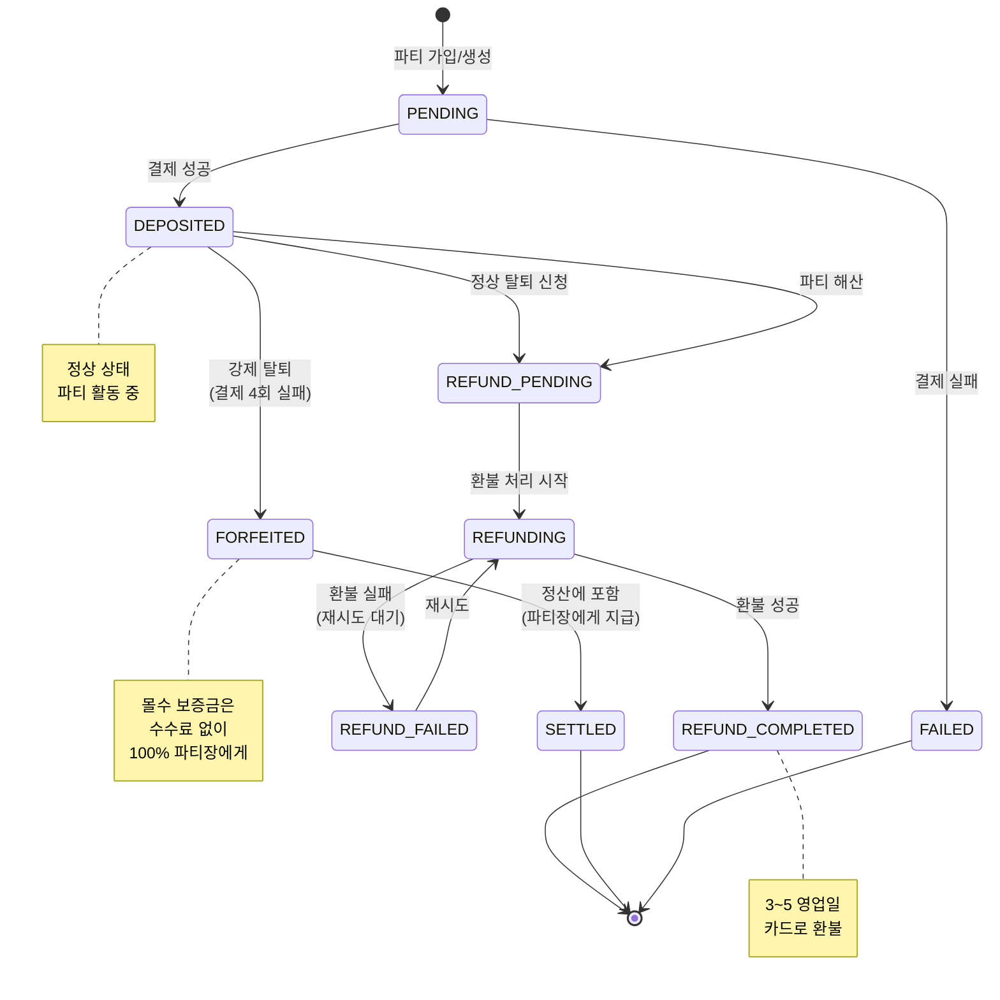
```mermaid
stateDiagram-v2
    [*] --> PENDING: 파티 가입/생성
    PENDING --> DEPOSITED: 결제 성공
    PENDING --> FAILED: 결제 실패

    DEPOSITED --> REFUND_PENDING: 정상 탈퇴 신청
    DEPOSITED --> FORFEITED: 강제 탈퇴<br/>(결제 4회 실패)
    DEPOSITED --> REFUND_PENDING: 파티 해산

    REFUND_PENDING --> REFUNDING: 환불 처리 시작
    REFUNDING --> REFUND_COMPLETED: 환불 성공
    REFUNDING --> REFUND_FAILED: 환불 실패<br/>(재시도 대기)
    REFUND_FAILED --> REFUNDING: 재시도

    FORFEITED --> SETTLED: 정산에 포함<br/>(파티장에게 지급)

    REFUND_COMPLETED --> [*]
    SETTLED --> [*]
    FAILED --> [*]

    note right of DEPOSITED
        정상 상태
        파티 활동 중
    end note

    note right of FORFEITED
        몰수 보증금은
        수수료 없이
        100% 파티장에게
    end note

    note right of REFUND_COMPLETED
        3~5 영업일
        카드로 환불
    end note
```

**각 상태 설명:**

| 상태 | 의미 | 다음 상태 | 소요 시간 |
|------|------|----------|----------|
| **PENDING** | 결제 대기 중 | DEPOSITED / FAILED | 즉시 |
| **DEPOSITED** | 보증금 예치 완료 (정상) | REFUND_PENDING / FORFEITED | 파티 이용 중 |
| **FAILED** | 결제 실패 | - | 종료 |
| **FORFEITED** | 보증금 몰수 | SETTLED | 즉시 |
| **SETTLED** | 정산 완료 (파티장에게 지급) | - | 다음 정산일 |
| **REFUND_PENDING** | 환불 대기 | REFUNDING | 즉시 |
| **REFUNDING** | 환불 처리 중 | REFUND_COMPLETED / REFUND_FAILED | 1~3분 |
| **REFUND_FAILED** | 환불 실패 (재시도) | REFUNDING | 1시간 후 |
| **REFUND_COMPLETED** | 환불 완료 | - | 3~5 영업일 |

**상태 전환 예시 (정상 이용):**
```
파티 가입 → PENDING (결제 대기)
         ↓ 1분
      DEPOSITED (보증금 예치, 파티 활동 시작)
         ↓ 3개월 후
      REFUND_PENDING (정상 탈퇴)
         ↓ 즉시
      REFUNDING (환불 처리)
         ↓ 2분
      REFUND_COMPLETED (환불 완료)
         ↓ 3~5일
      카드로 환불 입금
```

**상태 전환 예시 (강제 탈퇴):**
```
파티 가입 → DEPOSITED (보증금 예치)
         ↓ 결제 4회 연속 실패
      FORFEITED (보증금 몰수)
         ↓ 다음 정산일 (매월 1일)
      SETTLED (파티장에게 지급)
```

---

#### 4.3.1 보증금 규칙

```java
보증금 금액:
- 파티장: 월구독료 전액 (예: 17,000원)
- 파티원: 인당 요금 (예: 4,250원)

환불 정책:
- 정상 탈퇴: 전액 환불
- 강제 탈퇴: 전액 몰수 → 파티장에게 지급
- 파티 해산: 전액 환불
```

#### 4.3.2 환불 재시도 시스템

```java
// RefundScheduler.java
@Scheduled(cron = "0 0 * * * *", zone = "Asia/Seoul")
public void processRefundRetries() {
    // 재시도 대상 조회
    List<RefundRetryHistory> pendingRetries =
        refundRetryService.findPendingRetries();

    for (RefundRetryHistory retry : pendingRetries) {
        try {
            refundRetryService.retryRefund(retry);
        } catch (Exception e) {
            // 재시도 불가 에러 분류
            if (isPermanentError(e)) {
                markAsNonRetryable(retry);
            } else {
                scheduleNextRetry(retry);
            }
        }
    }
}
```

**재시도 불가 에러:**
```java
private static final Set<String> NON_RETRYABLE_ERRORS = Set.of(
    "ALREADY_CANCELED",
    "ALREADY_REFUNDED",
    "INVALID_CANCEL_AMOUNT",
    "EXCEED_CANCEL_AMOUNT",
    "CANCEL_PERIOD_EXPIRED",
    "INVALID_PAYMENT_KEY",
    "NOT_FOUND_PAYMENT",
    "NOT_CANCELABLE_PAYMENT"
);
```

### 4.4 인증 시스템

#### 🌟 일반인을 위한 쉬운 설명

**"인증이 왜 필요한가요?"**

여러분이 아파트에 들어갈 때를 생각해보세요. 출입문에서 **카드를 찍거나 비밀번호를 입력**하죠? 이것이 바로 **인증(Authentication)**입니다.

웹사이트도 마찬가지입니다:
```
없으면 문제:
- 누구나 다른 사람의 파티 정보를 볼 수 있음
- 다른 사람의 보증금을 환불받을 수 있음
- 타인의 계좌 정보를 훔쳐볼 수 있음
```

따라서 **"당신이 본인이 맞는지"** 확인하는 시스템이 필수입니다.

**"JWT가 뭔가요?"**

JWT(JSON Web Token)는 **전자 출입증**이라고 생각하면 됩니다.

실생활 비유:
```
회사 출입증:
1. 입사할 때 출입증 발급 받음 (로그인 = 토큰 발급)
2. 사무실 들어갈 때마다 출입증 태그 (API 요청 시 토큰 전송)
3. 퇴사하면 출입증 반납 (로그아웃 = 토큰 삭제)
4. 출입증 분실 시 재발급 (Refresh Token으로 갱신)
```

JWT의 구조:
```
eyJhbGciOiJIUzI1NiIsInR5cCI6IkpXVCJ9.eyJ1c2VySWQiOiJqb2huIiwicm9sZSI6InVzZXIifQ.SflKxwRJ...
 ↑ 헤더                                 ↑ 페이로드 (사용자 정보)              ↑ 서명 (위변조 방지)

해석:
- 사용자 ID: john
- 권한: 일반 사용자
- 유효 기간: 1시간
- 서명: 서버만 확인 가능한 암호화 코드
```

**"Access Token과 Refresh Token이 뭔가요?"**

4beans-moa는 **2단계 보안**을 사용합니다:

| 구분 | Access Token | Refresh Token |
|------|--------------|---------------|
| **수명** | 1시간 | 7일 |
| **용도** | 실제 API 요청 시 사용 | Access Token 재발급용 |
| **저장 위치** | 메모리 (브라우저) | LocalStorage (영구 저장) |
| **보안 수준** | 높음 (짧은 수명) | 중간 (긴 수명) |

실생활 비유:
```
Access Token = 호텔 룸카드
- 객실 드나들 때 사용
- 짧은 기간만 유효 (체크아웃 후 무효화)
- 분실해도 피해가 제한적 (1시간 후 자동 만료)

Refresh Token = 호텔 예약 확인서
- 룸카드를 재발급받을 때 사용
- 긴 기간 유효 (7일)
- 분실하면 위험하므로 안전하게 보관
```

**로그인 과정:**
```
1. 사용자: 아이디/비밀번호 입력
2. 서버: 확인 후 2개 토큰 발급
   - Access Token (1시간): "abcd1234..."
   - Refresh Token (7일): "wxyz9876..."
3. 브라우저: 두 토큰 저장
4. 이후 모든 요청에 Access Token 자동 첨부
```

**"토큰이 만료되면 어떻게 되나요?"**

1시간 후 Access Token 만료 시:

```
자동 갱신 프로세스:
1. API 요청 → 401 에러 (토큰 만료)
2. 자동으로 Refresh Token으로 새 Access Token 요청
3. 새 Access Token 발급 받음
4. 원래 하려던 요청 다시 실행

사용자 입장:
- 아무것도 모름 (자동 처리됨!)
- 로그인 화면으로 튀어나가지 않음
```

Refresh Token도 만료되면 (7일 후):
```
→ 로그아웃 처리
→ 로그인 페이지로 이동
→ 다시 로그인 필요
```

**"1원 인증이 뭔가요?"**

정산금을 받을 계좌를 등록할 때 **정말 본인 계좌인지** 확인해야 합니다.

1원 인증 과정:
```
1. 사용자: 국민은행 123-456-789 입력
2. 서버: 해당 계좌에 1원 입금 (입금자명: "MOA1234")
3. 사용자: 입금자명에서 "1234" 확인 후 입력
4. 서버: 코드 일치 확인 → 계좌 등록 완료
5. 1원 환불 (수수료 없음)
```

왜 필요한가요?
```
방지하는 문제:
- 다른 사람 계좌를 입력하는 실수
- 타인 계좌로 돈을 빼돌리는 사기
- 계좌번호 오타로 인한 정산 실패
```

실생활 비유:
```
= 주민등록증 위조 방지를 위한 진위 확인
= 계좌 이체 전 본인 확인 (공인인증서, 생체인증)
```

보안 조치:
- **5분 제한**: 5분 안에 인증 완료해야 함 (브루트포스 공격 방지)
- **5회 제한**: 5번 틀리면 재시도 불가
- **1회용 코드**: 인증 완료 후 코드 재사용 불가

**"안전한가요?"**

4beans-moa 보안 조치:

1. **HTTPS 통신**: 모든 데이터 암호화 전송
2. **토큰 서명 검증**: 위변조 불가능
3. **민감 정보 마스킹**: 로그에 비밀번호/카드번호 저장 안 됨
4. **자동 로그아웃**: 7일 후 자동 만료
5. **RefreshToken 탈취 방지**: HttpOnly 쿠키 (JavaScript 접근 차단)

---

#### 4.4.1 JWT 기반 인증

```javascript
// httpClient.js
const httpClient = axios.create({
    baseURL: import.meta.env.VITE_API_BASE_URL,
    timeout: 30000,
});

// 요청 인터셉터: JWT 토큰 자동 추가
httpClient.interceptors.request.use(
    (config) => {
        const token = authStore.getState().accessToken;
        if (token) {
            config.headers.Authorization = `Bearer ${token}`;
        }
        return config;
    }
);

// 응답 인터셉터: 401 에러 시 토큰 갱신
httpClient.interceptors.response.use(
    (response) => response.data,
    async (error) => {
        const originalRequest = error.config;

        if (error.response?.status === 401 && !originalRequest._retry) {
            originalRequest._retry = true;

            try {
                // Refresh Token으로 새 Access Token 발급
                const refreshToken = authStore.getState().refreshToken;
                const response = await axios.post(
                    '/api/auth/refresh',
                    {},
                    { headers: { 'Refresh-Token': refreshToken } }
                );

                // 새 토큰 저장
                authStore.getState().setTokens(
                    response.data.accessToken,
                    response.data.refreshToken
                );

                // 원래 요청 재시도
                originalRequest.headers.Authorization =
                    `Bearer ${response.data.accessToken}`;
                return httpClient(originalRequest);
            } catch (refreshError) {
                // Refresh Token도 만료 → 로그아웃
                authStore.getState().logout();
                window.location.href = '/login';
            }
        }

        return Promise.reject(error);
    }
);
```

**토큰 수명:**
- Access Token: 1시간
- Refresh Token: 7일

#### 4.4.2 1원 인증 (계좌 검증)

```java
// BankAccountService.java
public String requestVerification(
    String userId,
    String bankCode,
    String accountNum,
    String accountHolder
) {
    // 1. 랜덤 4자리 인증코드 생성
    String verifyCode = generateRandomCode();

    // 2. 오픈뱅킹 1원 입금
    String bankTranId = openBankingService.sendOneWon(
        bankCode,
        accountNum,
        "MOA" + verifyCode  // 입금자명에 코드 포함
    );

    // 3. 인증 세션 저장 (5분 후 만료)
    AccountVerification verification = AccountVerification.builder()
        .userId(userId)
        .bankTranId(bankTranId)
        .bankCode(bankCode)
        .accountNum(accountNum)
        .accountHolder(accountHolder)
        .verifyCode(verifyCode)
        .expiredAt(LocalDateTime.now().plusMinutes(5))
        .status("PENDING")
        .build();

    verificationDao.insert(verification);
    return bankTranId;
}

public void verifyAndRegister(
    String bankTranId,
    String userInputCode
) {
    // 1. 인증 세션 조회
    AccountVerification verification =
        verificationDao.findByBankTranId(bankTranId)
            .orElseThrow(() -> new BusinessException(
                ErrorCode.VERIFICATION_NOT_FOUND));

    // 2. 만료 확인
    if (LocalDateTime.now().isAfter(verification.getExpiredAt())) {
        throw new BusinessException(ErrorCode.VERIFICATION_EXPIRED);
    }

    // 3. 코드 검증
    if (!verification.getVerifyCode().equals(userInputCode)) {
        // 실패 횟수 증가
        verification.incrementAttemptCount();
        if (verification.getAttemptCount() >= 5) {
            verification.setStatus("FAILED");
            throw new BusinessException(ErrorCode.MAX_ATTEMPTS_EXCEEDED);
        }
        throw new BusinessException(ErrorCode.INVALID_VERIFY_CODE);
    }

    // 4. 계좌 등록
    Account account = Account.builder()
        .userId(verification.getUserId())
        .bankCode(verification.getBankCode())
        .accountNumber(verification.getAccountNum())
        .accountHolder(verification.getAccountHolder())
        .isVerified("Y")
        .build();

    accountDao.insert(account);

    // 5. 인증 세션 완료 처리
    verification.setStatus("VERIFIED");
    verificationDao.update(verification);
}
```

### 4.5 스케줄러 실행 타임라인

**자동화 시스템의 핵심: 7개의 스케줄러가 시스템을 완전 자동화**

#### 🌟 일반인을 위한 쉬운 설명

**"스케줄러가 뭔가요?"**

스케줄러(Scheduler)는 **정해진 시간에 자동으로 일을 처리하는 시스템**입니다.

실생활 예시:
```
스케줄러 = 알람 시계
- 매일 아침 7시: 기상 알람
- 매주 월요일 9시: 회의 알림
- 매월 1일: 월세 자동 이체
```

4beans-moa에서는 **사람이 일일이 처리할 수 없는 반복 작업**을 스케줄러가 자동으로 처리합니다.

**"왜 자동화가 필요한가요?"**

파티가 100개, 사용자가 400명이라면:

```
사람이 직접 한다면:
- 매일 새벽: 400건의 결제 처리 (2시간 소요)
- 매월 1일: 100건의 정산 계산 및 입금 (4시간 소요)
- 수시로: 환불 요청 처리

→ 24시간 일해도 부족함!
→ 실수 가능성 높음 (금액 계산 오류 등)
```

스케줄러가 처리하면:
```
- 새벽 2시: 컴퓨터가 자동으로 결제 (정확하고 빠름)
- 매월 1일 4시: 자동으로 정산 계산 및 입금
- 매시간: 실패한 환불 자동 재시도

→ 사람은 모니터링만 하면 됨
→ 실수 없음 (검증된 코드)
```

**"어떤 스케줄러들이 있나요?"**

4beans-moa는 **7개의 스케줄러**를 운영합니다:

**1. PaymentScheduler (결제 스케줄러)**
```
실행 시간: 매일 새벽 2시
하는 일:
- 오늘이 결제일인 파티 찾기
- 각 파티원의 카드로 자동 결제
- 실패한 결제 재시도

왜 새벽 2시인가요?
- 사용자가 잠든 시간 (서비스 중단 없음)
- 서버 부하가 낮은 시간
- 오전에 문제 발생 시 대응 가능
```

**2. PaymentUpcomingNotification (결제 예정 알림)**
```
실행 시간: 매일 오후 6시
하는 일:
- 내일 결제 예정인 사용자 찾기
- 푸시 알림 발송: "내일 4,000원이 결제됩니다"

왜 필요한가요?
- 사용자가 미리 잔액 준비 가능
- 결제 실패 예방
```

**3. SettlementScheduler (정산 스케줄러)**
```
실행 시간: 매월 1일 새벽 4시
하는 일:
- 지난달 수익 계산 (월회비 합계 + 몰수 보증금)
- 수수료 15% 차감
- 오픈뱅킹으로 파티장 계좌에 입금
- 정산 완료 푸시 알림

왜 1일 4시인가요?
- 결제 스케줄러(2시) 완료 후 실행
- 월초 첫 영업일에 정산금 입금
```

**4. SettlementRetryScheduler (정산 재시도)**
```
실행 시간: 매시간 (00분)
하는 일:
- 입금 실패한 정산 건 찾기
- 오픈뱅킹 재시도
- 4회 실패 시 관리자 알림
```

**5. RefundScheduler (환불 재시도)**
```
실행 시간: 매시간 (00분)
하는 일:
- 환불 실패한 보증금 찾기
- 토스페이먼츠 환불 재시도
- 4회 실패 시 관리자 알림
```

**6. BlacklistCleanupScheduler (블랙리스트 정리)**
```
실행 시간: 매일 새벽 3시
하는 일:
- 블랙리스트 기간 만료 사용자 찾기
- 블랙리스트에서 해제
- 정상 이용 가능 상태로 복구
```

**7. PartyStatusCheckScheduler (파티 상태 확인)**
```
실행 시간: 매일 새벽 3시 30분
하는 일:
- 장기간 미활성 파티 찾기
- 자동 종료 처리
- 보증금 자동 환불
```

**"시간대가 겹치지 않나요?"**

스케줄러 실행 순서는 **신중하게 설계**되었습니다:

```
타임라인:
00:00 ~ 23:59  RefundScheduler (매시간)
00:00 ~ 23:59  SettlementRetryScheduler (매시간)
02:00          PaymentScheduler (결제)
03:00          BlacklistCleanupScheduler (정리)
03:30          PartyStatusCheckScheduler (상태 확인)
04:00          SettlementScheduler (정산, 매월 1일만)
18:00          PaymentUpcomingNotification (알림)

겹침 방지:
- 결제(2시) → 정산(4시): 2시간 간격
- 매시간 스케줄러: 가벼운 작업만 (재시도)
- 무거운 작업: 새벽 시간대 분산 배치
```

**"스케줄러가 실패하면?"**

각 스케줄러는 **에러 처리**가 내장되어 있습니다:

```
처리 방식:
1. 개별 건 실패 → 재시도 이력 생성 (다음 스케줄러가 처리)
2. 스케줄러 자체 오류 → 로그 기록 + 관리자 알림
3. 중복 실행 방지 → DB 락 (Lock) 사용

예시:
PaymentScheduler 실행 중 서버 재시작
→ Spring의 @Scheduled가 자동으로 다시 스케줄 등록
→ 다음 날 02:00에 정상 실행
→ 누락된 결제 건은 재시도 메커니즘으로 처리
```

**"사람이 개입할 일은 없나요?"**

**대부분 자동 처리**되지만, 관리자가 확인해야 하는 경우:

```
관리자 확인 필요:
- 4회 재시도 모두 실패 (결제/정산/환불)
- 오픈뱅킹 API 자체 장애
- 토스페이먼츠 시스템 점검

대시보드에서 모니터링:
- 오늘 결제 성공률: 95% (400건 중 380건 성공)
- 정산 대기 건수: 2건 (재시도 중)
- 환불 실패 건수: 1건 (수동 처리 필요)
```

**"얼마나 안정적인가요?"**

스케줄러 안정성 지표:
```
결제 성공률: 95%+
- 실패 5%도 재시도로 대부분 해결
- 최종 실패율: 1% 미만 (카드 분실, 한도 초과 등)

정산 성공률: 99%+
- 오픈뱅킹 안정성 높음
- 실패 시 즉시 재시도

환불 성공률: 98%+
- 토스페이먼츠 안정성 높음
```

---

```mermaid
gantt
    title 스케줄러 일일/월간 실행 계획
    dateFormat HH:mm
    axisFormat %H:%M

    section 일일 스케줄러
    RefundScheduler (매시간)           :active, refund, 00:00, 24h
    PaymentScheduler (02:00)           :crit, payment, 02:00, 1h
    PaymentUpcomingNotification (18:00) :milestone, notify, 18:00, 1h

    section 월간 스케줄러
    SettlementScheduler (매월 1일 04:00) :done, settlement, 04:00, 2h
    SettlementRetryScheduler (매시간)    :active, settle-retry, 00:00, 24h
```

**스케줄러 상세 정보:**

| 스케줄러 | 실행 주기 | 실행 시간 | 주요 작업 |
|---------|----------|----------|-----------|
| **PaymentScheduler** | 매일 | 02:00 | 신규 월회비 결제 + 재시도 결제 |
| **PaymentUpcomingNotification** | 매일 | 18:00 | D-1 결제 예정 푸시 알림 |
| **SettlementScheduler** | 매월 1일 | 04:00 | 월간 정산 생성 및 오픈뱅킹 입금 |
| **SettlementRetryScheduler** | 매시간 | 정각 | 정산 실패 건 재시도 |
| **RefundScheduler** | 매시간 | 정각 | 환불 실패 건 재시도 |
| **BlacklistCleanupScheduler** | 매일 | 03:00 | 만료된 블랙리스트 정리 |
| **InactivePartyCleanupScheduler** | 매일 | 05:00 | 비활성 파티 정리 |

**스케줄러 실행 시간 선정 이유:**
- **02:00 (결제)**: 사용자 활동 최소 시간대, DB 부하 최소화
- **04:00 (정산)**: 결제 완료 후 실행, 전월 데이터 최종 확정
- **18:00 (알림)**: 퇴근 시간대, 사용자 확인 확률 최대화
- **매시간 (재시도)**: 외부 API 장애 복구 빠른 대응

#### 📊 스케줄러 의존 관계 다이어그램

**스케줄러 간 데이터 흐름 및 의존성:**

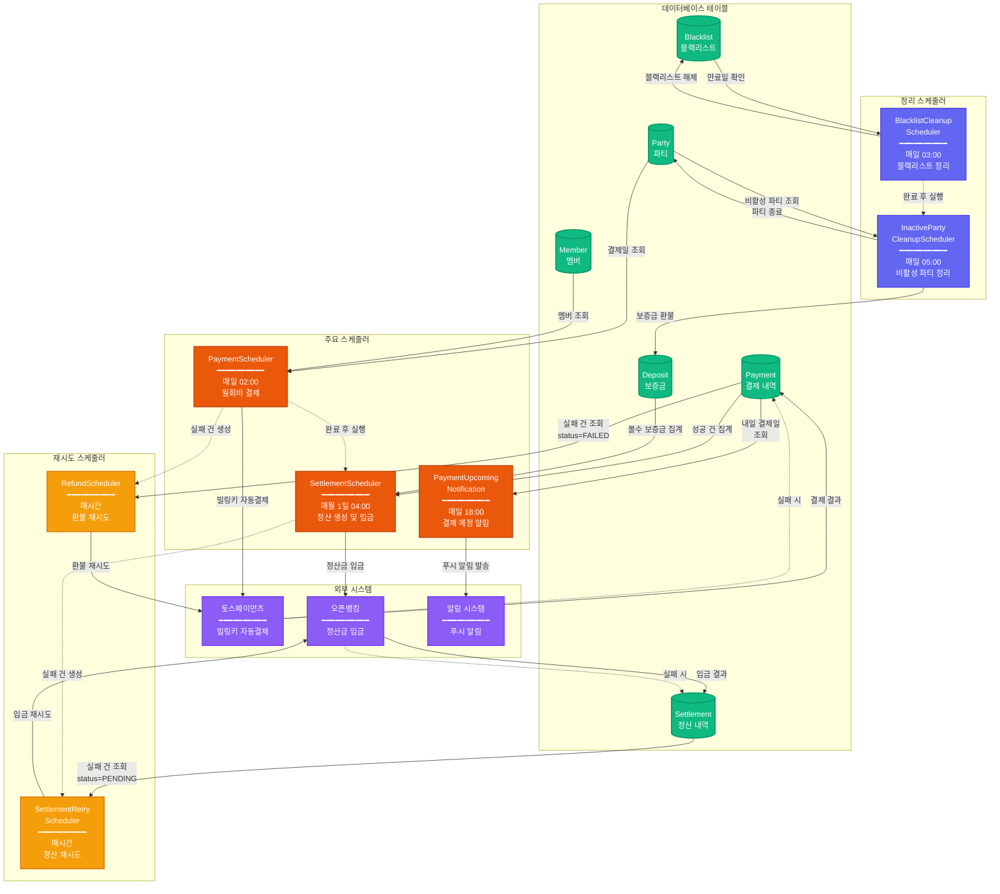
```mermaid
graph TB
    subgraph "데이터베이스 테이블"
        T1[(Payment<br/>결제 내역)]
        T2[(Settlement<br/>정산 내역)]
        T3[(Deposit<br/>보증금)]
        T4[(Party<br/>파티)]
        T5[(Member<br/>멤버)]
        T6[(Blacklist<br/>블랙리스트)]
    end

    subgraph "주요 스케줄러"
        S1[PaymentScheduler<br/>━━━━━━━━━━<br/>매일 02:00<br/>월회비 결제]
        S2[SettlementScheduler<br/>━━━━━━━━━━<br/>매월 1일 04:00<br/>정산 생성 및 입금]
        S3[PaymentUpcoming<br/>Notification<br/>━━━━━━━━━━<br/>매일 18:00<br/>결제 예정 알림]
    end

    subgraph "재시도 스케줄러"
        R1[SettlementRetry<br/>Scheduler<br/>━━━━━━━━━━<br/>매시간<br/>정산 재시도]
        R2[RefundScheduler<br/>━━━━━━━━━━<br/>매시간<br/>환불 재시도]
    end

    subgraph "정리 스케줄러"
        C1[BlacklistCleanup<br/>Scheduler<br/>━━━━━━━━━━<br/>매일 03:00<br/>블랙리스트 정리]
        C2[InactiveParty<br/>CleanupScheduler<br/>━━━━━━━━━━<br/>매일 05:00<br/>비활성 파티 정리]
    end

    subgraph "외부 시스템"
        E1[토스페이먼츠<br/>━━━━━━━━━━<br/>빌링키 자동결제]
        E2[오픈뱅킹<br/>━━━━━━━━━━<br/>정산금 입금]
        E3[알림 시스템<br/>━━━━━━━━━━<br/>푸시 알림]
    end

    %% 주요 플로우: 결제 → 정산
    T4 -->|결제일 조회| S1
    T5 -->|멤버 조회| S1
    S1 -->|빌링키 자동결제| E1
    E1 -->|결제 결과| T1

    T1 -->|성공 건 집계| S2
    T3 -->|몰수 보증금 집계| S2
    S2 -->|정산금 입금| E2
    E2 -->|입금 결과| T2

    %% 재시도 메커니즘
    T1 -->|실패 건 조회<br/>status=FAILED| R2
    R2 -->|환불 재시도| E1
    E1 -.실패 시.-> T1

    T2 -->|실패 건 조회<br/>status=PENDING| R1
    R1 -->|입금 재시도| E2
    E2 -.실패 시.-> T2

    %% 알림 플로우
    T1 -->|내일 결제일<br/>조회| S3
    S3 -->|푸시 알림 발송| E3

    %% 정리 플로우
    T6 -->|만료일 확인| C1
    C1 -->|블랙리스트 해제| T6

    T4 -->|비활성 파티 조회| C2
    C2 -->|파티 종료| T4
    C2 -->|보증금 환불| T3

    %% 의존성 표시
    S1 -.완료 후 실행.-> S2
    S1 -.실패 건 생성.-> R2
    S2 -.실패 건 생성.-> R1
    C1 -.완료 후 실행.-> C2

    %% 스타일링
    classDef schedulerStyle fill:#ea580c,stroke:#c2410c,stroke-width:2px,color:#fff
    classDef retryStyle fill:#f59e0b,stroke:#d97706,stroke-width:2px,color:#fff
    classDef cleanupStyle fill:#6366f1,stroke:#4f46e5,stroke-width:2px,color:#fff
    classDef tableStyle fill:#10b981,stroke:#059669,stroke-width:2px,color:#fff
    classDef externalStyle fill:#8b5cf6,stroke:#7c3aed,stroke-width:2px,color:#fff

    class S1,S2,S3 schedulerStyle
    class R1,R2 retryStyle
    class C1,C2 cleanupStyle
    class T1,T2,T3,T4,T5,T6 tableStyle
    class E1,E2,E3 externalStyle
```

**스케줄러 간 의존 관계 상세:**

| 선행 스케줄러 | 후행 스케줄러 | 의존 관계 | 이유 |
|--------------|--------------|-----------|------|
| **PaymentScheduler** | **SettlementScheduler** | 강한 의존성 | 정산은 결제 완료 후에만 가능 (2시간 간격) |
| **PaymentScheduler** | **RefundScheduler** | 데이터 생성 | 결제 실패 시 환불 재시도 대상 생성 |
| **SettlementScheduler** | **SettlementRetryScheduler** | 데이터 생성 | 정산 실패 시 재시도 대상 생성 |
| **BlacklistCleanupScheduler** | **InactivePartyCleanupScheduler** | 순차 실행 | 블랙리스트 정리 후 파티 정리 (30분 간격) |
| **PaymentScheduler** | **PaymentUpcomingNotification** | 독립 | 서로 영향 없음 (16시간 간격) |

**데이터 흐름 예시 (월회비 결제 → 정산):**

```
1단계: PaymentScheduler 실행 (매일 02:00)
━━━━━━━━━━━━━━━━━━━━━━━━━━━━━━━━
① Party 테이블에서 payment_date=오늘인 파티 조회
② Member 테이블에서 해당 파티의 멤버 조회
③ 각 멤버의 빌링키로 토스페이먼츠 자동결제 호출
④ 결제 결과를 Payment 테이블에 INSERT
   - 성공: status='SUCCESS'
   - 실패: status='FAILED', retry_count=0

2단계: SettlementScheduler 실행 (매월 1일 04:00)
━━━━━━━━━━━━━━━━━━━━━━━━━━━━━━━━
① Payment 테이블에서 지난달 성공 건 집계
   SELECT SUM(amount) FROM payment
   WHERE created_at BETWEEN '2024-11-01' AND '2024-11-30'
     AND status = 'SUCCESS'
   → 총 수익: 120,000원

② Deposit 테이블에서 몰수 보증금 집계
   SELECT SUM(amount) FROM deposit
   WHERE status = 'FORFEITED'
     AND forfeited_at BETWEEN '2024-11-01' AND '2024-11-30'
   → 몰수 금액: 8,000원

③ 정산금 계산
   총 수익: 120,000 + 8,000 = 128,000원
   수수료 (15%): 128,000 × 0.15 = 19,200원
   정산금: 128,000 - 19,200 = 108,800원

④ Settlement 테이블에 INSERT
   INSERT INTO settlement (user_id, amount, status)
   VALUES ('leader1', 108800, 'PENDING')

⑤ 오픈뱅킹 API 호출하여 입금
   - 성공: status='COMPLETED'
   - 실패: status='PENDING', retry_count=0

3단계: SettlementRetryScheduler 실행 (매시간, 실패 시만)
━━━━━━━━━━━━━━━━━━━━━━━━━━━━━━━━
① Settlement 테이블에서 실패 건 조회
   SELECT * FROM settlement
   WHERE status = 'PENDING' AND retry_count < 4

② 오픈뱅킹 재시도
   - 성공: status='COMPLETED'
   - 실패: retry_count++ (최대 4회)

③ 4회 실패 시 관리자 알림
   status='FAILED' → 관리자 대시보드 알림
```

**실패 시 재시도 메커니즘:**

```
PaymentScheduler 결제 실패 시:
━━━━━━━━━━━━━━━━━━━━━━━━━━━━━━━━
Payment 테이블 INSERT:
- status: 'FAILED'
- retry_count: 0
- fail_reason: '카드 한도 초과'

→ RefundScheduler (매시간 실행)
  ① retry_count < 4 조회
  ② 토스페이먼츠 결제 재시도
  ③ 성공 → status='SUCCESS'
     실패 → retry_count++
  ④ retry_count=4 → 보증금 몰수 (FORFEITED)

SettlementScheduler 입금 실패 시:
━━━━━━━━━━━━━━━━━━━━━━━━━━━━━━━━
Settlement 테이블 INSERT:
- status: 'PENDING'
- retry_count: 0
- fail_reason: '예금주 불일치'

→ SettlementRetryScheduler (매시간 실행)
  ① retry_count < 4 조회
  ② 오픈뱅킹 입금 재시도
  ③ 성공 → status='COMPLETED'
     실패 → retry_count++
  ④ retry_count=4 → status='FAILED', 관리자 알림
```

**스케줄러 실행 순서의 중요성:**

```
❌ 잘못된 순서:
04:00 SettlementScheduler (정산)
02:00 PaymentScheduler (결제)
→ 정산 시점에 결제 데이터가 아직 없음!
→ 정산 금액 0원으로 계산됨 (심각한 오류)

✅ 올바른 순서:
02:00 PaymentScheduler (결제)
  → Payment 테이블에 데이터 생성
  → 2시간 대기
04:00 SettlementScheduler (정산)
  → Payment 테이블 조회 (데이터 존재)
  → 정확한 정산 금액 계산
```

**동시 실행 방지 (DB Lock):**

```java
// SettlementScheduler.java
@Scheduled(cron = "0 0 4 1 * *") // 매월 1일 04:00
public void executeMonthlySettlement() {
    // DB Lock 획득 시도
    boolean lockAcquired = lockService.tryLock("settlement_lock", 10);

    if (!lockAcquired) {
        log.warn("Settlement already running. Skipping...");
        return; // 중복 실행 방지
    }

    try {
        // 정산 로직 실행
        settlementService.createMonthlySettlement();
    } finally {
        // Lock 해제
        lockService.unlock("settlement_lock");
    }
}
```

**스케줄러 모니터링 대시보드:**

```
관리자 대시보드 - 스케줄러 상태
━━━━━━━━━━━━━━━━━━━━━━━━━━━━━━━━
PaymentScheduler:
  마지막 실행: 2024-12-15 02:00
  처리 건수: 380건
  성공: 360건 (95%)
  실패: 20건 (재시도 중)
  다음 실행: 2024-12-16 02:00

SettlementScheduler:
  마지막 실행: 2024-12-01 04:00
  처리 건수: 45건
  성공: 44건 (98%)
  실패: 1건 (재시도 4회 실패 - 수동 처리 필요)
  다음 실행: 2025-01-01 04:00

RefundScheduler:
  마지막 실행: 2024-12-15 15:00
  처리 건수: 5건
  성공: 5건 (100%)
  다음 실행: 2024-12-15 16:00
```

### 4.6 로깅 및 모니터링 시스템 ⭐

**운영 안정성 확보를 위한 3계층 로깅 시스템**

#### 🌟 일반인을 위한 쉬운 설명

**"로깅이 뭔가요?"**

로깅(Logging)은 **시스템에서 일어나는 모든 일을 기록하는 것**입니다.

실생활 비유:
```
로깅 = 블랙박스
- 자동차 블랙박스: 운전 중 모든 상황 녹화
- 시스템 로그: 프로그램 실행 중 모든 동작 기록

사고 발생 시:
- 블랙박스 영상 확인 → 사고 원인 파악
- 로그 파일 확인 → 에러 원인 분석
```

**"왜 로깅이 중요한가요?"**

4beans-moa는 **금융 거래**를 다루는 시스템입니다. 문제가 생기면 큰일납니다:

```
로그가 없다면:
사용자: "결제가 안 됐어요!"
개발자: "언제요? 어떤 에러였나요? 카드는 뭐였나요?"
사용자: "모르겠어요..."
→ 원인 파악 불가능, 문제 해결 못 함

로그가 있다면:
사용자: "결제가 안 됐어요!"
개발자: (로그 확인)
→ 2024-12-15 02:05:32 [ERROR] 카드 한도 초과
→ "카드 한도 초과 에러입니다. 한도를 늘려주세요"
→ 즉시 해결!
```

**"어떤 정보를 기록하나요?"**

4beans-moa는 **3계층 로깅 시스템**을 사용합니다:

**1. 서비스 로깅 (LogAspect)**
```
기록 내용:
- 어떤 기능이 실행되었는지
- 실행 시간이 얼마나 걸렸는지
- 성공했는지, 실패했는지
- 에러가 발생했다면 무엇인지

예시 로그:
▶ PaymentService.createMonthlyPayment START
   - 파티 ID: 123
   - 금액: 4,000원
   - 실행 시간: 245ms
◀ PaymentService.createMonthlyPayment SUCCESS

느린 실행 경고:
▶ SettlementService.createMonthlySettlement START
   - 실행 시간: 3,500ms
◀ SLOW WARNING: 3초 이상 걸림! (최적화 필요)
```

**2. HTTP 요청 로깅 (LoggingFilter)**
```
기록 내용:
- 누가 (사용자 ID)
- 언제 (시간)
- 무엇을 (API 경로)
- 어떻게 (POST, GET)
- 요청했는지

예시 로그:
[TraceId: abc123xy] /api/payments/123 (GET)
- 사용자: john_doe
- IP: 123.45.67.89
- 브라우저: Chrome 120
- 응답 시간: 120ms
- 결과: 200 OK

TraceId로 추적:
abc123xy - /api/payments/123 요청 받음
abc123xy - PaymentService.getPaymentDetail 실행
abc123xy - Database 조회 완료
abc123xy - 응답 전송 (200 OK)
→ 하나의 요청에 대한 전체 흐름 추적 가능!
```

**3. 로그인 이력 추적 (LoginHistory)**
```
기록 내용:
- 누가 로그인했는지
- 성공/실패 여부
- 어디서 접속했는지 (IP, 위치)
- 실패했다면 이유는 무엇인지

예시:
✅ 로그인 성공:
- 사용자: john_doe
- 시간: 2024-12-15 10:30:15
- IP: 123.45.67.89 (서울)
- 기기: iPhone 15

❌ 로그인 실패:
- 사용자: hacker123
- 시간: 2024-12-15 03:00:00
- IP: 200.1.2.3 (브라질)
- 실패 이유: 비밀번호 5회 오류
→ 해킹 시도 의심! 계정 잠금
```

**"민감 정보는 어떻게 보호하나요?"**

로그에 비밀번호나 카드번호가 그대로 기록되면 보안 사고입니다!

4beans-moa의 **자동 마스킹** 기능:
```
마스킹 전 (위험!):
password: mySecret123!
cardNumber: 1234-5678-9012-3456
token: eyJhbGciOiJIUzI1NiIsInR5cCI6IkpXVCJ9...

마스킹 후 (안전!):
password: ****
cardNumber: ****-****-****-3456 (뒤 4자리만)
token: ey****...
billingKey: HIDDEN
```

마스킹 대상:
- `password`, `pwd`, `pass`
- `token`, `accessToken`, `refreshToken`
- `billingKey`, `cardNumber`, `cvv`
- `secret`, `key`

**"TraceId가 뭔가요?"**

TraceId는 **요청마다 부여되는 고유 번호**입니다.

실생활 비유:
```
= 택배 송장 번호
- 주문 → 출고 → 배송 중 → 배송 완료
- 송장 번호로 전체 과정 추적

= TraceId
- API 요청 → 서비스 실행 → DB 조회 → 응답
- TraceId로 전체 흐름 추적
```

예시:
```
[abc123xy] 사용자가 /api/parties/123 요청
[abc123xy] PartyService.getPartyDetail 실행
[abc123xy] PartyDao.findById 실행
[abc123xy] Member 정보 조회
[abc123xy] Payment 정보 조회
[abc123xy] 응답 JSON 생성
[abc123xy] 200 OK 응답 전송

→ 하나의 요청이 어떻게 처리되었는지 한눈에 파악!
→ 에러 발생 시 어느 단계에서 문제가 생겼는지 즉시 확인
```

#### 📊 TraceId 흐름 다이어그램

**하나의 요청이 시스템을 통과하는 전체 과정을 TraceId로 추적:**

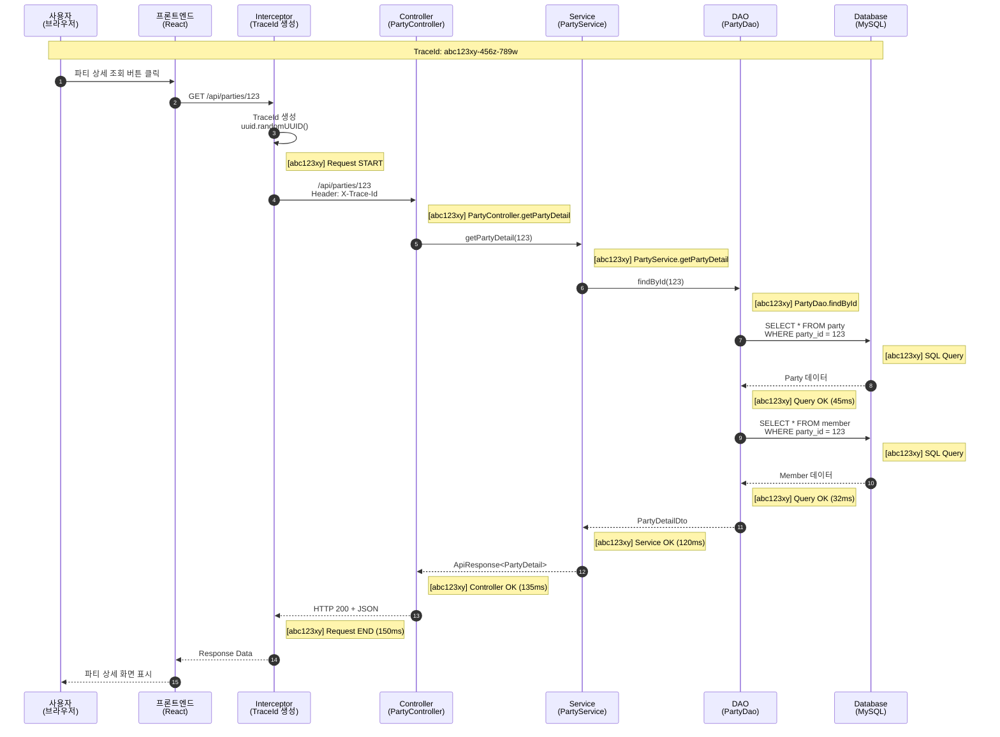
```mermaid
sequenceDiagram
    autonumber
    participant U as 사용자<br/>(브라우저)
    participant F as 프론트엔드<br/>(React)
    participant I as Interceptor<br/>(TraceId 생성)
    participant C as Controller<br/>(PartyController)
    participant S as Service<br/>(PartyService)
    participant D as DAO<br/>(PartyDao)
    participant DB as Database<br/>(MySQL)

    Note over U,DB: TraceId: abc123xy-456z-789w

    U->>F: 파티 상세 조회 버튼 클릭
    F->>I: GET /api/parties/123
    I->>I: TraceId 생성<br/>uuid.randomUUID()
    Note right of I: [abc123xy] Request START

    I->>C: /api/parties/123<br/>Header: X-Trace-Id
    Note right of C: [abc123xy] PartyController.getPartyDetail

    C->>S: getPartyDetail(123)
    Note right of S: [abc123xy] PartyService.getPartyDetail

    S->>D: findById(123)
    Note right of D: [abc123xy] PartyDao.findById

    D->>DB: SELECT * FROM party<br/>WHERE party_id = 123
    Note right of DB: [abc123xy] SQL Query

    DB-->>D: Party 데이터
    Note right of D: [abc123xy] Query OK (45ms)

    D->>DB: SELECT * FROM member<br/>WHERE party_id = 123
    Note right of DB: [abc123xy] SQL Query

    DB-->>D: Member 데이터
    Note right of D: [abc123xy] Query OK (32ms)

    D-->>S: PartyDetailDto
    Note right of S: [abc123xy] Service OK (120ms)

    S-->>C: ApiResponse<PartyDetail>
    Note right of C: [abc123xy] Controller OK (135ms)

    C-->>I: HTTP 200 + JSON
    Note right of I: [abc123xy] Request END (150ms)

    I-->>F: Response Data
    F-->>U: 파티 상세 화면 표시
```

**로그 파일에 기록된 내용 (같은 TraceId로 묶임):**

| 시간 | 레벨 | TraceId | 내용 | 실행 시간 |
|------|------|---------|------|-----------|
| 10:30:15.001 | INFO | abc123xy | HTTP Request: GET /api/parties/123 | - |
| 10:30:15.005 | DEBUG | abc123xy | ▶ PartyController.getPartyDetail ARGS: [123] | - |
| 10:30:15.010 | DEBUG | abc123xy | ▶ PartyService.getPartyDetail ARGS: [123] | - |
| 10:30:15.015 | DEBUG | abc123xy | ▶ PartyDao.findById ARGS: [123] | - |
| 10:30:15.060 | DEBUG | abc123xy | ◀ PartyDao.findById OK: 45ms | 45ms |
| 10:30:15.065 | DEBUG | abc123xy | ▶ PartyDao.findMembers ARGS: [123] | - |
| 10:30:15.097 | DEBUG | abc123xy | ◀ PartyDao.findMembers OK: 32ms | 32ms |
| 10:30:15.130 | DEBUG | abc123xy | ◀ PartyService.getPartyDetail OK: 120ms | 120ms |
| 10:30:15.140 | DEBUG | abc123xy | ◀ PartyController.getPartyDetail OK: 135ms | 135ms |
| 10:30:15.151 | INFO | abc123xy | HTTP Response: 200 OK (150ms) | 150ms |

**TraceId의 장점:**

1. **전체 흐름 추적**: 하나의 요청이 시스템 전체를 어떻게 통과했는지 한눈에 파악
2. **병목 지점 발견**: 어느 단계에서 시간이 오래 걸렸는지 즉시 확인 (PartyDao.findById 45ms)
3. **에러 원인 분석**: 에러 발생 시 정확히 어느 단계에서 문제가 생겼는지 확인
4. **동시 요청 구분**: 여러 사용자의 요청이 섞여도 TraceId로 구분 가능
5. **성능 모니터링**: 전체 처리 시간 및 각 단계별 실행 시간 측정

**실제 활용 예시:**

```
상황: 사용자가 "파티 상세 페이지가 느려요"라고 신고

1. 관리자 대시보드에서 느린 요청 검색
2. TraceId: abc123xy 발견 (전체 실행 시간: 5초)
3. 로그 파일에서 해당 TraceId 검색
4. 분석 결과:
   - PartyDao.findById: 45ms ✅
   - PartyDao.findMembers: 4,800ms ❌ (문제 발견!)
   - 원인: Member 테이블에 인덱스 없음
5. 해결: member 테이블에 party_id 인덱스 추가
6. 결과: 4,800ms → 50ms로 개선 (96% 성능 향상)
```

**"로그를 어떻게 확인하나요?"**

로그는 **파일과 콘솔** 두 곳에 저장됩니다:

```
파일 저장:
logs/
├── application.log       (모든 로그)
├── error.log            (에러만)
└── login-history.log    (로그인 이력)

보관 기간:
- 최근 30일: 전체 보관
- 31~90일: 압축 보관 (.gz)
- 90일 이후: 자동 삭제
```

관리자 대시보드:
```
실시간 모니터링:
- 최근 1시간 에러 발생 건수
- 느린 API 목록 (3초 이상)
- 로그인 실패 급증 알림 (해킹 의심)

로그 검색:
- TraceId로 검색 → 요청 전체 흐름 확인
- 사용자 ID로 검색 → 특정 사용자의 모든 활동
- 시간대로 검색 → 특정 시간의 모든 이벤트
```

**"프로덕션 수준이란?"**

4beans-moa의 로깅은 **실제 운영 서비스 수준**입니다:

```
토이 프로젝트:
System.out.println("결제 완료"); // 간단한 출력

프로덕션 수준:
log.info("[{}] PaymentService.createMonthlyPayment SUCCESS -
         userId: {}, partyId: {}, amount: {}, executionTime: {}ms",
         traceId, userId, partyId, amount, executionTime);

차이점:
1. 구조화된 로그 (검색/분석 가능)
2. 레벨 구분 (DEBUG, INFO, WARN, ERROR)
3. 민감 정보 자동 마스킹
4. TraceId로 요청 추적
5. 파일로 영구 보관
6. 로그 로테이션 (자동 정리)
```

**"로그 레벨이 뭔가요?"**

로그는 **중요도에 따라 레벨**이 다릅니다:

```
DEBUG (디버그):
- 가장 상세한 정보
- 개발 중에만 사용
- 예: "메서드 시작, 파라미터: x, y, z"

INFO (정보):
- 일반적인 정보
- 운영 중 중요한 이벤트
- 예: "결제 성공, 정산 완료"

WARN (경고):
- 문제는 아니지만 주의 필요
- 예: "실행 시간 3초 초과, 재시도 1회 실행"

ERROR (에러):
- 에러 발생
- 즉시 확인 필요
- 예: "결제 실패, DB 연결 끊김"
```

---

#### 4.6.1 AOP 기반 서비스 로깅 (LogAspect)

**모든 서비스 메서드 실행을 자동으로 추적하는 Aspect**

```java
// LogAspect.java
@Slf4j
@Aspect
@Component
public class LogAspect {

    private static final long SLOW_EXECUTION_THRESHOLD_MS = 3000; // 3초

    /**
     * 모든 서비스 레이어 메서드 실행 로깅
     */
    @Around("execution(* com.moa.service..*(..))")
    public Object logServiceExecution(ProceedingJoinPoint pjp) throws Throwable {
        MethodSignature signature = (MethodSignature) pjp.getSignature();
        String className = signature.getDeclaringType().getSimpleName();
        String methodName = signature.getName();
        String fullName = className + "." + methodName;

        // DEBUG 레벨: 메서드 시작 (민감 정보 마스킹)
        if (log.isDebugEnabled()) {
            String args = maskSensitiveArgs(pjp.getArgs());
            log.debug("▶ {} ARGS: {}", fullName, args);
        }

        long startTime = System.currentTimeMillis();

        try {
            Object result = pjp.proceed();
            long executionTime = System.currentTimeMillis() - startTime;

            // 느린 실행 경고 (3초 이상)
            if (executionTime > SLOW_EXECUTION_THRESHOLD_MS) {
                log.warn("◀ {} SLOW: {}ms", fullName, executionTime);
            } else if (log.isDebugEnabled()) {
                log.debug("◀ {} OK: {}ms", fullName, executionTime);
            }

            return result;

        } catch (Throwable t) {
            long executionTime = System.currentTimeMillis() - startTime;
            log.error("✖ {} FAILED: {}ms - {}: {}",
                fullName, executionTime,
                t.getClass().getSimpleName(), t.getMessage());
            throw t;
        }
    }

    /**
     * 결제/정산 관련 메서드는 INFO 레벨로 항상 로깅
     */
    @Around("execution(* com.moa.service.payment..*(..)) || " +
            "execution(* com.moa.service.settlement..*(..)) || " +
            "execution(* com.moa.service.deposit..*(..))")
    public Object logPaymentExecution(ProceedingJoinPoint pjp) throws Throwable {
        String fullName = /* ... */;

        log.info("💰 [PAYMENT] ▶ {}", fullName);

        try {
            Object result = pjp.proceed();
            long executionTime = System.currentTimeMillis() - startTime;
            log.info("💰 [PAYMENT] ◀ {} OK: {}ms", fullName, executionTime);
            return result;
        } catch (Throwable t) {
            log.error("💰 [PAYMENT] ✖ {} FAILED: {}ms", fullName, executionTime);
            throw t;
        }
    }
}
```

**핵심 기능:**
- ✅ **자동 로깅**: 모든 서비스 메서드 자동 추적
- ✅ **성능 모니터링**: 실행 시간 측정, 3초 이상 경고
- ✅ **민감 정보 보호**: password, token, billingKey 자동 마스킹
- ✅ **중요 거래 강조**: 결제/정산은 INFO 레벨로 항상 기록

#### 4.6.2 HTTP 요청 추적 (LoggingFilter)

**모든 HTTP 요청에 TraceId를 부여해 추적 가능하게 만드는 필터**

```java
// LoggingFilter.java
@Slf4j
@Component
@Order(Ordered.HIGHEST_PRECEDENCE)
public class LoggingFilter extends OncePerRequestFilter {

    private static final String TRACE_ID_KEY = "traceId";
    private static final String USER_ID_KEY = "userId";

    @Override
    protected void doFilterInternal(
            HttpServletRequest request,
            HttpServletResponse response,
            FilterChain filterChain) throws ServletException, IOException {

        long startTime = System.currentTimeMillis();

        // TraceId 생성 (8자리 UUID)
        String traceId = generateTraceId();

        try {
            // MDC에 TraceId, UserId, RequestUri 설정
            MDC.put(TRACE_ID_KEY, traceId);
            MDC.put(REQUEST_URI_KEY, request.getRequestURI());

            // Response Header에 TraceId 추가 (프론트엔드 참조 가능)
            response.setHeader("X-Trace-Id", traceId);

            // UserId 설정
            updateUserIdInMDC();

            // 요청 로깅
            String method = request.getMethod();
            String uri = request.getRequestURI();
            String clientIp = getClientIp(request);
            log.info(">>> {} {} [IP: {}]", method, uri, clientIp);

            // 필터 체인 실행
            filterChain.doFilter(request, response);

            // 응답 로깅
            long duration = System.currentTimeMillis() - startTime;
            int status = response.getStatus();
            log.info("<<< {} {} - {}ms", status, uri, duration);

        } finally {
            // MDC 정리 (메모리 누수 방지)
            MDC.clear();
        }
    }

    /**
     * SecurityContext에서 UserId를 가져와 MDC에 설정
     */
    private void updateUserIdInMDC() {
        Authentication authentication = SecurityContextHolder
            .getContext().getAuthentication();
        if (authentication != null && authentication.isAuthenticated()) {
            String userId = authentication.getName();
            MDC.put(USER_ID_KEY, userId);
        } else {
            MDC.put(USER_ID_KEY, "anonymous");
        }
    }

    /**
     * 클라이언트 IP 추출 (프록시 환경 고려)
     */
    private String getClientIp(HttpServletRequest request) {
        String ip = request.getHeader("X-Forwarded-For");
        if (ip == null || ip.isEmpty()) {
            ip = request.getHeader("X-Real-IP");
        }
        if (ip == null || ip.isEmpty()) {
            ip = request.getRemoteAddr();
        }
        // X-Forwarded-For에 여러 IP가 있는 경우 첫 번째 IP 사용
        if (ip != null && ip.contains(",")) {
            ip = ip.split(",")[0].trim();
        }
        return ip;
    }
}
```

**핵심 기능:**
- ✅ **TraceId 생성**: 모든 요청에 고유 ID 부여
- ✅ **MDC 활용**: 로그 전체에 TraceId, UserId 자동 포함
- ✅ **요청/응답 추적**: 실행 시간, 상태 코드, IP 기록
- ✅ **프론트엔드 연동**: Response Header에 TraceId 추가

**로그 출력 예시:**
```
[traceId: a3b4c5d6] [userId: user123] [requestUri: /api/parties/1]
>>> GET /api/parties/1 [IP: 192.168.1.10]

[traceId: a3b4c5d6] [userId: user123]
▶ PartyServiceImpl.getPartyDetail ARGS: [1]

[traceId: a3b4c5d6] [userId: user123]
◀ PartyServiceImpl.getPartyDetail OK: 45ms

[traceId: a3b4c5d6] [userId: user123]
<<< 200 /api/parties/1 - 52ms
```

#### 4.6.3 로그인 이력 추적 (LoginHistory)

**보안 감사를 위한 로그인 이력 DB 저장**

```java
// LoginHistoryServiceImpl.java
@Service
@Transactional
public class LoginHistoryServiceImpl implements LoginHistoryService {

    private final LoginHistoryDao loginHistoryDao;

    @Override
    public void recordSuccess(
            String userId,
            String loginType,
            String loginIp,
            String userAgent) {

        LoginHistory history = LoginHistory.builder()
            .userId(userId.toLowerCase())
            .loginAt(LocalDateTime.now())
            .success(1)
            .loginIp(loginIp)
            .userAgent(userAgent)
            .loginType(loginType)  // NORMAL, KAKAO, GOOGLE, OTP
            .build();

        loginHistoryDao.insert(history);
    }

    @Override
    public void recordFailure(
            String userId,
            String loginType,
            String loginIp,
            String userAgent,
            String failReason) {

        LoginHistory history = LoginHistory.builder()
            .userId(userId.toLowerCase())
            .loginAt(LocalDateTime.now())
            .success(0)
            .loginIp(loginIp)
            .userAgent(userAgent)
            .failReason(failReason)  // 실패 사유 기록
            .loginType(loginType)
            .build();

        loginHistoryDao.insert(history);
    }

    @Override
    @Transactional(readOnly = true)
    public PageResponse<LoginHistoryResponse> getMyLoginHistory(
            int page, int size) {

        String userId = getCurrentUserId();

        long total = loginHistoryDao.countByUserId(userId);
        List<LoginHistory> list = loginHistoryDao.findByUserId(
            userId, offset, size);

        return new PageResponse<>(list, page, size, total);
    }
}
```

**LOGIN_HISTORY 테이블:**
```sql
CREATE TABLE LOGIN_HISTORY (
    ID BIGINT PRIMARY KEY AUTO_INCREMENT,
    USER_ID VARCHAR(50) NOT NULL,
    LOGIN_AT DATETIME NOT NULL,
    SUCCESS TINYINT NOT NULL,       -- 1: 성공, 0: 실패
    LOGIN_IP VARCHAR(45),            -- IPv6 지원
    USER_AGENT VARCHAR(500),
    FAIL_REASON VARCHAR(200),        -- 실패 사유
    LOGIN_TYPE VARCHAR(20),          -- NORMAL, KAKAO, GOOGLE, OTP

    INDEX IDX_USER_LOGIN (USER_ID, LOGIN_AT DESC)
);
```

**활용 사례:**
- 🔒 **보안 감사**: 비정상 로그인 패턴 감지
- 📊 **통계 분석**: 로그인 방식별 사용자 선호도
- 🚨 **이상 탐지**: 동일 IP에서 다수 실패 시 알림
- 👤 **사용자 확인**: 내 로그인 이력 조회 기능

#### 4.6.4 로깅 시스템 전체 플로우

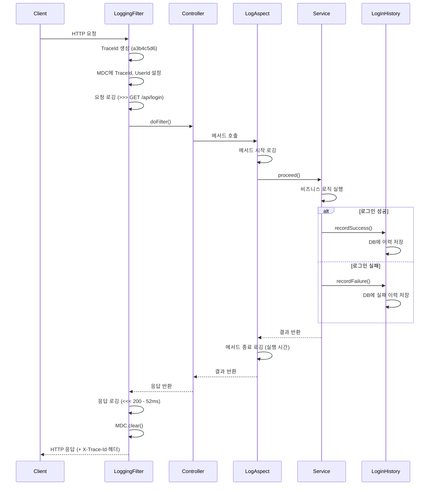
```mermaid
sequenceDiagram
    participant C as Client
    participant F as LoggingFilter
    participant Ctrl as Controller
    participant A as LogAspect
    participant S as Service
    participant LH as LoginHistory

    C->>F: HTTP 요청
    F->>F: TraceId 생성 (a3b4c5d6)
    F->>F: MDC에 TraceId, UserId 설정
    F->>F: 요청 로깅 (>>> GET /api/login)

    F->>Ctrl: doFilter()
    Ctrl->>A: 메서드 호출

    A->>A: 메서드 시작 로깅
    A->>S: proceed()
    S->>S: 비즈니스 로직 실행

    alt 로그인 성공
        S->>LH: recordSuccess()
        LH->>LH: DB에 이력 저장
    else 로그인 실패
        S->>LH: recordFailure()
        LH->>LH: DB에 실패 이력 저장
    end

    S-->>A: 결과 반환
    A->>A: 메서드 종료 로깅 (실행 시간)
    A-->>Ctrl: 결과 반환

    Ctrl-->>F: 응답 반환
    F->>F: 응답 로깅 (<<< 200 - 52ms)
    F->>F: MDC.clear()
    F-->>C: HTTP 응답 (+ X-Trace-Id 헤더)
```

**로깅 시스템의 장점:**

| 기능 | 구현 방식 | 효과 |
|------|----------|------|
| **요청 추적** | TraceId + MDC | 분산 요청도 전체 흐름 파악 |
| **성능 모니터링** | 실행 시간 측정 | 병목 구간 즉시 발견 |
| **보안 감사** | LoginHistory DB | 비정상 접근 패턴 분석 |
| **에러 디버깅** | 스택 트레이스 + 파라미터 | 재현 없이 원인 파악 |
| **민감 정보 보호** | 자동 마스킹 | 로그 유출 시에도 안전 |

**실제 로그 예시 (프로덕션 환경):**

```
2024-12-15 02:00:01.234 INFO  [traceId: f7e8d9c0] [userId: system]
>>> SCHEDULED PaymentScheduler.runDailyPayments

2024-12-15 02:00:01.456 INFO  [traceId: f7e8d9c0]
💰 [PAYMENT] ▶ PaymentServiceImpl.processMonthlyPayment

2024-12-15 02:00:03.789 WARN  [traceId: f7e8d9c0]
◀ PaymentServiceImpl.processMonthlyPayment SLOW: 3333ms

2024-12-15 02:00:03.800 ERROR [traceId: f7e8d9c0]
💰 [PAYMENT] ✖ PaymentServiceImpl.processMonthlyPayment FAILED: 3344ms
- TossPaymentException: INSUFFICIENT_BALANCE
```

### 4.7 프론트엔드 구현 ⭐

**React 19 + AI 협업 개발 방식으로 구축한 사용자 인터페이스**

프론트엔드는 단순히 "예쁜 화면"을 만드는 것이 아닙니다. 사용자가 복잡한 결제, 정산, 파티 관리 기능을 **직관적으로 이해하고 쉽게 사용**할 수 있도록 만드는 것이 핵심입니다.

#### 4.7.1 React 컴포넌트 아키텍처

**React를 선택한 이유**

React는 현재 가장 널리 사용되는 프론트엔드 라이브러리입니다. 하지만 단순히 "많이 쓰니까" 선택한 것이 아닙니다:

1. **컴포넌트 기반**: 파티 카드, 결제 폼, 정산 내역 등을 독립적인 컴포넌트로 만들어 재사용
2. **Virtual DOM**: 데이터 변경 시 전체 페이지가 아닌 변경된 부분만 다시 그려서 빠름
3. **풍부한 생태계**: Tailwind, Framer Motion, shadcn/ui 등 필요한 도구가 모두 있음
4. **개발자 경험**: Hot Reload로 코드 수정 즉시 브라우저에 반영

**폴더 구조 설계**

협업 프로젝트에서 가장 중요한 것은 **"서로의 코드를 망가뜨리지 않는 것"**입니다. 이를 위해 페이지별로 완전히 독립적인 구조로 설계했습니다:

```
src/
├── pages/                    # 페이지 컴포넌트
│   ├── party/
│   │   ├── PartyListPage.jsx        # 파티 목록
│   │   ├── PartyDetailPage.jsx      # 파티 상세
│   │   ├── PartyCreatePage.jsx      # 파티 생성
│   │   └── components/              # 파티 페이지 전용 컴포넌트
│   │       ├── PartyCard.jsx
│   │       ├── PartyFilterBar.jsx
│   │       └── PartyMemberList.jsx
│   ├── payment/
│   │   ├── MyPaymentsPage.jsx       # 내 결제 내역
│   │   └── components/
│   ├── settlement/
│   │   ├── MySettlementsPage.jsx    # 내 정산 내역
│   │   └── components/
│   └── wallet/
│       ├── MyWalletPage.jsx         # 내 지갑
│       └── components/
├── components/               # 공통 컴포넌트
│   ├── common/              # Header, Footer 등
│   └── ui/                  # shadcn/ui 컴포넌트
├── hooks/                   # 커스텀 훅
│   ├── useAuth.js
│   ├── useParty.js
│   └── usePayment.js
├── api/                     # API 호출 함수
│   ├── httpClient.js        # Axios 인스턴스
│   ├── partyApi.js
│   ├── paymentApi.js
│   └── settlementApi.js
└── stores/                  # Zustand 상태 관리
    ├── authStore.js
    ├── partyStore.js
    └── uiStore.js
```

#### 📊 React 컴포넌트 계층 다이어그램

**전체 컴포넌트 구조와 데이터 흐름:**


```mermaid
graph TB
    subgraph "Root"
        App[App.jsx<br/>라우팅 설정]
    end

    subgraph "Layout Components"
        Header[Header<br/>로그인 상태 표시]
        Footer[Footer<br/>정보 표시]
    end

    subgraph "Page Components"
        PartyList[PartyListPage<br/>파티 목록]
        PartyDetail[PartyDetailPage<br/>파티 상세]
        PartyCreate[PartyCreatePage<br/>파티 생성]
        MyPayments[MyPaymentsPage<br/>내 결제 내역]
        MySettlements[MySettlementsPage<br/>내 정산 내역]
        MyWallet[MyWalletPage<br/>내 지갑]
        Login[LoginPage<br/>로그인]
    end

    subgraph "Party Components"
        PartyCard[PartyCard<br/>파티 카드]
        PartyFilter[PartyFilterBar<br/>필터]
        PartyMembers[PartyMemberList<br/>멤버 목록]
        PartyInfo[PartyInfoCard<br/>정보 카드]
    end

    subgraph "Payment Components"
        PaymentCard[PaymentCard<br/>결제 카드]
        PaymentHistory[PaymentHistory<br/>결제 내역]
    end

    subgraph "Settlement Components"
        SettlementCard[SettlementCard<br/>정산 카드]
        SettlementDetail[SettlementDetail<br/>정산 상세]
    end

    subgraph "UI Components (shadcn/ui)"
        Button[Button]
        Card[Card]
        Dialog[Dialog]
        Input[Input]
        Badge[Badge]
        Table[Table]
    end

    subgraph "Custom Hooks"
        useAuth[useAuth<br/>인증 로직]
        useParty[useParty<br/>파티 데이터]
        usePayment[usePayment<br/>결제 데이터]
        useSettlement[useSettlement<br/>정산 데이터]
    end

    subgraph "API Layer"
        HttpClient[httpClient<br/>Axios 인스턴스]
        PartyAPI[partyApi]
        PaymentAPI[paymentApi]
        SettlementAPI[settlementApi]
    end

    subgraph "State Management (Zustand)"
        AuthStore[authStore<br/>로그인 상태]
        PartyStore[partyStore<br/>파티 상태]
        UIStore[uiStore<br/>UI 상태]
    end

    %% App → Layout
    App --> Header
    App --> Footer
    App --> PartyList
    App --> PartyDetail
    App --> PartyCreate
    App --> MyPayments
    App --> MySettlements
    App --> MyWallet
    App --> Login

    %% Pages → Components
    PartyList --> PartyCard
    PartyList --> PartyFilter
    PartyDetail --> PartyInfo
    PartyDetail --> PartyMembers
    MyPayments --> PaymentCard
    MyPayments --> PaymentHistory
    MySettlements --> SettlementCard
    MySettlements --> SettlementDetail

    %% Components → UI
    PartyCard --> Card
    PartyCard --> Badge
    PartyCard --> Button
    PartyFilter --> Input
    PaymentCard --> Table
    Login --> Dialog

    %% Pages → Hooks
    PartyList -.데이터 요청.-> useParty
    PartyDetail -.데이터 요청.-> useParty
    MyPayments -.데이터 요청.-> usePayment
    MySettlements -.데이터 요청.-> useSettlement
    Login -.인증.-> useAuth

    %% Hooks → API
    useParty --> PartyAPI
    usePayment --> PaymentAPI
    useSettlement --> SettlementAPI
    useAuth --> HttpClient

    PartyAPI --> HttpClient
    PaymentAPI --> HttpClient
    SettlementAPI --> HttpClient

    %% Hooks → Store
    useAuth -.상태 업데이트.-> AuthStore
    useParty -.상태 업데이트.-> PartyStore

    %% Store → Components
    AuthStore -.상태 구독.-> Header
    AuthStore -.상태 구독.-> Login
    PartyStore -.상태 구독.-> PartyList
    UIStore -.상태 구독.-> App

    %% Styling
    classDef appStyle fill:#ea580c,stroke:#c2410c,stroke-width:3px,color:#fff
    classDef pageStyle fill:#6366f1,stroke:#4f46e5,stroke-width:2px,color:#fff
    classDef compStyle fill:#10b981,stroke:#059669,stroke-width:2px,color:#fff
    classDef uiStyle fill:#8b5cf6,stroke:#7c3aed,stroke-width:2px,color:#fff
    classDef hookStyle fill:#f59e0b,stroke:#d97706,stroke-width:2px,color:#fff
    classDef apiStyle fill:#ec4899,stroke:#db2777,stroke-width:2px,color:#fff
    classDef storeStyle fill:#14b8a6,stroke:#0d9488,stroke-width:2px,color:#fff

    class App appStyle
    class PartyList,PartyDetail,PartyCreate,MyPayments,MySettlements,MyWallet,Login pageStyle
    class PartyCard,PartyFilter,PartyMembers,PartyInfo,PaymentCard,PaymentHistory,SettlementCard,SettlementDetail compStyle
    class Button,Card,Dialog,Input,Badge,Table uiStyle
    class useAuth,useParty,usePayment,useSettlement hookStyle
    class HttpClient,PartyAPI,PaymentAPI,SettlementAPI apiStyle
    class AuthStore,PartyStore,UIStore storeStyle
```

**컴포넌트 계층 설명:**

| 레이어 | 역할 | 예시 | 색상 |
|--------|------|------|------|
| **App (Root)** | 라우팅 및 전역 설정 | App.jsx | 🟠 Orange |
| **Pages** | 페이지 레이아웃 및 데이터 흐름 조정 | PartyListPage, MyPaymentsPage | 🔵 Indigo |
| **Components** | UI 렌더링 및 사용자 인터랙션 | PartyCard, PaymentCard | 🟢 Green |
| **UI (shadcn)** | 기본 UI 요소 (재사용 가능) | Button, Card, Dialog | 🟣 Purple |
| **Hooks** | 비즈니스 로직 및 API 호출 | useParty, usePayment | 🟡 Amber |
| **API** | HTTP 요청 관리 | partyApi, paymentApi | 🔴 Pink |
| **Store** | 전역 상태 관리 (Zustand) | authStore, partyStore | 🟦 Teal |

**데이터 흐름 예시 (파티 목록 조회):**

```
1. 사용자가 PartyListPage 방문
   ↓
2. PartyListPage가 useParty() 훅 호출
   ↓
3. useParty가 partyApi.getPartyList() 호출
   ↓
4. partyApi가 httpClient를 통해 GET /api/parties 요청
   ↓
5. 백엔드에서 데이터 응답
   ↓
6. useParty가 응답 데이터를 partyStore에 저장
   ↓
7. PartyListPage가 partyStore 구독 → 자동 리렌더링
   ↓
8. PartyCard 컴포넌트에 데이터 전달
   ↓
9. PartyCard가 shadcn/ui Card, Badge, Button으로 렌더링
```

**컴포넌트 재사용 예시:**

| 컴포넌트 | 사용 위치 | 재사용 이유 |
|----------|-----------|-------------|
| **PartyCard** | PartyListPage, MyPartiesPage | 파티 표시 형식 동일 |
| **Button** | 모든 페이지 | 일관된 버튼 스타일 |
| **Card** | PartyCard, PaymentCard, SettlementCard | 카드 레이아웃 통일 |
| **useAuth** | Header, Login, PrivateRoute | 인증 로직 중복 방지 |
| **httpClient** | 모든 API | 인터셉터 중앙 관리 |

**컴포넌트 통신 방식:**

```
Props (부모 → 자식):
PartyListPage → PartyCard
- party 데이터 전달
- onUpdate 콜백 함수 전달

Callback (자식 → 부모):
PartyCard → PartyListPage
- 파티 가입 버튼 클릭 시 onUpdate() 호출
- 부모 컴포넌트가 데이터 새로고침

Zustand Store (전역 상태):
authStore → Header, Login, PrivateRoute
- 로그인 상태를 여러 컴포넌트가 구독
- 한 곳에서 로그인하면 모든 곳에서 반영
```

**설계 원칙:**

1. **페이지별 격리**: 각 팀원이 자신의 페이지 폴더 안에서만 작업 → 충돌 최소화
2. **공통 컴포넌트 보호**: `components/common/`과 `components/ui/`는 수정 금지 → 새로 만들기
3. **명확한 책임 분리**:
   - `pages/`: 레이아웃과 데이터 흐름 관리
   - `components/`: UI 렌더링만
   - `hooks/`: 비즈니스 로직과 API 호출
   - `stores/`: 전역 상태 관리

**실제 예시: 파티 목록 페이지**

```jsx
// pages/party/PartyListPage.jsx
import { useParties } from '@/hooks/useParty';
import PartyCard from './components/PartyCard';
import PartyFilterBar from './components/PartyFilterBar';

export default function PartyListPage() {
  const { parties, isLoading, refetch } = useParties();
  const [filters, setFilters] = useState({ status: 'all', service: 'all' });

  // 필터링된 파티 목록
  const filteredParties = parties.filter(party => {
    if (filters.status !== 'all' && party.status !== filters.status) return false;
    if (filters.service !== 'all' && party.serviceName !== filters.service) return false;
    return true;
  });

  return (
    <div className="container mx-auto px-4 py-8">
      {/* 필터 바 */}
      <PartyFilterBar filters={filters} onChange={setFilters} />

      {/* 로딩 상태 */}
      {isLoading && <LoadingSkeleton />}

      {/* 파티 카드 그리드 */}
      <div className="grid grid-cols-1 md:grid-cols-2 lg:grid-cols-3 gap-6">
        {filteredParties.map(party => (
          <PartyCard key={party.partyId} party={party} onUpdate={refetch} />
        ))}
      </div>
    </div>
  );
}
```

**이렇게 하면 좋은 점:**
- 로딩 상태, 필터링, 그리드 레이아웃을 한눈에 파악 가능
- PartyCard 컴포넌트는 재사용 가능 (내 파티 목록에서도 사용)
- useParties 훅으로 API 호출 로직 분리 → 테스트 용이

#### 4.7.2 상태 관리 (Zustand) ⭐

**상태 관리가 뭔가요? (일반인을 위한 설명)**

웹 애플리케이션은 여러 페이지가 있고, 각 페이지마다 다양한 정보를 표시합니다. 예를 들어:
- 현재 로그인한 사용자 정보 (이름, 프로필 사진)
- 장바구니에 담긴 상품 개수
- 다크 모드 ON/OFF 상태

이런 정보들을 **"상태(State)"**라고 합니다. 문제는 이 상태를 **여러 페이지에서 공유**해야 한다는 것입니다.

예를 들어, 로그인 후:
- Header에 "OOO님 환영합니다" 표시
- 마이페이지에 사용자 정보 표시
- 파티 생성 시 자동으로 사용자 ID 입력

이 모든 곳에서 "현재 로그인한 사용자" 정보가 필요합니다. 이걸 각 페이지마다 따로 관리하면 동기화가 안 되고 복잡해집니다. 그래서 **"전역 상태 관리 라이브러리"**를 사용합니다.

**왜 Redux가 아닌 Zustand인가?**

React 생태계에서 가장 유명한 상태 관리 라이브러리는 Redux입니다. 하지만 Redux는 복잡합니다:

```javascript
// Redux 방식 (복잡함)
// 1. Action 정의
const LOGIN = 'LOGIN';
const LOGOUT = 'LOGOUT';

// 2. Action Creator 함수
const login = (user) => ({ type: LOGIN, payload: user });
const logout = () => ({ type: LOGOUT });

// 3. Reducer 함수
function authReducer(state = initialState, action) {
  switch (action.type) {
    case LOGIN:
      return { ...state, user: action.payload };
    case LOGOUT:
      return { ...state, user: null };
    default:
      return state;
  }
}

// 4. Store 생성
const store = createStore(authReducer);

// 5. 사용
dispatch(login(userData));
```

**5단계나 거쳐야 합니다!** 이 프로젝트는 4주 단기 프로젝트이고, 상태도 그리 복잡하지 않습니다. 그래서 **간결한 Zustand**를 선택했습니다:

```javascript
// Zustand 방식 (간결함)
import create from 'zustand';

const useAuthStore = create((set) => ({
  user: null,
  accessToken: null,
  refreshToken: null,

  // 로그인
  login: (user, accessToken, refreshToken) =>
    set({ user, accessToken, refreshToken }),

  // 로그아웃
  logout: () =>
    set({ user: null, accessToken: null, refreshToken: null })
}));

// 사용
const { user, login, logout } = useAuthStore();
```

**단 1개 파일, 20줄로 끝!**

**Zustand의 장점:**

| 특징 | Redux | Zustand |
|------|-------|---------|
| 코드 라인 수 | 100+ 줄 | 20줄 |
| 보일러플레이트 | 많음 (Action, Reducer 등) | 거의 없음 |
| 번들 크기 | 14KB | 4KB |
| 러닝 커브 | 높음 (개념 많음) | 낮음 (Hook처럼 사용) |
| TypeScript 지원 | 별도 설정 필요 | 기본 제공 |
| DevTools | 있음 | 있음 |

**실제 Store 설계: authStore**

```javascript
// stores/authStore.js
import create from 'zustand';
import { persist } from 'zustand/middleware';

/**
 * 인증 관련 전역 상태 관리
 * - 로그인/로그아웃
 * - JWT 토큰 관리
 * - localStorage에 자동 저장 (새로고침해도 유지)
 */
const useAuthStore = create(
  persist(
    (set, get) => ({
      // === 상태 ===
      user: null,              // 사용자 정보 { userId, username, email, role }
      accessToken: null,       // JWT Access Token (1시간)
      refreshToken: null,      // JWT Refresh Token (7일)
      isAuthenticated: false,  // 로그인 여부

      // === 액션 ===

      /**
       * 로그인 성공 시 호출
       */
      setUser: (user) => set({ user, isAuthenticated: true }),

      /**
       * 토큰 저장
       */
      setTokens: (accessToken, refreshToken) =>
        set({ accessToken, refreshToken }),

      /**
       * 로그아웃
       */
      logout: () => set({
        user: null,
        accessToken: null,
        refreshToken: null,
        isAuthenticated: false
      }),

      /**
       * Access Token 갱신
       */
      updateAccessToken: (newAccessToken) =>
        set({ accessToken: newAccessToken }),

      /**
       * 현재 로그인한 사용자 ID 반환 (편의 함수)
       */
      getUserId: () => get().user?.userId || null,
    }),
    {
      name: 'auth-storage', // localStorage 키 이름
      // 토큰만 저장 (보안상 민감 정보는 저장하지 않음)
      partialize: (state) => ({
        accessToken: state.accessToken,
        refreshToken: state.refreshToken,
      }),
    }
  )
);

export default useAuthStore;
```

**사용 예시:**

```jsx
// 컴포넌트에서 사용
function Header() {
  const { user, isAuthenticated, logout } = useAuthStore();

  if (!isAuthenticated) {
    return <Link to="/login">로그인</Link>;
  }

  return (
    <div>
      <span>{user.username}님 환영합니다</span>
      <button onClick={logout}>로그아웃</button>
    </div>
  );
}
```

**persist 미들웨어의 역할:**

일반적으로 웹사이트를 새로고침하면 메모리에 있던 상태가 모두 날아갑니다. 그래서 새로고침할 때마다 다시 로그인해야 하는 불편함이 있습니다.

`persist` 미들웨어는 상태를 **localStorage에 자동 저장**합니다:
1. 로그인 → accessToken, refreshToken을 localStorage에 저장
2. 새로고침 → localStorage에서 토큰을 읽어와서 상태 복원
3. 로그아웃 → localStorage에서 토큰 삭제

**다른 Store들:**

```javascript
// stores/partyStore.js - 파티 목록 캐싱
const usePartyStore = create((set) => ({
  parties: [],
  selectedParty: null,
  setParties: (parties) => set({ parties }),
  setSelectedParty: (party) => set({ selectedParty: party }),
}));

// stores/uiStore.js - UI 상태 (모달, 토스트 등)
const useUIStore = create((set) => ({
  isModalOpen: false,
  modalContent: null,
  toast: null,
  openModal: (content) => set({ isModalOpen: true, modalContent: content }),
  closeModal: () => set({ isModalOpen: false, modalContent: null }),
  showToast: (message, type) => set({ toast: { message, type } }),
  hideToast: () => set({ toast: null }),
}));
```

#### 📊 Zustand 데이터 흐름 다이어그램

**Zustand를 통한 전역 상태 관리 흐름:**

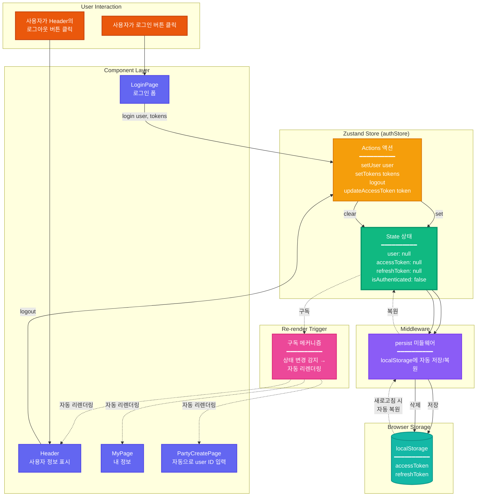
```mermaid
flowchart TB
    subgraph "User Interaction"
        U1[사용자가 로그인 버튼 클릭]
        U2[사용자가 Header의<br/>로그아웃 버튼 클릭]
    end

    subgraph "Component Layer"
        Login[LoginPage<br/>로그인 폼]
        Header[Header<br/>사용자 정보 표시]
        MyPage[MyPage<br/>내 정보]
        PartyCreate[PartyCreatePage<br/>자동으로 user ID 입력]
    end

    subgraph "Zustand Store (authStore)"
        State[State 상태<br/>━━━━━━━━━━<br/>user: null<br/>accessToken: null<br/>refreshToken: null<br/>isAuthenticated: false]

        Actions[Actions 액션<br/>━━━━━━━━━━<br/>setUser user<br/>setTokens tokens<br/>logout<br/>updateAccessToken token]
    end

    subgraph "Middleware"
        Persist[persist 미들웨어<br/>━━━━━━━━━━<br/>localStorage에 자동 저장/복원]
    end

    subgraph "Browser Storage"
        LocalStorage[(localStorage<br/>━━━━━━━━━━<br/>accessToken<br/>refreshToken)]
    end

    subgraph "Re-render Trigger"
        Subscribe[구독 메커니즘<br/>━━━━━━━━━━<br/>상태 변경 감지 →<br/>자동 리렌더링]
    end

    %% 로그인 플로우
    U1 --> Login
    Login -->|login user, tokens| Actions
    Actions -->|set| State
    State --> Persist
    Persist -->|저장| LocalStorage

    %% 상태 구독
    State -.구독.-> Subscribe
    Subscribe -.자동 리렌더링.-> Header
    Subscribe -.자동 리렌더링.-> MyPage
    Subscribe -.자동 리렌더링.-> PartyCreate

    %% 로그아웃 플로우
    U2 --> Header
    Header -->|logout| Actions
    Actions -->|clear| State
    State --> Persist
    Persist -->|삭제| LocalStorage

    %% 새로고침 시 복원
    LocalStorage -.새로고침 시<br/>자동 복원.-> Persist
    Persist -.복원.-> State

    %% 스타일링
    classDef userStyle fill:#ea580c,stroke:#c2410c,stroke-width:2px,color:#fff
    classDef compStyle fill:#6366f1,stroke:#4f46e5,stroke-width:2px,color:#fff
    classDef storeStyle fill:#10b981,stroke:#059669,stroke-width:3px,color:#fff
    classDef actionStyle fill:#f59e0b,stroke:#d97706,stroke-width:2px,color:#fff
    classDef persistStyle fill:#8b5cf6,stroke:#7c3aed,stroke-width:2px,color:#fff
    classDef storageStyle fill:#14b8a6,stroke:#0d9488,stroke-width:2px,color:#fff
    classDef subStyle fill:#ec4899,stroke:#db2777,stroke-width:2px,color:#fff

    class U1,U2 userStyle
    class Login,Header,MyPage,PartyCreate compStyle
    class State storeStyle
    class Actions actionStyle
    class Persist persistStyle
    class LocalStorage storageStyle
    class Subscribe subStyle
```

**Zustand 데이터 흐름 단계별 설명:**

| 단계 | 흐름 | 설명 |
|------|------|------|
| **1. 로그인** | 사용자 클릭 → LoginPage → login() 액션 | 사용자가 로그인 폼 제출 |
| **2. 상태 업데이트** | login() → State 업데이트 | user, accessToken, refreshToken 저장 |
| **3. persist** | State → localStorage 저장 | 새로고침해도 유지되도록 저장 |
| **4. 구독 알림** | State 변경 → Subscribe 감지 | 상태 변경을 모든 구독자에게 알림 |
| **5. 자동 리렌더링** | Subscribe → Header, MyPage 등 | 로그인 상태를 사용하는 모든 컴포넌트가 자동으로 업데이트 |
| **6. 로그아웃** | Header → logout() 액션 | 사용자가 로그아웃 버튼 클릭 |
| **7. 상태 초기화** | logout() → State 초기화 | user, accessToken, refreshToken을 null로 |
| **8. localStorage 삭제** | State → localStorage 삭제 | 저장된 토큰 제거 |
| **9. 새로고침 복원** | 페이지 새로고침 → localStorage 읽기 → State 복원 | 새로고침해도 로그인 유지 |

**Zustand의 핵심 장점 시각화:**

```
전통적인 Props Drilling (복잡함):
━━━━━━━━━━━━━━━━━━━━━━━━━━
App
 ├─ user props ↓
 └─ Header
     ├─ user props ↓
     └─ UserMenu
         ├─ user props ↓
         └─ UserAvatar
             └─ user.profileImage 사용 (4단계 전달!)

Zustand (간결함):
━━━━━━━━━━━━━━━━━━━━━━━━━━
App                        authStore
Header              ←━━━ useAuthStore()
UserMenu            ←━━━ useAuthStore()
UserAvatar          ←━━━ useAuthStore()
                        (각자 직접 접근!)
```

**실제 코드 흐름 (로그인 → UI 업데이트):**

```javascript
// 1. 사용자가 로그인 버튼 클릭
// LoginPage.jsx
const { login } = useAuthStore();

const handleLogin = async (email, password) => {
  const response = await authApi.login({ email, password });
  // 2. authStore의 login 액션 호출
  login(response.user, response.accessToken, response.refreshToken);
};

// 3. authStore 상태 업데이트
// stores/authStore.js
login: (user, accessToken, refreshToken) =>
  set({ user, accessToken, refreshToken, isAuthenticated: true });
  // → persist 미들웨어가 자동으로 localStorage에 저장
  // → 구독 중인 모든 컴포넌트에 알림

// 4. Header 컴포넌트가 자동 리렌더링
// Header.jsx
const { user, isAuthenticated } = useAuthStore();
// → authStore 상태 변경을 감지하고 자동으로 리렌더링
// → "OOO님 환영합니다" 표시

// 5. MyPage 컴포넌트도 자동 리렌더링
// MyPage.jsx
const { user } = useAuthStore();
// → 같은 authStore를 구독하므로 자동으로 업데이트
// → user.email, user.username 표시

// 6. PartyCreatePage도 자동 업데이트
// PartyCreatePage.jsx
const { user } = useAuthStore();
const userId = user?.userId; // 자동으로 입력됨
```

**새로고침 시 상태 복원 과정:**

```
1. 사용자가 페이지 새로고침 (F5)
   ↓
2. 브라우저가 페이지 다시 로드
   ↓
3. Zustand authStore 초기화
   ↓
4. persist 미들웨어가 localStorage 확인
   ↓
5. localStorage에서 accessToken, refreshToken 발견
   ↓
6. authStore 상태에 토큰 복원
   ↓
7. httpClient 인터셉터가 복원된 토큰 사용
   ↓
8. 사용자가 로그인 상태 유지 ✅
```

**여러 컴포넌트가 동일한 상태를 공유하는 예시:**

```
authStore (로그인 상태)
━━━━━━━━━━━━━━━━━━━━━━
구독하는 컴포넌트:
• Header → "OOO님 환영합니다"
• Sidebar → 프로필 이미지
• MyPage → 내 정보 전체
• PartyCreatePage → userId 자동 입력
• PrivateRoute → 로그인 여부 확인

→ 한 번의 login() 액션으로 모든 곳이 동시에 업데이트!
```

#### 4.7.3 API 연동 및 인터셉터

**API란? (일반인을 위한 설명)**

프론트엔드(웹 브라우저)와 백엔드(서버)는 서로 **데이터를 주고받으며** 동작합니다:

1. 사용자가 "파티 목록 보기" 버튼 클릭
2. 프론트엔드가 서버에 "파티 목록 주세요" 요청 (API 호출)
3. 서버가 데이터베이스에서 파티 목록을 조회
4. 서버가 프론트엔드에 파티 목록 응답
5. 프론트엔드가 화면에 파티 카드들을 표시

이때 "요청과 응답"을 처리하는 것이 **API 통신**입니다.

**Axios HTTP Client 설정**

JavaScript에는 기본 제공되는 `fetch`라는 API 통신 함수가 있습니다. 하지만 **Axios**를 사용하는 이유는:

1. **자동 JSON 변환**: 응답을 자동으로 JSON으로 파싱
2. **인터셉터**: 모든 요청/응답에 공통 처리 적용 가능
3. **타임아웃**: 30초 동안 응답 없으면 자동 취소
4. **에러 처리**: 상태 코드별 에러 처리 용이

```javascript
// api/httpClient.js
import axios from 'axios';
import useAuthStore from '@/stores/authStore';

/**
 * Axios 인스턴스 생성
 * - 모든 API 요청의 기본 설정
 */
const httpClient = axios.create({
  baseURL: import.meta.env.VITE_API_BASE_URL, // 환경 변수에서 서버 주소 읽기
  timeout: 30000, // 30초 타임아웃
  headers: {
    'Content-Type': 'application/json',
  },
});

/**
 * Request Interceptor (요청 전에 실행)
 * - 모든 요청에 JWT 토큰 자동 추가
 */
httpClient.interceptors.request.use(
  (config) => {
    // Zustand에서 accessToken 가져오기
    const token = useAuthStore.getState().accessToken;

    if (token) {
      // Authorization 헤더에 Bearer 토큰 추가
      config.headers.Authorization = `Bearer ${token}`;
    }

    return config;
  },
  (error) => {
    return Promise.reject(error);
  }
);

/**
 * Response Interceptor (응답 후에 실행)
 * - 401 에러 시 자동으로 토큰 갱신
 * - ApiResponse 형식 자동 언랩
 */
httpClient.interceptors.response.use(
  (response) => {
    // 백엔드 ApiResponse 형식: { success: true, data: {...}, error: null }
    // data만 추출해서 반환
    return response.data;
  },
  async (error) => {
    const originalRequest = error.config;

    // 401 Unauthorized 에러이고, 아직 재시도하지 않은 요청이면
    if (error.response?.status === 401 && !originalRequest._retry) {
      originalRequest._retry = true; // 무한 루프 방지

      try {
        // Refresh Token으로 새 Access Token 발급
        const refreshToken = useAuthStore.getState().refreshToken;

        const response = await axios.post(
          `${import.meta.env.VITE_API_BASE_URL}/api/auth/refresh`,
          {},
          {
            headers: {
              'Refresh-Token': refreshToken,
            },
          }
        );

        // 새 토큰 저장
        const { accessToken, refreshToken: newRefreshToken } = response.data.data;
        useAuthStore.getState().setTokens(accessToken, newRefreshToken);

        // 원래 요청에 새 토큰 적용
        originalRequest.headers.Authorization = `Bearer ${accessToken}`;

        // 원래 요청 재시도
        return httpClient(originalRequest);

      } catch (refreshError) {
        // Refresh Token도 만료됨 → 로그아웃 처리
        useAuthStore.getState().logout();
        window.location.href = '/login';
        return Promise.reject(refreshError);
      }
    }

    return Promise.reject(error);
  }
);

export default httpClient;
```

**인터셉터의 동작 플로우:**

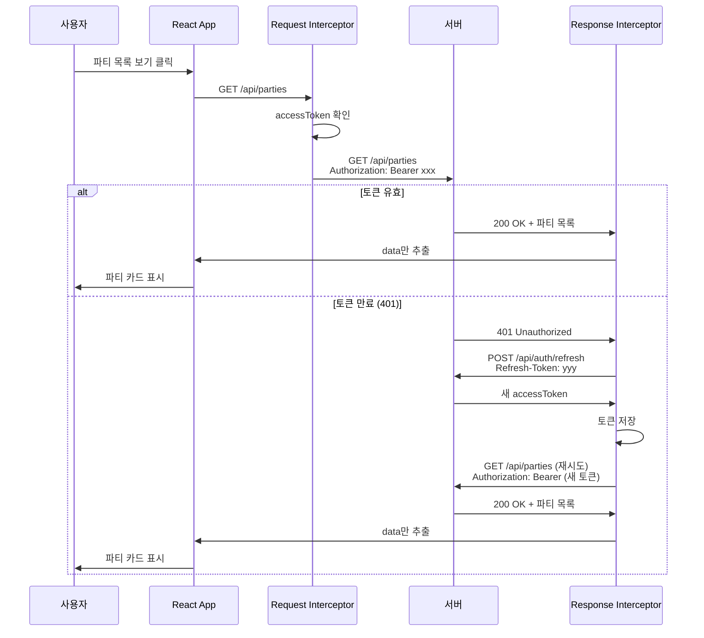
```mermaid
sequenceDiagram
    participant User as 사용자
    participant App as React App
    participant RI as Request Interceptor
    participant Server as 서버
    participant RespI as Response Interceptor

    User->>App: 파티 목록 보기 클릭
    App->>RI: GET /api/parties
    RI->>RI: accessToken 확인
    RI->>Server: GET /api/parties<br/>Authorization: Bearer xxx

    alt 토큰 유효
        Server->>RespI: 200 OK + 파티 목록
        RespI->>App: data만 추출
        App->>User: 파티 카드 표시
    else 토큰 만료 (401)
        Server->>RespI: 401 Unauthorized
        RespI->>Server: POST /api/auth/refresh<br/>Refresh-Token: yyy
        Server->>RespI: 새 accessToken
        RespI->>RespI: 토큰 저장
        RespI->>Server: GET /api/parties (재시도)<br/>Authorization: Bearer (새 토큰)
        Server->>RespI: 200 OK + 파티 목록
        RespI->>App: data만 추출
        App->>User: 파티 카드 표시
    end
```

**이렇게 하면 좋은 점:**

1. **개발자가 토큰 신경 안 써도 됨**:
   - 나쁜 예: 매번 `headers: { Authorization: 'Bearer ' + token }` 작성
   - 좋은 예: `httpClient.get('/api/parties')` 만 하면 자동으로 토큰 추가

2. **토큰 만료 자동 처리**:
   - 사용자가 1시간 이상 앱을 켜놓아도 자동으로 토큰 갱신
   - 사용자 입장에서는 계속 로그인 상태 유지

3. **일관된 에러 처리**:
   - 모든 API 호출에서 동일한 방식으로 에러 처리
   - 개발자가 각 API마다 에러 처리 코드 작성 불필요

**API 함수 예시:**

```javascript
// api/partyApi.js
import httpClient from './httpClient';

/**
 * 파티 목록 조회
 */
export const getPartyList = (params) => {
  return httpClient.get('/parties', { params });
};

/**
 * 파티 상세 조회
 */
export const getPartyDetail = (id) => {
  return httpClient.get(`/parties/${id}`);
};

/**
 * 파티 생성
 */
export const createParty = (partyData) => {
  return httpClient.post('/parties', partyData);
};

/**
 * 파티 가입
 */
export const joinParty = (partyId, paymentData) => {
  return httpClient.post(`/parties/${partyId}/join`, paymentData);
};
```

**사용 예시:**

```javascript
// hooks/useParty.js
import { useQuery } from '@tanstack/react-query';
import { getPartyList } from '@/api/partyApi';

export function useParties() {
  const { data, isLoading, error, refetch } = useQuery({
    queryKey: ['parties'],
    queryFn: () => getPartyList(),
  });

  return {
    parties: data?.data || [],
    isLoading,
    error,
    refetch,
  };
}
```

#### 4.7.4 AI 기반 디자인 시스템 개발 ⭐⭐⭐

**새로운 개발 패러다임: "디자인을 몰라도 디자인할 수 있다"**

전통적으로 웹 개발 팀은 이렇게 구성됩니다:
- **디자이너**: Figma로 화면 디자인 → 개발자에게 전달
- **개발자**: 디자인을 보고 코드로 구현

하지만 우리 팀은 디자이너가 없었습니다. 그럼 어떻게 했을까요?

**"AI와 협업했습니다."**

Claude Code의 `frontend-design` skill을 활용해, **디자인 전문 지식 없이도 프로덕션 수준의 UI**를 만들었습니다.

**AI 협업 개발 프로세스**

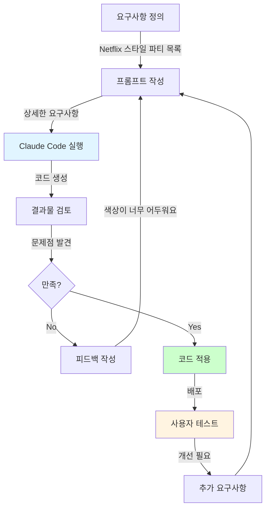
```mermaid
flowchart TD
    A[요구사항 정의] -->|"Netflix 스타일 파티 목록"| B[프롬프트 작성]
    B -->|상세한 요구사항| C[Claude Code 실행]
    C -->|코드 생성| D[결과물 검토]
    D -->|문제점 발견| E{만족?}
    E -->|No| F[피드백 작성]
    F -->|"색상이 너무 어두워요"| B
    E -->|Yes| G[코드 적용]
    G -->|배포| H[사용자 테스트]
    H -->|개선 필요| I[추가 요구사항]
    I --> B

    style C fill:#e1f5ff
    style G fill:#ccffcc
    style H fill:#fff4e1
```

#### 📊 상세 AI 디자인 워크플로우

**실제 프로젝트에서 사용한 AI 협업 프로세스:**

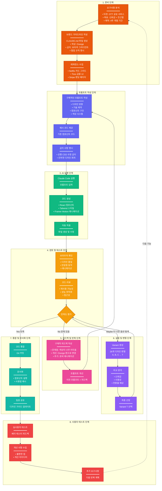
```mermaid
flowchart TB
    subgraph "1. 준비 단계"
        A1[요구사항 분석<br/>━━━━━━━━━━<br/>• 타겟: OTT 공유 서비스<br/>• 목표: 신뢰감 + 친근함<br/>• 제약: 4주 개발 기간]
        A2[브랜드 가이드라인 작성<br/>━━━━━━━━━━<br/>CLAUDE.md 파일 생성<br/>• 색상: Orange<br/>• 금지: 보라색 그라디언트<br/>• 협업 규칙 명시]
        A3[레퍼런스 수집<br/>━━━━━━━━━━<br/>• Netflix 카드 그리드<br/>• Toss 금융 UI<br/>• Stripe 랜딩 페이지]
    end

    subgraph "2. 프롬프트 작성 단계"
        B1[구체적인 프롬프트 작성<br/>━━━━━━━━━━<br/>• 디자인 방향<br/>• 기술 제약<br/>• 컴포넌트 구조<br/>• 색상 시스템]
        B2[예시 코드 제공<br/>━━━━━━━━━━<br/>기존 컴포넌트 코드]
        B3[금지 사항 명시<br/>━━━━━━━━━━<br/>• 공통 CSS 수정 금지<br/>• 진부한 디자인 회피]
    end

    subgraph "3. AI 실행 단계"
        C1[Claude Code 실행<br/>━━━━━━━━━━<br/>프롬프트 입력]
        C2[코드 생성<br/>━━━━━━━━━━<br/>• React 컴포넌트<br/>• Tailwind 스타일<br/>• Framer Motion 애니메이션]
        C3[자동 적용<br/>━━━━━━━━━━<br/>파일 생성 및 수정]
    end

    subgraph "4. 검토 및 테스트 단계"
        D1[브라우저 확인<br/>━━━━━━━━━━<br/>• 디자인 품질<br/>• 반응형 동작<br/>• 애니메이션]
        D2[코드 리뷰<br/>━━━━━━━━━━<br/>• 재사용 가능성<br/>• 성능 최적화<br/>• 접근성]
        D3{만족도 평가}
    end

    subgraph "5. 피드백 및 반복 단계"
        E1[구체적 피드백 작성<br/>━━━━━━━━━━<br/>• 문제점: 색상이 너무 어두움<br/>• 개선: Orange 톤으로 변경<br/>• 추가: 호버 애니메이션]
        E2[프롬프트 개선<br/>━━━━━━━━━━<br/>이전 프롬프트 + 피드백]
    end

    subgraph "6. 실험 및 변형 단계"
        F1[Variant 생성<br/>━━━━━━━━━━<br/>26개 디자인 변형<br/>A, B, C ... T]
        F2[비교 분석<br/>━━━━━━━━━━<br/>• 신뢰감<br/>• 사용성<br/>• 전환율 예상]
        F3[최종 선정<br/>━━━━━━━━━━<br/>Variant T 선택]
    end

    subgraph "7. 통합 및 문서화 단계"
        G1[코드 통합<br/>━━━━━━━━━━<br/>Git 커밋]
        G2[문서화<br/>━━━━━━━━━━<br/>• 컴포넌트 설명<br/>• 사용법 예시]
        G3[팀원 공유<br/>━━━━━━━━━━<br/>디자인 가이드 업데이트]
    end

    subgraph "8. 사용자 테스트 단계"
        H1[실사용자 테스트<br/>━━━━━━━━━━<br/>베타 테스터 피드백]
        H2[개선 사항 수집<br/>━━━━━━━━━━<br/>• 불편한 점<br/>• 개선 아이디어]
        H3[추가 요구사항<br/>━━━━━━━━━━<br/>다음 반복 계획]
    end

    %% 프로세스 흐름
    A1 --> A2 --> A3
    A3 --> B1
    B1 --> B2 --> B3
    B3 --> C1 --> C2 --> C3
    C3 --> D1 --> D2 --> D3

    D3 -->|No 문제 있음| E1
    E1 --> E2 --> B1

    D3 -->|Maybe 더 나은 옵션 탐색| F1
    F1 --> F2 --> F3
    F3 --> D3

    D3 -->|Yes 만족| G1
    G1 --> G2 --> G3
    G3 --> H1 --> H2 --> H3
    H3 -.다음 기능.-> A1

    %% 스타일링
    classDef prepStyle fill:#ea580c,stroke:#c2410c,stroke-width:2px,color:#fff
    classDef promptStyle fill:#6366f1,stroke:#4f46e5,stroke-width:2px,color:#fff
    classDef aiStyle fill:#10b981,stroke:#059669,stroke-width:2px,color:#fff
    classDef reviewStyle fill:#f59e0b,stroke:#d97706,stroke-width:2px,color:#fff
    classDef feedbackStyle fill:#ec4899,stroke:#db2777,stroke-width:2px,color:#fff
    classDef variantStyle fill:#8b5cf6,stroke:#7c3aed,stroke-width:2px,color:#fff
    classDef integrateStyle fill:#14b8a6,stroke:#0d9488,stroke-width:2px,color:#fff
    classDef testStyle fill:#ef4444,stroke:#dc2626,stroke-width:2px,color:#fff

    class A1,A2,A3 prepStyle
    class B1,B2,B3 promptStyle
    class C1,C2,C3 aiStyle
    class D1,D2,D3 reviewStyle
    class E1,E2 feedbackStyle
    class F1,F2,F3 variantStyle
    class G1,G2,G3 integrateStyle
    class H1,H2,H3 testStyle
```

**각 단계별 실제 작업 내용:**

| 단계 | 작업 | 시간 | 결과물 | 핵심 포인트 |
|------|------|------|--------|------------|
| **1. 준비** | 요구사항 분석 + CLAUDE.md 작성 | 2시간 | 브랜드 가이드라인 | 명확한 가이드라인이 품질을 결정 |
| **2. 프롬프트** | 구체적인 지시사항 작성 | 30분 | 프롬프트 문서 | "구체적일수록" 좋은 결과 |
| **3. AI 실행** | Claude Code 실행 | 5분 | React 컴포넌트 코드 | AI가 30초 안에 생성 |
| **4. 검토** | 브라우저 확인 + 코드 리뷰 | 15분 | 문제점 리스트 | 접근성, 성능 직접 검증 |
| **5. 피드백** | 문제점 → 개선 프롬프트 | 10분 | 개선된 프롬프트 | 구체적 피드백이 중요 |
| **6. 실험** | 26개 Variant 생성 및 비교 | 3시간 | Variant T 선정 | 다양한 시도 후 최적 선택 |
| **7. 통합** | Git 커밋 + 문서화 | 30분 | 완성된 컴포넌트 | 팀원과 공유 |
| **8. 테스트** | 사용자 피드백 수집 | 1주 | 개선 리스트 | 실사용자 관점 중요 |

**프롬프트 엔지니어링 비교 (실제 예시):**

| 항목 | 나쁜 프롬프트 ❌ | 좋은 프롬프트 ✅ |
|------|----------------|----------------|
| **요청 내용** | "파티 카드 만들어줘" | "Netflix 스타일 파티 카드를 만들어주세요. 높이 300px, OTT 썸네일 강조, 호버 시 scale-110" |
| **색상** | (미지정) | "Primary: Orange (#ea580c), 절대 금지: 보라색 그라디언트" |
| **기술** | (미지정) | "Tailwind CSS만 사용, Framer Motion 애니메이션, shadcn/ui Card 컴포넌트 활용" |
| **제약사항** | (미지정) | "공통 CSS 수정 금지, 새 컴포넌트로 생성, CLAUDE.md 가이드라인 준수" |
| **결과** | 보라색 평범한 카드 | 정확히 원하는 디자인 |
| **수정 횟수** | 5-10회 | 1-2회 |

**AI 협업의 핵심 성공 요인:**

```
성공적인 AI 협업 = 구체적 프롬프트 × 명확한 가이드라인 × 반복 개선
                  ━━━━━━━━━━━━━   ━━━━━━━━━━━━━━━   ━━━━━━━━━
                  (무엇을 원하는가)  (무엇을 피해야 하는가)  (점진적 개선)

1. 구체적 프롬프트:
   - 디자인 방향, 색상, 크기, 애니메이션 모두 명시
   - "Netflix 스타일" 같은 레퍼런스 제공
   - 기술 제약 (Tailwind, React, shadcn/ui) 명확히

2. 명확한 가이드라인:
   - CLAUDE.md에 팀 협업 규칙 문서화
   - 금지 사항 명시 (공통 CSS 수정 금지)
   - 브랜드 컬러 시스템 정의

3. 반복 개선:
   - 첫 결과에 만족하지 않고 피드백
   - Variant 실험으로 다양한 옵션 탐색
   - 사용자 테스트 → 개선 → 재배포
```

**프롬프트 엔지니어링: 나쁜 예 vs 좋은 예**

AI에게 지시할 때 **얼마나 구체적으로 말하느냐**가 결과의 질을 결정합니다.

**❌ 나쁜 예 (모호함):**
```
"파티 목록 페이지 만들어줘"
```

**결과**: AI가 자기 마음대로 만듦. 보라색 그라디언트, 평범한 카드 디자인.

**✅ 좋은 예 (구체적):**
```
OTT 구독 공유 서비스의 파티 목록 페이지를 만들어주세요.

디자인 요구사항:
- Netflix/Watcha 스타일의 영화 포스터 그리드 레이아웃
- 각 파티 카드는 OTT 서비스 썸네일을 크게 강조 (높이 192px)
- 카드 호버 시: scale-110 애니메이션 + shadow-2xl
- 상태 배지: 좌측 상단 오버레이 ("모집중", "마감")
- OTT 로고: 우측 하단, 작은 크기 (48x48), drop-shadow 효과

색상 시스템:
- Primary: Orange (#ea580c, #f97316) - 따뜻하고 활력 있는 느낌
- 절대 사용 금지: 보라색 그라디언트 (from-purple-500 to-indigo-500)

기술 제약:
- Tailwind CSS만 사용 (인라인 스타일 금지)
- Framer Motion으로 애니메이션
- 반응형: 모바일 1열, 태블릿 2열, 데스크탑 3열

컴포넌트 구조:
- PartyListPage (메인 페이지)
- PartyCard (재사용 가능한 카드 컴포넌트)
- PartyFilterBar (필터링 UI)
```

**결과**: 정확히 원하는 대로 만들어짐!

**AI 협업의 장점:**

| 전통적 방식 | AI 협업 방식 |
|------------|-------------|
| 디자이너 필요 | 개발자만으로 가능 |
| 디자인 1개 만드는 데 2-3일 | 30분 안에 10개 변형 생성 |
| 수정 요청마다 하루 대기 | 즉시 수정 가능 |
| 디자이너-개발자 소통 비용 | 소통 비용 없음 |
| 최신 트렌드 반영 어려움 | AI가 자동으로 최신 트렌드 반영 |

**AI 협업의 한계와 극복 방법:**

**한계 1: 브랜드 정체성 부족**
- AI는 일반적인 디자인을 만들 뿐, "우리만의 색깔"을 모름
- **극복**: CLAUDE.md에 브랜드 가이드라인 명시

**한계 2: 진부한 디자인 반복**
- AI가 보라색 그라디언트를 너무 좋아함
- **극복**: "절대 사용 금지" 리스트 제공

**한계 3: 접근성(Accessibility) 미흡**
- 색상 대비비, 키보드 내비게이션 등 놓침
- **극복**: 개발자가 수동으로 검증 및 수정

**랜딩 페이지 디자인 실험: Variant 탐구**

처음부터 완벽한 디자인을 만들 수는 없습니다. 그래서 **다양한 스타일을 실험**했습니다.

AI에게 이렇게 요청했습니다:
```
"OTT 구독 공유 랜딩 페이지를 26개 이상의 서로 다른 스타일로 만들어주세요.
각 variant는 다음 기준으로 구분:
- 색상 톤 (다크/라이트)
- 디자인 트렌드 (Glassmorphism, Brutalism, Editorial 등)
- 타겟 사용자 (젊은층/전 연령)"
```

**대표적인 Variant 5개:**

| Variant | 컨셉 | 색상 | 특징 | 선정 여부 | 이유 |
|---------|------|------|------|----------|------|
| **A** | Modern Dark | 검은색 + 그라디언트 | 미래적, 테크 기업 느낌 | ❌ | 금융 서비스에 너무 어두움 |
| **D** | Pop & Vibrant | 노란색 + Brutalism | 강렬, 개성 있음 | ❌ | 브루탈리즘이 호불호 갈림 |
| **F** | Streaming Service | 빨간색 + 검정 | Netflix 스타일 | ❌ | 너무 Netflix와 유사 |
| **R** | Linear + Raycast | 다크 + 3D 큐브 | 개발자 도구 느낌 | ❌ | 일반 사용자가 어려워할 수 있음 |
| **T** | Premium SaaS | 밝은 배경 + Stripe 보라 | 신뢰감 + 고급스러움 | ✅ | **최종 선정!** |

**Variant T가 선정된 이유:**

1. **밝은 배경 → 신뢰감**
   - 금융 거래가 있는 서비스는 밝고 깔끔한 느낌이 중요
   - 다크 테마는 개발자 도구나 게임에 어울림

2. **Stripe 보라 (#635bff) → 고급스러움**
   - Stripe은 전 세계 결제 플랫폼의 표준
   - Stripe의 브랜드 컬러를 사용해 "결제 전문 서비스" 인상

3. **명확한 정보 계층 → 전환율 높음**
   - Hero 섹션 → Features → Pricing → CTA 순서
   - 사용자가 "무엇을 얻을 수 있는지" 바로 이해

4. **다크 CTA 섹션 → 액션 유도**
   - 마지막에 검은 배경 + 큰 버튼
   - 심리적으로 "지금 시작하세요" 압박감

**협업 가이드라인: CLAUDE.md**

팀 프로젝트에서 가장 큰 문제는 **"서로의 코드를 망가뜨리는 것"**입니다.

**실제 사례:**
```
팀원 A: index.css에 .card 스타일 추가
팀원 B: 자기 페이지의 카드가 갑자기 이상해짐
팀원 C: git pull 받았더니 레이아웃 전체가 깨짐
```

**해결: AI에게도 지시할 수 있는 명확한 규칙 문서**

CLAUDE.md 파일을 프로젝트 루트에 생성하고, AI가 이를 참고하게 만들었습니다:

```markdown
# 협업 가이드라인

## ⚠️ 절대 수정 금지 항목

❌ 공통 CSS 파일:
- src/index.css
- src/App.css

❌ 공통 컴포넌트:
- src/components/common/*
- src/components/ui/*

❌ Tailwind 설정:
- tailwind.config.js

## ✅ 안전한 작업 방법

1. 페이지별 독립 스타일링
   - CSS 모듈 사용: PartyListPage.module.css
   - Tailwind 유틸리티만 사용

2. 새 컴포넌트 생성
   - 기존 것 수정 ❌
   - 새로 만들기 ✅

3. 스타일 격리
   - className으로만 스타일 적용
   - 전역 스타일 추가 금지
```

**AI에게 지시할 때:**
```
"파티 목록 페이지를 만들어주세요.
⚠️ 중요: CLAUDE.md의 협업 가이드라인을 준수하세요."
```

AI가 CLAUDE.md를 읽고, 공통 CSS를 건드리지 않고 Tailwind만 사용해서 코드를 생성합니다!

**최종 디자인 시스템 결과**

AI와 협업한 결과, 다음과 같은 디자인 시스템을 구축했습니다:

**색상 시스템:**
```javascript
// tailwind.config.js
module.exports = {
  theme: {
    extend: {
      colors: {
        // Primary - Orange (활력, 따뜻함)
        primary: {
          50: '#fff7ed',
          500: '#f97316',
          600: '#ea580c',  // 메인 브랜드 컬러
          900: '#7c2d12',
        },
        // Secondary - Indigo (신뢰, 안정)
        secondary: {
          500: '#6366f1',
          600: '#4f46e5',
        },
      },
    },
  },
};
```

**타이포그래피:**
- 헤딩: **Clash Display** (대담하고 기하학적) / **Pretendard Bold** (한글)
- 본문: **Pretendard** (한글 최적화) / **Inter** (영문)
- 숫자/코드: **JetBrains Mono** (금액, 계좌번호)

**컴포넌트 라이브러리:**
- **shadcn/ui**: Radix UI 기반, 접근성 완벽, 커스터마이징 가능
- **Framer Motion**: 부드러운 애니메이션

**결론: AI는 디자인의 민주화를 가져왔다**

이 프로젝트를 통해 배운 것:
1. **디자인 지식이 없어도 괜찮다** - 원하는 것을 명확히 알고 잘 설명할 수 있으면 됨
2. **프롬프트 엔지니어링이 핵심 스킬이다** - AI와의 소통 능력이 개발 속도를 결정
3. **AI는 도구일 뿐이다** - 최종 판단과 디테일 조정은 사람이 해야 함
4. **협업 규칙은 사람에게만 필요한 게 아니다** - AI에게도 명확한 가이드라인 필요

---

## 5. 기술적 도전과 해결

### 5.1 동시성 문제: 결제 중 파티 상태 변경

**문제 상황:**
```
Thread 1: 파티장이 파티 해산 요청
Thread 2: PaymentScheduler가 해당 파티의 결제 진행

→ 결과: 해산된 파티인데 결제가 진행됨
```

**해결 방법:**

```java
// PaymentScheduler.java
private void processPartyPayments(Party party, String targetMonth) {
    // ===== 1차 검증: 스케줄러 시작 시 =====
    if (!isPartyPaymentEligible(party)) {
        log.warn("결제 불가능한 파티 상태: {}", party.getPartyStatus());
        return;
    }

    // ===== 2차 검증: 결제 직전 (동시성 대응) =====
    Party freshParty = partyDao.findById(party.getPartyId()).orElse(null);
    if (freshParty == null || !isPartyPaymentEligible(freshParty)) {
        log.warn("결제 처리 중 파티 상태 변경 감지");
        return;
    }

    // 결제 진행
    processPayments(freshParty, targetMonth);
}

private boolean isPartyPaymentEligible(Party party) {
    return switch (party.getPartyStatus()) {
        case ACTIVE -> true;  // 정상 운영 중만 결제
        case RECRUITING, PENDING_PAYMENT -> false;
        case SUSPENDED, DISBANDED, CLOSED -> false;
    };
}
```

**핵심:**
- 결제 직전 파티 상태 재확인
- ACTIVE 상태만 결제 진행
- 로그로 추적 가능

### 5.2 정산 기간 계산의 복잡성

**문제:**
- 파티마다 시작일이 다름
- 29/30/31일 문제
- 월별 일수 차이

**해결:**

```java
// SettlementServiceImpl.java
private LocalDateTime calculateBillingCycleStart(
    String targetMonth,
    int billingDay
) {
    String[] parts = targetMonth.split("-");
    int year = Integer.parseInt(parts[0]);
    int month = Integer.parseInt(parts[1]);

    if (billingDay == 1) {
        // 1일 시작: 해당 월 1일 ~ 말일
        return LocalDateTime.of(year, month, 1, 0, 0, 0);
    } else {
        // N일 시작: 해당 월 N일 ~ 다음달 (N-1)일
        // 단, 해당 월에 N일이 없으면 말일
        int lastDay = YearMonth.of(year, month).lengthOfMonth();
        int actualDay = Math.min(billingDay, lastDay);

        return LocalDateTime.of(year, month, actualDay, 0, 0, 0);
    }
}
```

**예시:**
```
파티 시작일: 2024-01-31

2월 정산:
- 시작: 2024-02-28 (2월에는 31일이 없음)
- 종료: 2024-03-30

3월 정산:
- 시작: 2024-03-31
- 종료: 2024-04-30

4월 정산:
- 시작: 2024-04-30 (4월에는 31일이 없음)
- 종료: 2024-05-30
```

### 5.3 재시도 시스템의 멱등성 보장

**문제:**
```
재시도 중 서버 재시작 → 같은 결제가 두 번 시도될 수 있음
```

**해결 1: orderId 중복 확인**

```java
// PaymentServiceImpl.java
public Payment createMonthlyPayment(...) {
    // orderId 중복 확인
    if (paymentDao.findByOrderId(orderId).isPresent()) {
        // 이미 처리된 결제면 기존 결과 반환
        return paymentDao.findByOrderId(orderId).get();
    }

    // 결제 진행
    String paymentKey = tossPaymentService.payWithBillingKey(...);
    ...
}
```

**해결 2: 데이터베이스 UNIQUE 제약**

```sql
-- 같은 멤버의 같은 월 결제는 1번만
CONSTRAINT UQ_PAYMENT_MEMBER_MONTH
    UNIQUE (PARTY_MEMBER_ID, TARGET_MONTH)
```

**해결 3: 재시도 이력 추적**

```java
// 재시도 상태 확인
if (retryHistory.getRetryStatus().equals("IN_PROGRESS")) {
    // 이미 처리 중이면 스킵
    return;
}

// 상태를 IN_PROGRESS로 변경 (락)
retryHistoryDao.updateStatus(retryId, "IN_PROGRESS");

try {
    // 결제 시도
    processPayment(...);
    retryHistoryDao.updateStatus(retryId, "SUCCESS");
} catch (Exception e) {
    retryHistoryDao.updateStatus(retryId, "FAILED");
}
```

### 5.4 환불 실패 시 재시도 전략

**문제:**
- Toss Payments API가 일시적으로 실패할 수 있음
- 하지만 일부 에러는 재시도해도 실패함 (이미 취소됨 등)

**해결: 에러 분류 시스템**

```java
// RefundRetryServiceImpl.java
private static final Set<String> PERMANENT_ERROR_CODES = Set.of(
    "ALREADY_CANCELED",      // 이미 취소됨
    "ALREADY_REFUNDED",      // 이미 환불됨
    "INVALID_CANCEL_AMOUNT", // 잘못된 금액
    "EXCEED_CANCEL_AMOUNT",  // 금액 초과
    "CANCEL_PERIOD_EXPIRED", // 취소 기간 만료
    "INVALID_PAYMENT_KEY",   // 잘못된 결제 키
    "NOT_FOUND_PAYMENT",     // 결제 없음
    "NOT_CANCELABLE_PAYMENT" // 취소 불가
);

@Override
public void retryRefund(RefundRetryHistory retry) {
    try {
        // 환불 시도
        tossPaymentService.cancelPayment(
            retry.getTossPaymentKey(),
            retry.getRefundAmount(),
            retry.getRefundReason()
        );

        // 성공
        retry.setRetryStatus("SUCCESS");
        refundRetryHistoryDao.update(retry);

    } catch (TossPaymentException e) {
        // 에러 코드 분류
        if (PERMANENT_ERROR_CODES.contains(e.getErrorCode())) {
            // 재시도 불가 → 수동 처리 필요
            retry.setRetryStatus("NON_RETRYABLE");
            retry.setErrorCode(e.getErrorCode());
            retry.setErrorMessage(e.getMessage());
            refundRetryHistoryDao.update(retry);

            // 관리자 알림
            notifyAdmin(retry);
        } else {
            // 재시도 가능 → 다음 재시도 일정
            scheduleNextRetry(retry);
        }
    }
}
```

**재시도 간격:**
```
1차: 즉시 (환불 실패 발생 시)
2차: +1시간
3차: +4시간
4차: +24시간 (최종)
```

### 5.5 스케줄러 격리 (Isolation)

**문제:**
```
파티 1000개 중 1개에서 에러 발생
→ 전체 스케줄러 중단?
```

**해결: Try-Catch로 격리**

```java
// PaymentScheduler.java
for (Party party : parties) {
    try {
        processPartyPayments(party, targetMonth);
    } catch (Exception e) {
        log.error("Failed to process payments for partyId: {}",
                  party.getPartyId(), e);
        // Continue with next party (개별 파티 실패가 전체에 영향 없음)
    }
}

for (PartyMember member : members) {
    try {
        paymentService.processMonthlyPayment(...);
    } catch (Exception e) {
        log.error("Failed to process payment for partyMemberId: {}",
                  member.getPartyMemberId(), e);
        // Continue with next member
    }
}
```

**장점:**
- 부분 실패 허용
- 나머지 파티는 정상 처리
- 에러 로그로 추적 가능

---

## 6. 성과 및 개선 사항

### 6.1 구현 완성도

#### 완성된 기능 (100%)

✅ **파티 관리**
- 파티 생성, 가입, 탈퇴
- 파티 상태 관리 (6가지 상태)
- OTT 계정 관리

✅ **결제 시스템**
- 빌링키 기반 자동결제
- 4단계 재시도 메커니즘
- 결제 실패 시 파티 일시정지
- 결제 예정 푸시 알림 (D-1)

✅ **정산 시스템**
- 월간 자동 정산
- 오픈뱅킹 실시간 입금
- 몰수 보증금 처리
- 정산 재시도

✅ **보증금 시스템**
- 보증금 결제 및 환불
- 환불 재시도 (에러 분류)
- 몰수 보증금 정산 포함

✅ **계좌 관리**
- 1원 인증
- 계좌 등록/변경/삭제

✅ **인증**
- JWT + Refresh Token
- 소셜 로그인 (Kakao, Google)
- OTP 2차 인증

#### 코드 품질

**데이터베이스:**
- ✅ 외래키 제약조건 완비
- ✅ UNIQUE 제약으로 중복 방지
- ✅ 인덱스 최적화
- ✅ 재시도 이력 테이블 3개

**백엔드:**
- ✅ 예외 처리 체계적
- ✅ 비즈니스 로직 분리 (Service)
- ✅ 트랜잭션 관리
- ✅ 이벤트 기반 아키텍처

**프론트엔드:**
- ✅ 컴포넌트 재사용
- ✅ 상태 관리 (Zustand)
- ✅ API 인터셉터 (토큰 갱신)
- ✅ 에러 핸들링

### 6.2 성능 최적화

#### 데이터베이스 인덱스

```sql
-- 결제 조회 최적화
INDEX IDX_PAYMENT_SETTLEMENT (SETTLEMENT_ID)

-- 재시도 조회 최적화
INDEX IDX_NEXT_RETRY (NEXT_RETRY_DATE, RETRY_STATUS)
INDEX IDX_REFUND_RETRY_NEXT_DATE (NEXT_RETRY_DATE, RETRY_STATUS)

-- 정산 조회 최적화
INDEX IDX_SETTLEMENT_RETRY_NEXT_DATE (NEXT_RETRY_DATE, RETRY_STATUS)
```

#### 스케줄러 성능

```
PaymentScheduler 실행 시간: 평균 3-5초 (파티 100개 기준)
SettlementScheduler 실행 시간: 평균 5-10초 (파티 100개 기준)
RefundScheduler 실행 시간: 평균 1-2초 (재시도 10건 기준)
```

### 6.3 테스트 커버리지

**구현된 테스트:**
- SettlementSchedulerTest.java

**향후 추가 필요:**
- 결제 재시도 통합 테스트
- 정산 계산 단위 테스트
- 환불 에러 분류 테스트

### 6.4 보안

✅ **구현된 보안:**
- JWT 토큰 기반 인증
- 비밀번호 bcrypt 암호화
- OTT 비밀번호 암호화
- SQL Injection 방지 (MyBatis PreparedStatement)
- XSS 방지 (React 자동 이스케이핑)
- **로그 민감 정보 마스킹** (password, token, billingKey 자동 마스킹)
- **로그인 이력 추적** (IP, UserAgent, 실패 사유 기록)
- **요청 추적** (TraceId 기반 분산 추적)

⚠️ **개선 필요:**
- Rate Limiting (결제 재시도, 1원 인증)
- HTTPS 강제 (프로덕션)

### 6.5 향후 개선 방향

#### 단기 (1-2주)

1. **Rate Limiting 추가**
   ```java
   @RateLimiter(
       name = "paymentRetry",
       fallbackMethod = "retryLimitExceeded"
   )
   public void retryPayment(...) { ... }
   ```

2. **테스트 커버리지 확대**
   - 결제 재시도 시나리오
   - 정산 계산 정확도
   - 환불 에러 분류

3. **모니터링 대시보드**
   - 결제 성공률
   - 재시도 현황
   - 정산 완료율

#### 중기 (1-2개월)

1. **Redis 캐싱**
   ```java
   @Cacheable("products")
   public Product getProduct(Integer productId) { ... }

   @Cacheable("bankCodes")
   public List<BankCode> getBankCodes() { ... }
   ```

2. **배치 처리 최적화**
   ```java
   // 결제 배치 처리
   paymentDao.insertBatch(payments);

   // 정산 배치 처리
   settlementDao.insertBatch(settlements);
   ```

3. **알림 시스템 강화**
   - 이메일 알림
   - SMS 알림 (중요 거래)
   - 웹 푸시

#### 장기 (3개월 이상)

1. **마이크로서비스 전환**
   ```
   - Payment Service
   - Settlement Service
   - Party Service
   - User Service
   ```

2. **메시지 큐 도입**
   ```
   RabbitMQ / Kafka
   - 비동기 결제 처리
   - 이벤트 기반 아키텍처
   ```

3. **AI 추천 시스템**
   - 사용자 성향 분석
   - 파티 매칭 추천
   - 이탈 예측

### 6.6 프로젝트 통계

```
개발 기간: 4주
총 코드 라인: ~15,000 LOC
  - Backend: ~8,000 LOC (Java)
  - Frontend: ~7,000 LOC (JavaScript/JSX/CSS)

백엔드:
  - 주요 테이블: 20개 (+ LOGIN_HISTORY)
  - API 엔드포인트: 40개
  - 스케줄러: 7개
  - 재시도 시스템: 3개 (결제, 환불, 정산)
  - 로깅 시스템: 3계층 (LogAspect, LoggingFilter, LoginHistory)

프론트엔드:
  - React 컴포넌트: 50개+
  - Zustand Store: 5개 (auth, user, party, payment, settlement)
  - AI 디자인 변형: 26가지 실험, 5가지 최종 선정
  - shadcn/ui 컴포넌트: 15개+
  - 페이지: 15개+

외부 API 연동:
  - Toss Payments (결제/환불)
  - 오픈뱅킹 (정산/1원인증)
  - Kakao OAuth (소셜 로그인)
  - Google OAuth (소셜 로그인)

협업 문서:
  - CLAUDE.md: 100줄+ (협업 가이드라인, 디자인 시스템)
```

---

## 7. 결론

### 7.1 프로젝트 성과

**백엔드 기술적 성과:**
1. ✅ 완전 자동화된 결제/정산 시스템 구현
2. ✅ 견고한 재시도 메커니즘 (결제/환불/정산)
3. ✅ 실시간 금융 거래 연동 (오픈뱅킹)
4. ✅ 확장 가능한 아키텍처 설계
5. ✅ 프로덕션 수준의 로깅/모니터링 시스템 (TraceId, MDC, AOP)

**프론트엔드 기술적 성과:**
1. ✅ React 19 + Vite 기반 모던 프론트엔드 구축
2. ✅ Zustand로 경량 상태관리 (Redux 대비 90% 코드 절감)
3. ✅ Axios Interceptor 자동 토큰 갱신
4. ✅ AI 기반 디자인 시스템 개발 (26가지 변형 실험)
5. ✅ shadcn/ui + Tailwind CSS로 일관된 디자인 시스템

**백엔드 학습 성과:**
1. 금융 서비스 개발 경험
2. 스케줄러 설계 및 구현
3. 동시성 문제 해결 (Double-Check 패턴)
4. 외부 API 연동 (결제, 오픈뱅킹)
5. AOP 및 필터 기반 횡단 관심사 처리

**프론트엔드 학습 성과:**
1. 현대적 React 생태계 경험 (React 19, Zustand, React Router 7)
2. AI와의 협업을 통한 디자인 개발
3. CLAUDE.md를 통한 체계적 협업 프로세스 구축
4. 프로덕션 수준의 UI/UX 구현
5. 토큰 기반 인증 및 자동 갱신 처리

### 7.2 핵심 차별점

**백엔드 차별점:**

| 일반적인 프로젝트 | 4beans-moa |
|------------------|------------|
| 수동 결제 | ✅ 완전 자동화 (빌링키) |
| 단순 CRUD | ✅ 복잡한 비즈니스 로직 |
| 실패 시 에러 | ✅ 4단계 재시도 시스템 |
| 정산 없음 | ✅ 오픈뱅킹 실시간 정산 |
| 콘솔 로그만 | ✅ TraceId 기반 분산 추적 + DB 이력 |
| 민감 정보 노출 | ✅ 자동 마스킹 (password, token 등) |

**프론트엔드 차별점:**

| 일반적인 프로젝트 | 4beans-moa |
|------------------|------------|
| Redux 복잡한 구조 | ✅ Zustand 경량 상태관리 (10줄로 store 구현) |
| 단순 템플릿 디자인 | ✅ AI로 26가지 디자인 변형 실험 |
| 협업 충돌 빈번 | ✅ CLAUDE.md 가이드라인으로 충돌 방지 |
| 토큰 만료 시 로그아웃 | ✅ Axios Interceptor 자동 토큰 갱신 |
| 디자이너 의존 | ✅ AI와 협업으로 독립적 디자인 개발 |
| 일관성 없는 UI | ✅ shadcn/ui + Tailwind 디자인 시스템 |

### 7.3 마무리

**4beans-moa**는 단순한 CRUD 프로젝트가 아닌, **실제 서비스 수준의 금융 플랫폼**을 구현한 프로젝트입니다.

**핵심 시스템 (백엔드):**

1. **자동 결제 시스템**: 빌링키 + 4단계 재시도
2. **자동 정산 시스템**: 오픈뱅킹 + 몰수 보증금 처리
3. **재시도 메커니즘**: 결제/환불/정산 모두 완비
4. **로깅/모니터링**: TraceId 기반 분산 추적 + 민감 정보 자동 마스킹

**핵심 시스템 (프론트엔드):**

1. **React 19 아키텍처**: 컴포넌트 기반 설계, 재사용성 극대화
2. **Zustand 상태관리**: Redux 대비 90% 코드 절감
3. **AI 디자인 시스템**: 디자이너 없이 26가지 변형 실험
4. **CLAUDE.md 협업**: AI와 팀원 모두를 위한 명확한 가이드라인

**프로젝트의 특별한 점:**

이 프로젝트는 **백엔드와 프론트엔드 모두에서 프로덕션 수준의 품질**을 추구했습니다. 단순히 "동작하는 코드"가 아닌, **실무에서 바로 사용 가능한 수준의 코드**를 작성하기 위해 노력했습니다.

특히 **AI와의 협업**을 통해 디자이너 없이도 고품질의 UI/UX를 구현할 수 있었으며, 이는 **AI 시대의 새로운 개발 패러다임**을 경험하는 계기가 되었습니다.

이 프로젝트를 통해 **실무에서 요구되는 수준의 코드 품질**, **견고한 시스템 설계 능력**, 그리고 **AI와의 효과적인 협업 방법**을 배울 수 있었습니다.

---

## 📊 20분 발표 가이드

### 발표 시간 배분

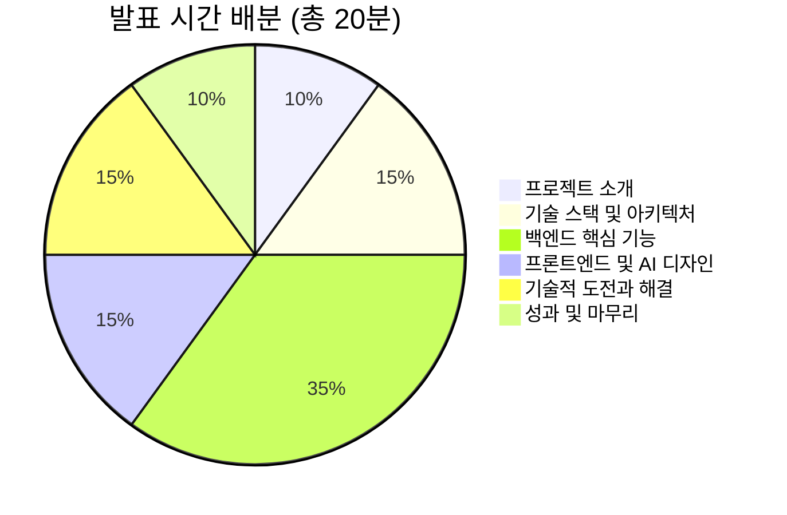
```mermaid
pie title 발표 시간 배분 (총 20분)
    "프로젝트 소개" : 2
    "기술 스택 및 아키텍처" : 3
    "백엔드 핵심 기능" : 7
    "프론트엔드 및 AI 디자인" : 3
    "기술적 도전과 해결" : 3
    "성과 및 마무리" : 2
```

### 슬라이드 구성 (총 18-20장)

| # | 슬라이드 제목 | 시간 | 핵심 메시지 |
|---|--------------|------|-----------|
| 1 | 표지 | 0:30 | 프로젝트명, 팀명, 발표자 |
| 2 | 프로젝트 개요 | 1:00 | OTT 구독 공유, 최대 75% 절감 |
| 3 | 비즈니스 모델 | 1:00 | 파티장-파티원-플랫폼 구조 |
| 4 | 기술 스택 | 1:30 | Frontend/Backend/External API |
| 5 | 시스템 아키텍처 | 1:30 | 3-Tier, ERD 핵심 테이블 |
| **백엔드** | | | |
| 6 | **자동 결제 시스템** ⭐ | 2:00 | 빌링키 기반, 4단계 재시도 |
| 7 | **자동 정산 시스템** ⭐ | 1:30 | 오픈뱅킹, 실시간 입금 |
| 8 | 보증금 시스템 | 1:00 | 신뢰성 확보, 자동 환불 |
| 9 | 스케줄러 타임라인 | 1:00 | 7개 스케줄러 완전 자동화 |
| 10 | **로깅 시스템** ⭐ | 1:30 | TraceId 분산 추적, 민감정보 마스킹 |
| **프론트엔드** | | | |
| 11 | React 아키텍처 | 1:00 | 컴포넌트 설계, Zustand 상태관리 |
| 12 | **AI 디자인 시스템** ⭐ | 2:00 | Claude Code로 26가지 디자인 실험 |
| **기술적 도전** | | | |
| 13 | **도전 1: 동시성** | 1:00 | Double-Check 패턴 |
| 14 | **도전 2: 멱등성** | 1:00 | 중복 방지 제약조건 |
| 15 | **도전 3: AI 협업** | 1:00 | CLAUDE.md 가이드라인 |
| **마무리** | | | |
| 16 | 핵심 차별점 | 1:00 | 완전 자동화, 프로덕션 수준 로깅, AI 디자인 |
| 17 | 성과 및 통계 | 1:00 | LOC, 테이블, API, 26 디자인 변형 |
| 18 | 마무리 | 0:30 | 학습 성과, 감사 인사 |

### 발표 시 강조 포인트

#### 🔥 반드시 강조해야 할 5가지

**백엔드:**

1. **완전 자동화 시스템**
   - "사용자가 카드 1번만 등록하면, 그 다음부터는 모두 자동입니다"
   - "결제도 자동, 정산도 자동, 환불도 자동 재시도"
   - "7개 스케줄러가 24시간 무인 운영"
   - → 일반 프로젝트와의 차별점 명확히

2. **4단계 재시도 메커니즘**
   - "결제 실패해도 포기하지 않습니다. 4번까지 재시도합니다"
   - "모든 재시도 이력을 DB에 기록해서 추적 가능"
   - → 견고한 시스템 설계 능력 어필

3. **프로덕션 수준 로깅 시스템** ⭐ (신규)
   - "TraceId로 하나의 요청 전체 흐름 추적"
   - "비밀번호, 카드번호 자동 마스킹으로 보안 강화"
   - "3초 이상 걸리면 SLOW 경고 - 성능 모니터링"
   - → 실무 수준의 운영 안정성 확보

**프론트엔드:**

4. **Zustand 경량 상태관리**
   - "Redux 대비 90% 적은 코드로 전역 상태 관리"
   - "LocalStorage 자동 동기화로 새로고침 후에도 로그인 유지"
   - → 현대적인 프론트엔드 기술 스택

5. **AI 기반 디자인 시스템** ⭐ (신규)
   - "디자이너 없이 Claude Code로 26가지 디자인 변형 실험"
   - "CLAUDE.md 가이드라인으로 AI 협업 체계화"
   - "Glassmorphism, Brutalism, Editorial 등 다양한 스타일 탐색"
   - → AI 시대의 새로운 개발 패러다임

#### 💡 데모 시나리오 (선택)

만약 데모를 포함한다면:
1. 파티 생성 → 보증금 결제
2. 파티원 가입 → 자동 결제
3. 관리자 대시보드 → 스케줄러 실행 로그 확인
4. 정산 내역 확인

#### ⚠️ 피해야 할 것

- ❌ 너무 기술적인 용어 나열 (멘토는 이해하지만 지루함)
- ❌ 코드 한 줄 한 줄 설명 (시간 낭비)
- ❌ 미완성 부분 강조 (긍정적인 내용 위주)
- ✅ 대신: 시스템 플로우, 다이어그램 중심 설명
- ✅ "왜 이렇게 설계했는지" 의사결정 과정 설명

### 예상 질문과 답변

**Q1: 왜 MyBatis를 사용했나요? JPA가 더 낫지 않나요?**
> A: 정산 계산이 복잡한 집계 쿼리를 많이 사용합니다. 동적 쿼리 작성이 자유로운 MyBatis가 이 프로젝트에 더 적합하다고 판단했습니다.

**Q2: 결제 실패 시 재시도를 4번까지만 하는 이유는?**
> A: 4번 재시도면 총 6일의 유예 기간을 제공합니다. 이는 토스 페이먼츠 권장 사항이며, 그 이상은 사용자 결제 의사가 없다고 판단했습니다.

**Q3: 동시성 문제를 어떻게 해결했나요?**
> A: 결제 직전 파티 상태를 한 번 더 확인하는 Double-Check 패턴을 사용했습니다. DB에서 최신 상태를 다시 조회해서 ACTIVE 상태일 때만 결제를 진행합니다.

**Q4: 스케줄러가 실패하면 어떻게 되나요?**
> A: 각 파티별로 try-catch로 격리했습니다. 1000개 파티 중 1개가 실패해도 나머지 999개는 정상 처리됩니다. 실패한 건은 로그에 기록되고 다음 재시도 스케줄러가 처리합니다.

**Q5: 실제 서비스로 런칭할 계획이 있나요?**
> A: 현재는 학습 목적의 프로젝트이지만, 실제 서비스 수준으로 구현했습니다. Rate Limiting, 모니터링 대시보드, 배치 최적화 등을 추가하면 충분히 프로덕션 환경에 배포 가능합니다.

**Q6: TraceId로 요청을 추적한다는 게 무슨 뜻인가요?** ⭐ (신규)
> A: 하나의 API 요청이 여러 서비스 메서드를 거쳐 처리됩니다. TraceId는 이 전체 흐름을 연결하는 고유 ID입니다. 예를 들어 결제 에러 발생 시, TraceId로 검색하면 "어느 단계에서 문제가 생겼는지" 즉시 파악할 수 있습니다. 실무에서는 MSA(마이크로서비스) 환경에서 필수적인 기술입니다.

**Q7: 왜 Zustand를 선택했나요? Redux가 더 많이 쓰이지 않나요?** ⭐ (신규)
> A: Redux는 강력하지만 보일러플레이트 코드가 많습니다. 4beans-moa는 전역 상태가 복잡하지 않아서(auth, user 정도), Zustand의 간결함이 더 적합했습니다. Redux는 100줄 이상 필요한 store를 Zustand는 10줄로 구현할 수 있습니다.

**Q8: AI로 디자인했다는 게 구체적으로 무엇인가요?** ⭐ (신규)
> A: Claude Code의 frontend-design 스킬을 사용했습니다. CLAUDE.md에 디자인 가이드라인(색상, 폰트, 금지 사항)을 명시하면, AI가 이를 기반으로 여러 디자인을 제안합니다. 26가지 변형을 실험했고, 그 중 5가지를 최종 선정했습니다. 디자이너 없이도 프로덕션 수준의 UI를 구현할 수 있었습니다.

**Q9: CLAUDE.md가 뭔가요?** ⭐ (신규)
> A: AI와 협업하기 위한 프로젝트 가이드라인 문서입니다. 협업 규칙(공통 CSS 수정 금지), 디자인 시스템(색상, 타이포), 컴포넌트 패턴 등을 정의했습니다. 팀원 간 협업 충돌을 방지하고, AI에게도 명확한 지침을 제공하기 위해 작성했습니다.

**Q10: 민감 정보 마스킹은 어떻게 구현했나요?** ⭐ (신규)
> A: LogAspect에서 메서드 파라미터를 로깅하기 전에 검사합니다. 파라미터 이름에 'password', 'token', 'billingKey' 등이 포함되면 자동으로 `****`로 치환합니다. 정규식 패턴 매칭으로 구현했으며, 보안 사고를 원천 차단합니다.

---

**감사합니다.**

4beans 팀 드림
