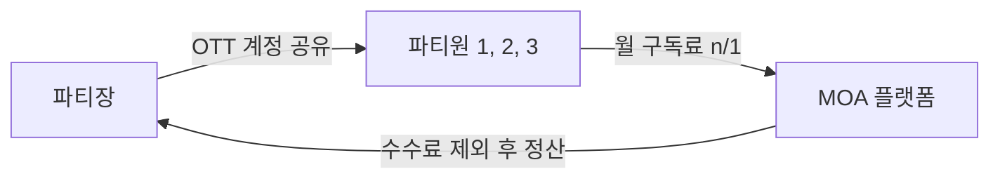
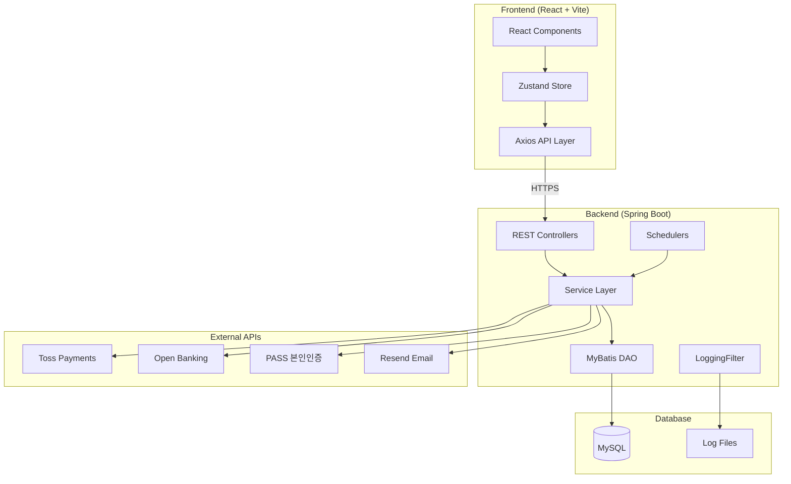
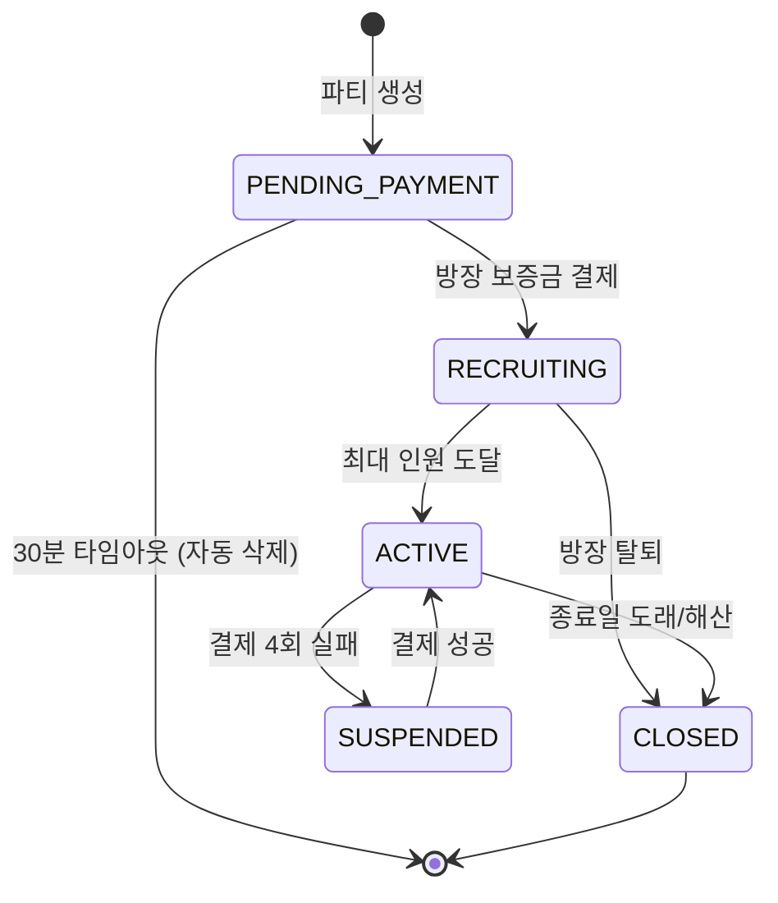
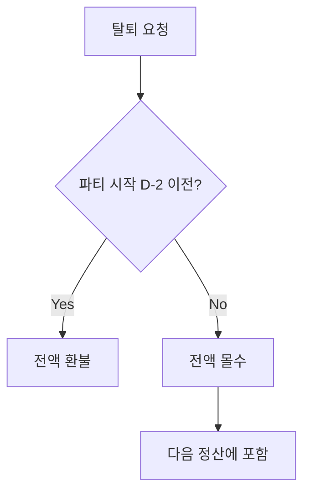
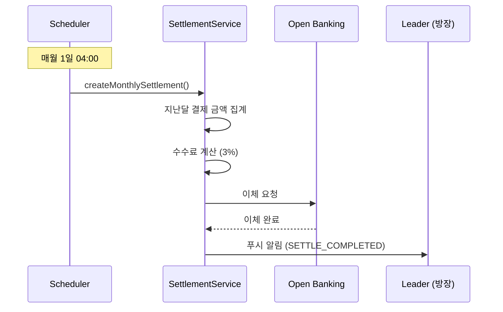
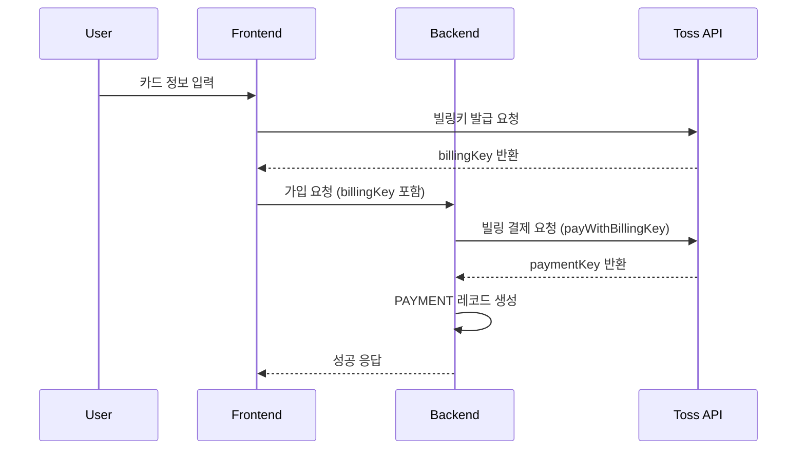
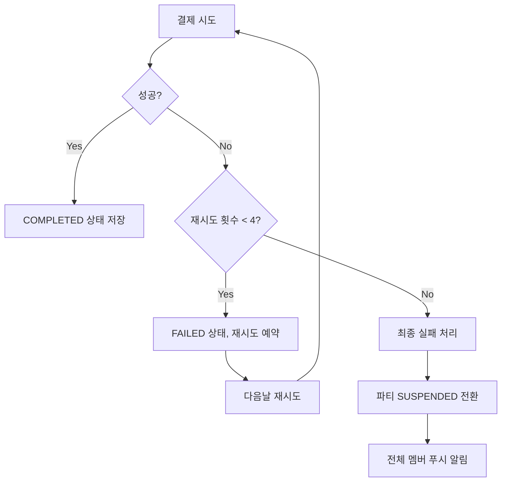

# MOA 프로젝트 최종 보고서 (1차)

> **OTT 구독 공유 플랫폼** - 함께 나누면 더 저렴하게!
> 
> 버전: 1.0 (1차 보고서) | 작성일: 2025-12-12 | 작성자: 4beans 팀

---

## 목차

1. [프로젝트 개요](#1-프로젝트-개요)
2. [기술 스택](#2-기술-스택)
3. [시스템 아키텍처](#3-시스템-아키텍처)
4. [핵심 기능 구현](#4-핵심-기능-구현)
5. [외부 연동 서비스](#5-외부-연동-서비스)
6. [예외 처리 시스템](#6-예외-처리-시스템)
7. [팀 구성 및 역할](#7-팀-구성-및-역할)
8. [프로젝트 회고](#8-프로젝트-회고) *(2차 작성 예정)*
9. [향후 계획](#9-향후-계획) *(2차 작성 예정)*
10. [부록](#10-부록)

---

## 1. 프로젝트 개요

### 1.1 서비스 소개

MOA는 넷플릭스, 왓챠 등 OTT 계정을 여러 사용자가 함께 **'파티'**를 만들어 공유하고, 비용을 자동으로 n분의 1로 나누어 결제하는 플랫폼입니다.

### 1.2 개발 배경

- OTT 서비스 구독료 부담 증가 (넷플릭스 프리미엄 17,000원/월)
- 계정 공유 시 **신뢰 문제** (정산, 탈퇴 등)
- 기존 공유 서비스의 **보안 취약점** 해결 필요

### 1.3 해결 방안

| 문제 | 해결책 |
|------|--------|
| 정산 불이행 | 자동 빌링 시스템 |
| 무단 탈퇴 | 보증금 제도 |
| 계정 노출 | AES-256 암호화 저장 + 권한 기반 노출 |
| 신뢰 부족 | 파티장/파티원 평점 시스템 |

### 1.4 핵심 비즈니스 모델



- **파티장(Leader)**: OTT 계정을 제공하고, 매월 정산금을 받습니다.
- **파티원(Member)**: 매월 자동으로 구독료를 결제하고, OTT 계정을 이용합니다.
- **MOA 플랫폼**: 결제, 정산, 보증금 관리를 자동화합니다.

### 1.5 개발 기간

- **기간**: 2024.11 ~ 2025.01 (약 2개월)
- **배포 URL**: [https://www.moamoa.cloud/](https://www.moamoa.cloud/)

---

## 2. 기술 스택

### 2.1 Frontend

| 기술 | 버전 | 용도 |
|------|------|------|
| **React** | 19.2.0 | UI 프레임워크 |
| **Vite** | 7.2.4 | 번들러 및 개발 서버 |
| **Tailwind CSS** | 4.1.17 | 스타일링 |
| **shadcn/ui (Radix)** | - | UI 컴포넌트 라이브러리 |
| **Zustand** | 5.0.9 | 전역 상태 관리 |
| **React Router** | 7.9.6 | 클라이언트 라우팅 |
| **Axios** | 1.13.2 | HTTP 클라이언트 |
| **Framer Motion** | 12.23.25 | 애니메이션 |

### 2.2 Backend

| 기술 | 버전 | 용도 |
|------|------|------|
| **Spring Boot** | 3.5.5 | 웹 프레임워크 |
| **Java** | 17 | 프로그래밍 언어 |
| **MyBatis** | 3.0.3 | SQL 매퍼 |
| **MySQL** | 8.0 | 데이터베이스 |
| **Spring Security** | 6.5 | 인증/인가 |
| **JWT (jjwt)** | 0.12.x | 토큰 기반 인증 |
| **Spring AOP** | - | 로깅, 트랜잭션 |
| **Logback** | - | 파일 로깅, 로그 롤링 |

### 2.3 Infrastructure (AWS)

| 서비스 | 용도 |
|--------|------|
| **EC2** | 애플리케이션 서버 |
| **RDS** | MySQL 데이터베이스 |
| **S3** | 정적 파일 저장 (프로필 이미지) |
| **Route 53** | DNS 관리 |

---

## 3. 시스템 아키텍처

### 3.1 전체 시스템 다이어그램



### 3.2 디렉토리 구조

**Frontend:**
```
src/
├── api/          # API 호출 함수 (14개 모듈)
├── components/   # 재사용 가능한 컴포넌트 (81개)
├── hooks/        # 커스텀 훅 (32개)
├── pages/        # 페이지 컴포넌트 (106개)
├── store/        # Zustand 스토어 (19개)
├── utils/        # 유틸리티 함수 (8개)
└── App.jsx       # 라우팅 설정
```

**Backend:**
```
com.moa/
├── auth/         # JWT 필터, 인증 관련
├── common/       # 공통 유틸, 예외 처리, 이벤트 (22개)
├── config/       # 설정 클래스 (11개)
├── dao/          # MyBatis DAO 인터페이스 (25개)
├── domain/       # 엔티티 및 Enum (37개)
├── dto/          # Request/Response DTO (66개)
├── scheduler/    # 스케줄러 (8개)
├── service/      # 비즈니스 로직 (54개)
└── web/          # REST 컨트롤러 (20개)
```

---

## 4. 핵심 기능 구현

### 4.1 파티 시스템

#### 파티 생명주기 (Lifecycle)



| 상태 | 설명 | 트리거 |
|------|------|--------|
| `PENDING_PAYMENT` | 결제 대기 | 파티 생성 시 |
| `RECRUITING` | 모집 중 | 방장 보증금 결제 완료 |
| `ACTIVE` | 이용 중 | `currentMembers == maxMembers` |
| `SUSPENDED` | 일시정지 | 결제 4회 실패 |
| `CLOSED` | 종료 | 종료일 도래 또는 해산 |

#### 동시성 제어 (Race Condition 방지)

파티 가입 시 정원 초과를 방지하기 위해 **Toss 결제 API 호출 전에 정원 증가**를 먼저 수행합니다.

```java
@Transactional
public void joinParty(Integer partyId, String userId, PaymentRequest request) {
    // 1. 정원 증가 (동시성 제어) - Toss 호출 전에 먼저 실행 ⭐
    int updatedRows = partyMemberDao.incrementMemberCountIfAvailable(partyId);
    if (updatedRows == 0) {
        throw new BusinessException(ErrorCode.PARTY_FULL);
    }

    try {
        // 2~4. 결제 처리...
    } catch (Exception e) {
        // 실패 시 정원 복구 (보상 트랜잭션)
        partyMemberDao.decrementMemberCount(partyId);
        throw e;
    }
}
```

---

### 4.2 구독 상품 시스템

#### 상품 구조

| 필드 | 타입 | 설명 |
|------|------|------|
| `productId` | INT | 상품 ID (PK) |
| `categoryId` | INT | 카테고리 ID (FK) |
| `productName` | VARCHAR | 상품명 (예: Netflix, Disney+) |
| `productStatus` | VARCHAR | 상태 (ACTIVE/INACTIVE) |
| `price` | INT | 월 구독료 |
| `image` | VARCHAR | 로고 이미지 URL |

#### 상품 관리 API

| 기능 | 메서드 | 엔드포인트 |
|------|--------|------------|
| 상품 등록 | POST | `/api/product` |
| 상품 목록 조회 | GET | `/api/product` |
| 상품 상세 조회 | GET | `/api/product/{productId}` |
| 상품 수정 | PUT | `/api/product` |
| 상품 삭제 | DELETE | `/api/product/{productId}` |
| 카테고리 목록 | GET | `/api/product/categories` |

---

### 4.3 결제 시스템

#### 결제 유형

| 유형 | 시점 | 처리 메서드 |
|------|------|-------------|
| **초기 결제** | 파티 가입 시 | `createInitialPayment()` |
| **월간 자동 결제** | 매월 결제일 | `processMonthlyPayment()` |
| **보증금 결제** | 파티 생성/가입 시 | `createDepositPayment()` |

#### 결제 실패 재시도 전략

| 시도 | 간격 | 푸시 알림 |
|------|------|-----------|
| 1차 | 즉시 | - |
| 2차 | +1일 | `PAY_FAILED_RETRY` |
| 3차 | +2일 | `PAY_FAILED_RETRY` |
| 4차 | +3일 | `PAY_FINAL_FAILED` (최종 실패) |

---

### 4.4 보증금 시스템

#### 보증금 규칙

| 역할 | 보증금 금액 | 환불 조건 |
|------|-------------|-----------|
| **방장** | 월구독료 전액 (예: 17,000원) | 파티 정상 종료 시 |
| **파티원** | 인당 요금 (예: 4,250원) | 파티 정상 종료 시 |

#### 탈퇴 시 환불 정책



---

### 4.5 정산 시스템

#### 정산 프로세스



#### 수수료 계산

```
정산 계산 공식:
────────────────────────────────────
총 수입 = 월회비 × 결제 완료 멤버 수 + 몰수 보증금
수수료 = 월회비 수입 × 3% (몰수 보증금은 수수료 면제)
순 정산액 = 총 수입 - 수수료
────────────────────────────────────
```

---

### 4.6 로깅 시스템

#### 로그 파일 분리

| 파일 | 용도 | 보관 기간 |
|------|------|-----------|
| `logs/moa.log` | 전체 애플리케이션 로그 | 90일 |
| `logs/error.log` | ERROR 레벨 로그만 분리 | 365일 |
| `logs/payment.log` | 결제/정산 관련 로그 | 365일 |

#### 로깅 구성 요소

1. **LoggingFilter**: HTTP 요청/응답 로깅, TraceId 주입, 민감정보 마스킹
2. **LogAspect**: 서비스 레이어 메서드 실행 시간 측정, 결제 로직 INFO 레벨 로깅

```java
// LoggingFilter - TraceId 생성 및 MDC 주입
String traceId = UUID.randomUUID().toString().substring(0, 8);
MDC.put("traceId", traceId);
MDC.put("userId", userId);
response.addHeader("X-Trace-Id", traceId);
```

---

### 4.7 보안

#### JWT 인증

- **Access Token**: 30분 유효
- **Refresh Token**: 7일 유효
- **저장 위치**: LocalStorage (Frontend)

#### AES-256 암호화

OTT 계정 정보(ID, Password)는 AES-256으로 암호화되어 DB에 저장됩니다.

```java
public static String encrypt(String plainText) {
    SecretKeySpec keySpec = new SecretKeySpec(SECRET_KEY.getBytes(), "AES");
    Cipher cipher = Cipher.getInstance("AES/CBC/PKCS5Padding");
    cipher.init(Cipher.ENCRYPT_MODE, keySpec, new IvParameterSpec(IV.getBytes()));
    return Base64.getEncoder().encodeToString(cipher.doFinal(plainText.getBytes()));
}
```

---

## 5. 외부 연동 서비스

### 5.1 Toss Payments (결제)

| 기능 | API 엔드포인트 |
|------|----------------|
| 빌링키 발급 | `POST /v1/billing/authorizations/card` |
| 빌링 결제 | `POST /v1/billing/{billingKey}` |
| 결제 취소(환불) | `POST /v1/payments/{paymentKey}/cancel` |

**빌링 결제 흐름:**


---

### 5.2 Open Banking (계좌 인증)

| 기능 | API 엔드포인트 |
|------|----------------|
| 1원 인증 요청 | `POST /mock/openbanking/inquiry/receive` |
| 인증코드 검증 | `POST /mock/openbanking/inquiry/verify` |
| 입금 이체 | `POST /mock/openbanking/transfer/deposit` |

**계좌 인증 프로세스:**
1. 사용자가 은행/계좌번호 입력
2. 1원 입금 요청 → 입금자명에 4자리 인증코드 포함
3. 사용자가 인증코드 입력
4. 검증 성공 시 계좌 등록

---

### 5.3 PASS 본인인증 (PortOne)

> **용도**: 계정 잠금 해제, 본인 확인

| 기능 | 설명 |
|------|------|
| 인증 요청 | `requestCertification()` - merchantUid 생성 |
| 인증 검증 | `verifyCertification(impUid)` - 이름, 전화번호, CI 반환 |

**구현 코드:**
```java
@Service
public class PassAuthServiceImpl implements PassAuthService {

    @Value("${portone.imp-key}")
    private String apiKey;

    @Value("${portone.imp-secret}")
    private String apiSecret;

    @Override
    public Map<String, Object> verifyCertification(String impUid) throws Exception {
        String token = getAccessToken();
        
        // PortOne API 호출
        ResponseEntity<Map> res = restTemplate.exchange(
            "https://api.iamport.kr/certifications/" + impUid,
            HttpMethod.GET, req, Map.class);
        
        // 결과 파싱: phone, name, ci, di 반환
        Map<String, Object> data = new HashMap<>();
        data.put("phone", response.get("phone"));
        data.put("ci", response.get("unique_key"));
        return data;
    }
}
```

**활용 사례:**
- **계정 잠금 해제**: 로그인 5회 실패 후 본인인증으로 잠금 해제

```java
@PostMapping("/unlock")
public ApiResponse<Void> unlockAccount(@RequestBody UnlockAccountRequest request) {
    Map<String, Object> data = passAuthService.verifyCertification(request.getImpUid());
    String phone = (String) data.get("phone");
    String ci = (String) data.get("ci");
    
    userService.unlockByCertification(request.getUserId(), phone, ci);
    return ApiResponse.success(null);
}
```

---

### 5.4 Resend (이메일)

| 기능 | 용도 |
|------|------|
| 인증 메일 발송 | 회원가입 이메일 인증 |
| 알림 메일 발송 | 결제 완료, 정산 완료 알림 |

---

## 6. 예외 처리 시스템

### 6.1 결제 실패 처리

#### 재시도 전략



#### PaymentRetryHistory 엔티티

```java
public class PaymentRetryHistory {
    private Integer retryId;
    private Integer paymentId;
    private Integer partyId;
    private Integer partyMemberId;
    private Integer attemptNumber;     // 1~4
    private LocalDateTime attemptDate;
    private String retryStatus;        // SUCCESS / FAILED
    private LocalDateTime nextRetryDate;
    private String errorCode;
    private String errorMessage;
}
```

---

### 6.2 환불 에러 분류

#### 재시도 가능 vs 불가능 구분

| 에러 코드 | 분류 | 설명 |
|-----------|------|------|
| `ALREADY_CANCELED` | 재시도 불가 | 이미 취소된 결제 |
| `ALREADY_REFUNDED` | 재시도 불가 | 이미 환불된 결제 |
| `INVALID_CANCEL_AMOUNT` | 재시도 불가 | 잘못된 취소 금액 |
| `NOT_CANCELABLE_PAYMENT` | 재시도 불가 | 취소 불가 결제 |
| `EXCEED_CANCEL_AMOUNT` | 재시도 불가 | 취소 금액 초과 |
| `INVALID_PAYMENT_KEY` | 재시도 불가 | 잘못된 결제 키 |
| `NOT_FOUND_PAYMENT` | 재시도 불가 | 결제 없음 |
| `CANCEL_PERIOD_EXPIRED` | 재시도 불가 | 취소 기간 만료 |
| 네트워크 오류 | 재시도 가능 | 일시적 API 오류 |
| 기타 미분류 | 재시도 가능 | 임시 실패 |

---

### 6.3 사용자 탈퇴 이벤트 처리

#### Spring Event 기반 비동기 처리

```java
@EventListener
@Async
@Transactional
public void handleUserDeleted(UserDeletedEvent event) {
    // 1. 파티장으로서의 파티 처리 (DISBANDED로 변경)
    handleLeaderParties(event.getUserId());

    // 2. 파티원으로서의 멤버십 처리 (보증금 환불)
    handleMemberParties(event.getUserId());
}
```

**처리 로직:**
- **파티장 탈퇴**: 파티 해산 + 모든 멤버 보증금 환불 + 알림 발송
- **파티원 탈퇴**: 보증금 환불 + 파티장에게 알림 발송

---

### 6.4 정산 예외 처리

| 상황 | 상태 | 처리 방법 |
|------|------|-----------|
| 계좌 미등록 | `PENDING_ACCOUNT` | 파티장에게 계좌 등록 요청 푸시 발송 |
| 정산 기간 미완료 | - | `SETTLEMENT_PERIOD_NOT_COMPLETED` 에러 반환 |
| 이체 실패 | `FAILED` | 자동 재시도 (24시간 이내) |

---

### 6.5 스케줄러 기반 자동화

| 스케줄러 | 실행 시간 | 역할 |
|----------|-----------|------|
| **PaymentScheduler** | 매일 02:00 | 월간 자동 결제 + 재시도 |
| **SettlementScheduler** | 매월 1일 04:00 | 월별 정산 생성 및 이체 |
| **PartyCloseScheduler** | 매일 03:00 | 종료일 도래 파티 종료 |
| **RefundScheduler** | 매 시간 | 환불 실패 건 재시도 |
| **PaymentTimeoutScheduler** | 5분마다 | 30분 경과 결제대기 파티 삭제 |
| **ExpiredPartyCleanupScheduler** | 매일 04:00 | CLOSED 30일 경과 파티 삭제 |

---

## 7. 팀 구성 및 역할

| 이름 | 역할 | 담당 기능 |
|------|------|-----------|
| **육주영** | 팀장 | 회원관리, 어드민, 인증 (JWT, OAuth, 2FA) |
| **박한솔** | Git 관리자 | 파티, 결제, 보증금, 정산, 예외 처리 |
| **김진원** | 클라우드 관리자 | 구독상품, AWS 인프라 |
| **김이서** | DBA | 고객센터, 알림, DB 설계 |

---

## 8. 프로젝트 회고

*(2차 작성 예정)*

- 잘한 점
- 개선할 점
- 배운 점

---

## 9. 향후 계획

*(2차 작성 예정)*

- 추가 기능 아이디어
- 성능 개선 방안

---

## 10. 부록

### 10.1 상태 코드 정의

#### 파티 상태 (PARTY_STATUS)
| 코드 | 설명 |
|------|------|
| `PENDING_PAYMENT` | 파티장 보증금 결제 대기 |
| `RECRUITING` | 멤버 모집 중 |
| `ACTIVE` | 활성 (정상 운영) |
| `SUSPENDED` | 일시정지 (결제 4회 실패 등) |
| `DISBANDED` | 해산 (파티장 탈퇴 등) |
| `CLOSED` | 종료 |

#### 결제 상태 (PAYMENT_STATUS)
| 코드 | 설명 |
|------|------|
| `PENDING` | 결제 대기 |
| `SUCCESS` | 결제 성공 |
| `FAILED` | 결제 실패 |
| `REFUNDED` | 환불 완료 |

### 10.2 에러 코드

| 코드 | 설명 |
|------|------|
| `AUTH_001` | 인증 실패 |
| `AUTH_002` | 토큰 만료 |
| `PARTY_001` | 파티를 찾을 수 없음 |
| `PARTY_002` | 파티 정원 초과 |
| `P410` | 일시정지된 파티 |
| `P411` | 해산된 파티 |
| `PAYMENT_001` | 결제 실패 |
| `PAYMENT_002` | 빌링키 없음 |
| `ACC401` | 정산 계좌 미등록 |
| `REF501` | 일시적 환불 오류 (재시도 가능) |
| `REF502` | 영구적 환불 오류 (재시도 불가) |

### 10.3 푸시 알림 코드 (27종)

| 카테고리 | 코드 | 설명 |
|----------|------|------|
| 파티 | `PARTY_JOIN` | 파티 가입 완료 |
| 파티 | `PARTY_WITHDRAW` | 파티 탈퇴 완료 |
| 파티 | `PARTY_START` | 파티 시작 |
| 결제 | `PAY_UPCOMING` | 결제 예정 (D-1) |
| 결제 | `PAY_SUCCESS` | 결제 완료 |
| 결제 | `PAY_FAILED_RETRY` | 결제 실패 (재시도 예정) |
| 보증금 | `DEPOSIT_REFUNDED` | 보증금 환불 완료 |
| 정산 | `SETTLE_COMPLETED` | 정산 입금 완료 |
| 오픈뱅킹 | `VERIFY_REQUESTED` | 1원 인증 요청 |

---

**문서 버전**: 1.0 (1차 보고서)  
**최종 수정일**: 2025-12-12  
**작성자**: 4beans 팀

---

*문서 끝*
