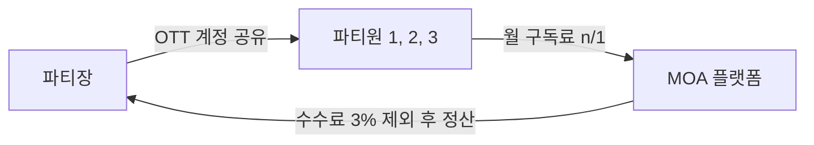

# MOA 프로젝트 최종 보고서 (확장판 V2)

> **OTT 구독 공유 플랫폼** - 함께 나누면 더 저렴하게!
> 
> 버전: 2.0 | 작성일: 2025-12-12 | 작성자: 4beans 팀

---

## 목차

1. [프로젝트 개요](#1-프로젝트-개요)
2. [기술 스택](#2-기술-스택)
3. [시스템 아키텍처](#3-시스템-아키텍처)
4. [데이터베이스 설계](#4-데이터베이스-설계)
5. [API 명세](#5-api-명세)
6. [핵심 기능 구현](#6-핵심-기능-구현)
7. [외부 연동 서비스](#7-외부-연동-서비스)
8. [예외 처리 시스템](#8-예외-처리-시스템)
9. [로깅 시스템](#9-로깅-시스템)
10. [팀 구성 및 역할](#10-팀-구성-및-역할)
11. [프로젝트 회고](#11-프로젝트-회고)
12. [부록](#12-부록)

---

## 1. 프로젝트 개요

### 1.1 서비스 소개

MOA는 넷플릭스, 왓챠 등 OTT 계정을 여러 사용자가 함께 **'파티'**를 만들어 공유하고, 비용을 자동으로 n분의 1로 나누어 결제하는 플랫폼입니다.

### 1.2 개발 배경 및 필요성

| 문제점 | 현황 |
|--------|------|
| OTT 비용 부담 | 넷플릭스 프리미엄 17,000원/월, 연간 20만원 이상 |
| 기존 공유 문제 | 정산 불이행, 무단 탈퇴, 계정 보안 취약 |
| 수동 관리 한계 | 매월 정산 알림, 결제 확인 등 번거로움 |

### 1.3 해결 방안

| 문제 | 해결책 | 구현 방법 |
|------|--------|-----------|
| 정산 불이행 | 자동 빌링 시스템 | Toss Payments 빌링키 |
| 무단 탈퇴 | 보증금 제도 | 탈퇴 시 환불/몰수 정책 |
| 계정 노출 | 암호화 저장 | AES-256 CBC 모드 |
| 신뢰 부족 | 파티 평점 시스템 | 거래 완료 후 상호 평가 |

### 1.4 핵심 비즈니스 모델



### 1.5 개발 기간 및 배포

- **기간**: 2024.11 ~ 2025.01 (약 2개월)
- **배포 URL**: [https://www.moamoa.cloud/](https://www.moamoa.cloud/)
- **API 서버**: https://api.moamoa.cloud/

---

## 2. 기술 스택

### 2.1 Frontend

| 분류 | 기술 | 버전 | 용도 |
|------|------|------|------|
| Framework | React | 19.2.0 | UI 라이브러리 |
| Build Tool | Vite | 7.2.4 | 번들러 + 개발 서버 |
| 상태 관리 | Zustand | 5.0.9 | 전역 상태 관리 |
| HTTP Client | Axios | 1.13.2 | API 통신 |
| Routing | React Router | 7.9.6 | SPA 라우팅 |
| Styling | Tailwind CSS | 4.1.17 | 유틸리티 CSS |
| UI Components | shadcn/ui | - | Radix 기반 컴포넌트 |
| Animation | Framer Motion | 12.23.25 | 애니메이션 |
| Form | React Hook Form + Zod | - | 폼 관리 및 유효성 검증 |
| Charts | Recharts | - | 차트 (관리자) |

### 2.2 Backend

| 분류 | 기술 | 버전 | 용도 |
|------|------|------|------|
| Framework | Spring Boot | 3.5.5 | 웹 프레임워크 |
| Language | Java | 17 | 개발 언어 |
| ORM | MyBatis | 3.0.3 | SQL 매퍼 |
| Security | Spring Security | 6.5 | 인증/인가 |
| JWT | jjwt | 0.12.x | 토큰 생성/검증 |
| Logging | Logback | - | 파일 로깅, 로그 롤링 |
| AOP | Spring AOP | - | 로깅, 트랜잭션 |
| OTP | dev.samstevens.totp | 1.7.1 | 이중 인증 |

### 2.3 Database

| 분류 | 기술 | 버전 | 용도 |
|------|------|------|------|
| RDBMS | MySQL | 8.0 | 주 데이터베이스 |
| Cache | Redis | 7.x | 세션/캐시 (선택) |

### 2.4 Infrastructure (AWS)

| 서비스 | 용도 |
|--------|------|
| EC2 | 애플리케이션 서버 |
| RDS | MySQL 데이터베이스 |
| S3 | 정적 파일 저장 (프로필 이미지) |
| Route 53 | DNS 관리 |
| ACM | SSL 인증서 |
| ALB | 로드 밸런서 |

### 2.5 외부 서비스

| 서비스 | 용도 |
|--------|------|
| **Toss Payments** | 결제 처리 (빌링키 자동결제) |
| **Open Banking** | 계좌 인증 (1원 인증), 정산 이체 |
| **PASS (PortOne)** | 본인인증 (계정 잠금 해제) |
| **Kakao OAuth** | 소셜 로그인 |
| **Google OAuth** | 소셜 로그인 |
| **Resend** | 이메일 발송 |

---

## 3. 시스템 아키텍처

### 3.1 전체 아키텍처

```
┌─────────────────────────────────────────────────────────────────┐
│                         Client Layer                            │
│  ┌─────────────────────────────────────────────────────────┐   │
│  │                    React SPA (Vite)                      │   │
│  │  ┌───────────┐  ┌───────────┐  ┌───────────────────┐   │   │
│  │  │  Zustand  │  │  Axios    │  │  React Router     │   │   │
│  │  │  (State)  │  │  (HTTP)   │  │  (Navigation)     │   │   │
│  │  └───────────┘  └───────────┘  └───────────────────┘   │   │
│  └─────────────────────────────────────────────────────────┘   │
└─────────────────────────────────────────────────────────────────┘
                               │
                               │ HTTPS / REST API
                               ▼
┌─────────────────────────────────────────────────────────────────┐
│                         Server Layer                            │
│  ┌─────────────────────────────────────────────────────────┐   │
│  │               Spring Boot Application                    │   │
│  │  ┌───────────┐  ┌───────────┐  ┌───────────────────┐   │   │
│  │  │Controller │→ │  Service  │→ │     MyBatis       │   │   │
│  │  │  (REST)   │  │  (Logic)  │  │    (Mapper)       │   │   │
│  │  └───────────┘  └───────────┘  └───────────────────┘   │   │
│  │                                                          │   │
│  │  ┌───────────┐  ┌───────────┐  ┌───────────────────┐   │   │
│  │  │   JWT     │  │ Scheduler │  │   WebClient       │   │   │
│  │  │  (Auth)   │  │  (Batch)  │  │ (External API)    │   │   │
│  │  └───────────┘  └───────────┘  └───────────────────┘   │   │
│  └─────────────────────────────────────────────────────────┘   │
└─────────────────────────────────────────────────────────────────┘
                               │
                               ▼
┌─────────────────────────────────────────────────────────────────┐
│                        Data Layer                               │
│  ┌─────────────┐  ┌─────────────┐  ┌─────────────────────┐     │
│  │   MySQL     │  │    Redis    │  │        S3           │     │
│  │   (RDS)     │  │   (Cache)   │  │    (Storage)        │     │
│  └─────────────┘  └─────────────┘  └─────────────────────┘     │
└─────────────────────────────────────────────────────────────────┘
                               │
                               ▼
┌─────────────────────────────────────────────────────────────────┐
│                     External Services                           │
│  ┌─────────────┐  ┌─────────────┐  ┌─────────────────────┐     │
│  │    Toss     │  │   Kakao     │  │      PASS           │     │
│  │  Payments   │  │   OAuth     │  │    (PortOne)        │     │
│  └─────────────┘  └─────────────┘  └─────────────────────┘     │
└─────────────────────────────────────────────────────────────────┘
```

### 3.2 Frontend 디렉토리 구조

```
src/
├── api/                    # API 통신 모듈 (14개)
│   ├── httpClient.js       # Axios 인스턴스 + 인터셉터
│   ├── authApi.js          # 인증 API
│   ├── partyApi.js         # 파티 API
│   ├── paymentApi.js       # 결제 API
│   ├── depositApi.js       # 보증금 API
│   ├── settlementApi.js    # 정산 API
│   ├── pushApi.js          # 푸시알림 API
│   └── ...
├── components/             # 재사용 컴포넌트 (81개)
│   ├── common/             # 공통 (Header, Footer, Modal)
│   ├── party/              # 파티 관련 컴포넌트
│   ├── payment/            # 결제 관련 컴포넌트
│   └── ui/                 # shadcn/ui 컴포넌트
├── hooks/                  # 커스텀 훅 (32개)
│   ├── useAuth.js          # 인증 훅
│   ├── useParty.js         # 파티 훅
│   └── ...
├── pages/                  # 페이지 컴포넌트 (106개)
│   ├── main/               # 메인 페이지
│   ├── party/              # 파티 페이지
│   ├── user/               # 유저 페이지
│   ├── admin/              # 관리자 페이지
│   └── landing/            # 랜딩 페이지 (50+개)
├── store/                  # Zustand 스토어 (19개)
│   ├── authStore.js        # 인증 상태 관리
│   ├── partyStore.js       # 파티 상태 관리
│   └── ...
├── utils/                  # 유틸리티 함수 (8개)
└── App.jsx                 # 라우팅 설정
```

### 3.3 Backend 디렉토리 구조

```
src/main/java/com/moa/
├── auth/                   # JWT 필터, 인증 관련
│   ├── filter/             # JwtAuthenticationFilter
│   ├── handler/            # EntryPoint, AccessDenied
│   └── provider/           # JwtProvider
├── common/                 # 공통 유틸, 예외, 이벤트 (22개)
│   ├── aspect/             # LogAspect (AOP 로깅)
│   ├── filter/             # LoggingFilter (HTTP 로깅)
│   ├── exception/          # GlobalExceptionHandler
│   ├── event/              # Spring Event 클래스
│   └── util/               # AESUtil, DateUtil
├── config/                 # 설정 클래스 (11개)
│   ├── SecurityConfig.java
│   ├── WebConfig.java
│   └── OpenBankingConfig.java
├── dao/                    # MyBatis DAO 인터페이스 (25개)
├── domain/                 # 엔티티 및 Enum (37개)
├── dto/                    # Request/Response DTO (66개)
├── scheduler/              # 스케줄러 (8개)
│   ├── PaymentScheduler.java
│   ├── SettlementScheduler.java
│   └── ...
├── service/                # 비즈니스 로직 (54개)
│   ├── party/              # 파티 서비스
│   ├── payment/            # 결제 서비스
│   ├── deposit/            # 보증금 서비스
│   ├── settlement/         # 정산 서비스
│   └── ...
└── web/                    # REST 컨트롤러 (20개)
```

---

## 4. 데이터베이스 설계

### 4.1 ERD

```
┌──────────────┐       ┌──────────────┐       ┌──────────────┐
│    USERS     │       │   PRODUCT    │       │   CATEGORY   │
├──────────────┤       ├──────────────┤       ├──────────────┤
│ USER_ID (PK) │       │PRODUCT_ID(PK)│◄──────│CATEGORY_ID(PK)
│ PASSWORD     │       │ CATEGORY_ID  │       │ CATEGORY_NAME│
│ NICKNAME     │       │ PRODUCT_NAME │       └──────────────┘
│ PHONE        │       │ PRICE        │
│ ROLE         │       │ MAX_SHARE    │
│ USER_STATUS  │       │ IMAGE        │
│ PROVIDER     │       └──────────────┘
│ OTP_ENABLED  │              │
└──────────────┘              │
       │                      │
       │         ┌────────────┴────────────┐
       │         │                         │
       ▼         ▼                         ▼
┌──────────────────────┐         ┌──────────────────┐
│       PARTY          │         │   SUBSCRIPTION   │
├──────────────────────┤         ├──────────────────┤
│ PARTY_ID (PK)        │         │SUBSCRIPTION_ID(PK)
│ PRODUCT_ID (FK)      │         │ USER_ID (FK)     │
│ PARTY_LEADER_ID (FK) │         │ PRODUCT_ID (FK)  │
│ PARTY_STATUS         │         │ START_DATE       │
│ MAX_MEMBERS          │         │ END_DATE         │
│ CURRENT_MEMBERS      │         └──────────────────┘
│ MONTHLY_FEE          │
│ OTT_ID               │
│ OTT_PASSWORD         │
│ ACCOUNT_ID (FK)      │
└──────────────────────┘
       │
       ▼
┌──────────────────────┐
│    PARTY_MEMBER      │
├──────────────────────┤
│ PARTY_MEMBER_ID (PK) │
│ PARTY_ID (FK)        │◄────────────┐
│ USER_ID (FK)         │             │
│ MEMBER_ROLE          │             │
│ MEMBER_STATUS        │             │
│ JOIN_DATE            │             │
│ BILLING_KEY          │             │
└──────────────────────┘             │
       │                             │
       ├─────────────┬───────────────┤
       │             │               │
       ▼             ▼               ▼
┌──────────────┐ ┌──────────────┐ ┌──────────────┐
│   DEPOSIT    │ │   PAYMENT    │ │  SETTLEMENT  │
├──────────────┤ ├──────────────┤ ├──────────────┤
│DEPOSIT_ID(PK)│ │PAYMENT_ID(PK)│ │SETTLEMENT_ID │
│ PARTY_ID     │ │ PARTY_ID     │ │ PARTY_ID     │
│PARTY_MEMBER_ID│ │PARTY_MEMBER_ID│ │PARTY_LEADER_ID
│ USER_ID      │ │ USER_ID      │ │ ACCOUNT_ID   │
│DEPOSIT_AMOUNT│ │PAYMENT_AMOUNT│ │ TOTAL_AMOUNT │
│DEPOSIT_STATUS│ │PAYMENT_STATUS│ │ NET_AMOUNT   │
│TOSS_PAYMENT_KEY│ │TOSS_PAYMENT_KEY│ │SETTLEMENT_STATUS
└──────────────┘ └──────────────┘ └──────────────┘
```

### 4.2 주요 테이블 정의

#### USERS (회원)
| 컬럼 | 타입 | 설명 |
|------|------|------|
| USER_ID | VARCHAR(50) | 이메일 (PK) |
| PASSWORD | VARCHAR(255) | 비밀번호 (bcrypt) |
| NICKNAME | VARCHAR(20) | 닉네임 |
| PHONE | VARCHAR(14) | 전화번호 |
| ROLE | VARCHAR(20) | 역할 (USER/ADMIN) |
| USER_STATUS | VARCHAR(20) | 상태 (ACTIVE/INACTIVE/DELETED) |
| PROVIDER | VARCHAR(50) | 로그인 제공자 (LOCAL/KAKAO/GOOGLE) |
| OTP_SECRET | VARCHAR(64) | Google OTP Secret |
| OTP_ENABLED | TINYINT(1) | OTP 활성화 여부 |

#### PRODUCT (구독 상품)
| 컬럼 | 타입 | 설명 |
|------|------|------|
| PRODUCT_ID | INT | 상품 ID (PK) |
| CATEGORY_ID | INT | 카테고리 ID (FK) |
| PRODUCT_NAME | VARCHAR(50) | 상품명 (Netflix, Disney+) |
| PRODUCT_STATUS | VARCHAR(20) | 상태 (ACTIVE/INACTIVE) |
| PRICE | INT | 월 구독료 |
| IMAGE | VARCHAR(255) | 로고 이미지 URL |

#### PARTY (파티)
| 컬럼 | 타입 | 설명 |
|------|------|------|
| PARTY_ID | INT | 파티 ID (PK) |
| PRODUCT_ID | INT | 상품 ID (FK) |
| PARTY_LEADER_ID | VARCHAR(50) | 파티장 ID (FK) |
| PARTY_STATUS | VARCHAR(20) | 상태 |
| MAX_MEMBERS | INT | 최대 인원 |
| CURRENT_MEMBERS | INT | 현재 인원 |
| MONTHLY_FEE | INT | 월 구독료 (인당) |
| OTT_ID | VARCHAR(100) | OTT 계정 ID (암호화) |
| OTT_PASSWORD | VARCHAR(255) | OTT 계정 비밀번호 (암호화) |
| ACCOUNT_ID | INT | 정산 계좌 ID (FK) |
| START_DATE | DATE | 파티 시작일 |
| END_DATE | DATE | 파티 종료일 |
| PAYMENT_DAY | INT | 결제일 (1-28) |

#### DEPOSIT (보증금)
| 컬럼 | 타입 | 설명 |
|------|------|------|
| DEPOSIT_ID | INT | 보증금 ID (PK) |
| PARTY_ID | INT | 파티 ID (FK) |
| PARTY_MEMBER_ID | INT | 파티 멤버 ID (FK) |
| USER_ID | VARCHAR(50) | 사용자 ID (FK) |
| DEPOSIT_TYPE | VARCHAR(20) | 타입 (LEADER/SECURITY) |
| DEPOSIT_AMOUNT | INT | 보증금 금액 |
| DEPOSIT_STATUS | VARCHAR(20) | 상태 (PENDING/PAID/REFUNDED) |
| TOSS_PAYMENT_KEY | VARCHAR(255) | Toss 결제 키 |

#### PAYMENT (결제)
| 컬럼 | 타입 | 설명 |
|------|------|------|
| PAYMENT_ID | INT | 결제 ID (PK) |
| PARTY_ID | INT | 파티 ID (FK) |
| PARTY_MEMBER_ID | INT | 파티 멤버 ID (FK) |
| PAYMENT_TYPE | VARCHAR(20) | 타입 (FIRST/MONTHLY) |
| PAYMENT_AMOUNT | INT | 결제 금액 |
| PAYMENT_STATUS | VARCHAR(20) | 상태 |
| TARGET_MONTH | VARCHAR(7) | 대상 월 (YYYY-MM) |
| TOSS_PAYMENT_KEY | VARCHAR(255) | Toss 결제 키 |

#### SETTLEMENT (정산)
| 컬럼 | 타입 | 설명 |
|------|------|------|
| SETTLEMENT_ID | INT | 정산 ID (PK) |
| PARTY_ID | INT | 파티 ID (FK) |
| PARTY_LEADER_ID | VARCHAR(50) | 파티장 ID (FK) |
| ACCOUNT_ID | INT | 정산 계좌 ID (FK) |
| SETTLEMENT_MONTH | VARCHAR(7) | 정산 월 (YYYY-MM) |
| TOTAL_AMOUNT | INT | 총 금액 |
| COMMISSION_RATE | DECIMAL(3,2) | 수수료율 |
| COMMISSION_AMOUNT | INT | 수수료 금액 |
| NET_AMOUNT | INT | 순 정산 금액 |
| SETTLEMENT_STATUS | VARCHAR(20) | 상태 |

---

*[Part 2에서 계속 - API 명세, 핵심 기능, 예외 처리 등]*
