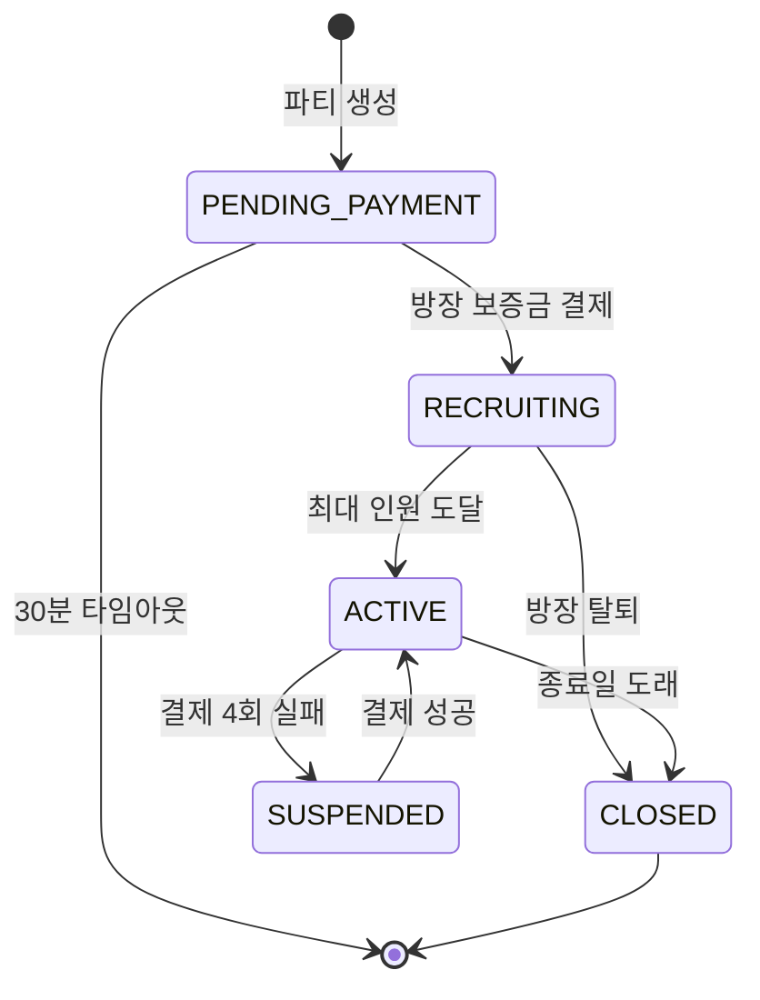
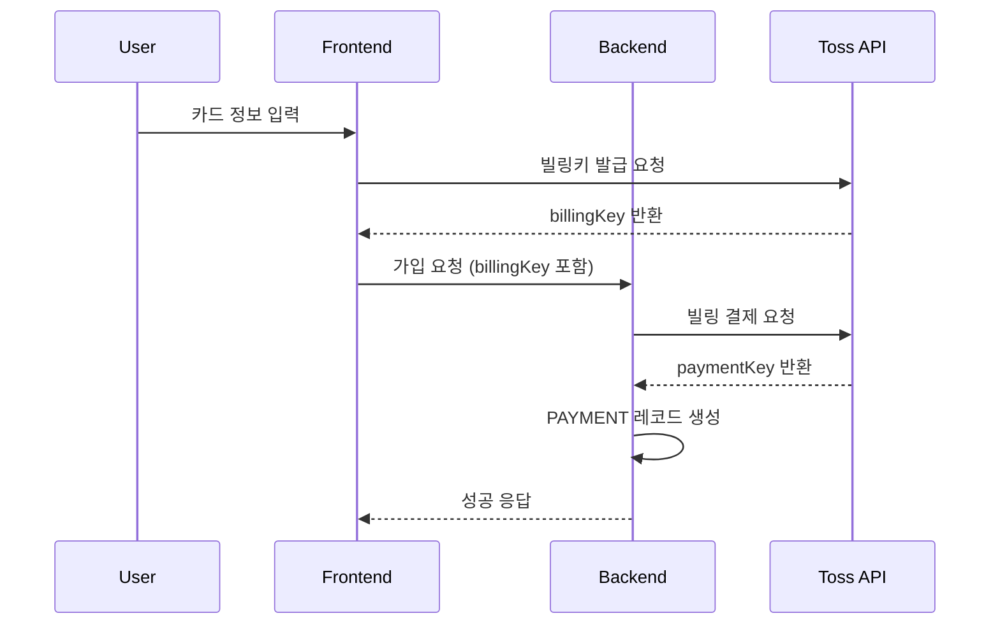
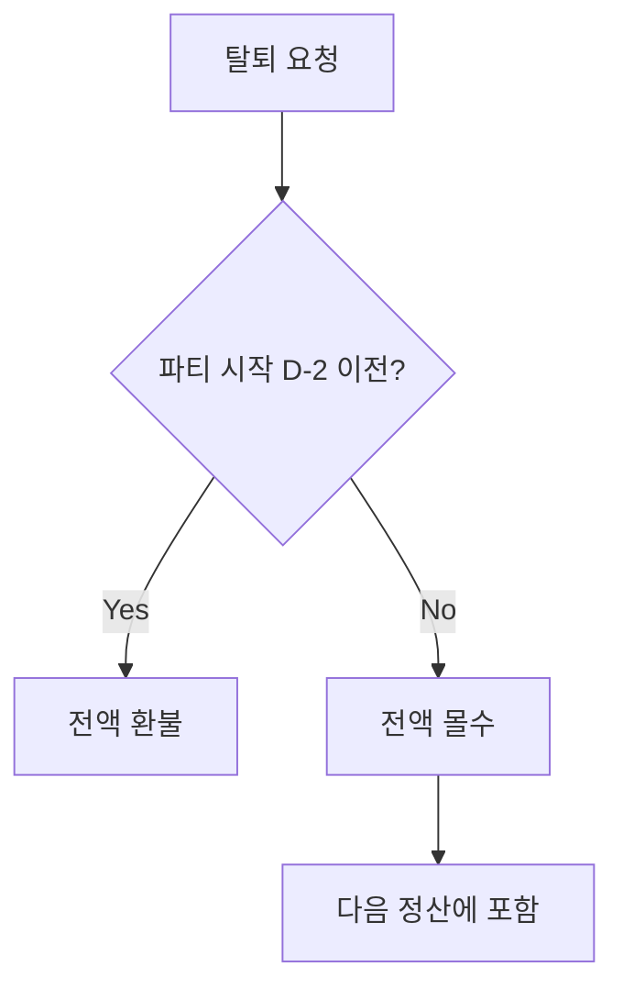

# MOA 프로젝트 최종 보고서 (확장판 V2) - Part 2

> Part 1에서 이어짐 (개요, 기술스택, 아키텍처, DB 설계)

---

## 5. API 명세

### 5.1 공통 사항

#### Base URL
```
Production: https://api.moamoa.cloud/api
Development: http://localhost:8080/api
```

#### 응답 형식
```json
{
  "success": true,
  "data": { ... },
  "error": null
}
```

#### 에러 응답
```json
{
  "success": false,
  "data": null,
  "error": {
    "code": "ERROR_CODE",
    "message": "에러 메시지"
  }
}
```

#### 인증 헤더
```
Authorization: Bearer {accessToken}
```

---

### 5.2 인증 API

#### 로그인
```http
POST /api/auth/login
Content-Type: application/json

Request:
{
  "userId": "user@email.com",
  "password": "Password123!"
}

Response (200):
{
  "success": true,
  "data": {
    "accessToken": "eyJhbGc...",
    "refreshToken": "eyJhbGc...",
    "accessTokenExpiresIn": 1800000,
    "user": {
      "userId": "user@email.com",
      "nickname": "닉네임",
      "role": "USER"
    }
  }
}
```

#### 토큰 갱신
```http
POST /api/auth/refresh
Headers:
  Refresh-Token: {refreshToken}

Response (200):
{
  "success": true,
  "data": {
    "accessToken": "새_토큰",
    "refreshToken": "새_리프레시_토큰",
    "accessTokenExpiresIn": 1800000
  }
}
```

#### OTP 설정 및 검증
```http
POST /api/auth/otp/setup
Authorization: Bearer {accessToken}

Response (200):
{
  "success": true,
  "data": {
    "secretKey": "BASE32_SECRET",
    "qrCodeUrl": "otpauth://totp/..."
  }
}
```

---

### 5.3 사용자 API

#### 회원가입
```http
POST /api/users/add
Content-Type: application/json

Request:
{
  "userId": "user@email.com",
  "password": "Password123!",
  "passwordConfirm": "Password123!",
  "nickname": "닉네임",
  "phone": "010-1234-5678"
}

Response (201):
{
  "success": true,
  "data": {
    "userId": "user@email.com",
    "message": "회원가입이 완료되었습니다."
  }
}
```

#### 내 정보 조회
```http
GET /api/users/me
Authorization: Bearer {accessToken}

Response (200):
{
  "success": true,
  "data": {
    "userId": "user@email.com",
    "nickname": "닉네임",
    "phone": "010-1234-5678",
    "role": "USER",
    "provider": "LOCAL",
    "otpEnabled": false
  }
}
```

---

### 5.4 파티 API

#### 파티 목록 조회
```http
GET /api/parties?page=0&size=12&platform=NETFLIX&status=RECRUITING

Response (200):
{
  "success": true,
  "data": {
    "content": [
      {
        "partyId": 1,
        "productName": "Netflix",
        "partyStatus": "RECRUITING",
        "maxMembers": 4,
        "currentMembers": 2,
        "monthlyFee": 4250,
        "startDate": "2025-02-01"
      }
    ],
    "totalPages": 10,
    "totalElements": 100
  }
}
```

#### 파티 생성
```http
POST /api/parties
Authorization: Bearer {accessToken}
Content-Type: application/json

Request:
{
  "productId": 1,
  "maxMembers": 4,
  "monthlyFee": 17000,
  "startDate": "2025-02-01",
  "endDate": "2025-12-31",
  "ottId": "netflix_id",
  "ottPassword": "netflix_pw"
}

Response (201):
{
  "success": true,
  "data": {
    "partyId": 1,
    "message": "파티가 생성되었습니다. 보증금 결제를 진행해주세요."
  }
}
```

#### 파티 가입
```http
POST /api/parties/{partyId}/join
Authorization: Bearer {accessToken}
Content-Type: application/json

Request:
{
  "billingKey": "toss_billing_key",
  "customerKey": "customer_key"
}

Response (200):
{
  "success": true,
  "data": {
    "partyMemberId": 1,
    "message": "파티에 가입되었습니다."
  }
}
```

#### 파티 탈퇴
```http
DELETE /api/parties/{partyId}/leave
Authorization: Bearer {accessToken}

Response (200):
{
  "success": true,
  "data": {
    "message": "파티에서 탈퇴했습니다."
  }
}
```

---

### 5.5 결제 API

#### 내 결제 내역
```http
GET /api/v1/payments/my
Authorization: Bearer {accessToken}

Response (200):
{
  "success": true,
  "data": [
    {
      "paymentId": 1,
      "partyId": 1,
      "productName": "Netflix",
      "paymentType": "MONTHLY",
      "paymentAmount": 4250,
      "paymentStatus": "SUCCESS",
      "targetMonth": "2025-01"
    }
  ]
}
```

---

### 5.6 보증금 API

#### 내 보증금 조회
```http
GET /api/deposits/my
Authorization: Bearer {accessToken}

Response (200):
{
  "success": true,
  "data": [
    {
      "depositId": 1,
      "partyId": 1,
      "depositType": "SECURITY",
      "depositAmount": 4250,
      "depositStatus": "PAID"
    }
  ]
}
```

---

### 5.7 정산 API

#### 내 정산 내역
```http
GET /api/settlements/my
Authorization: Bearer {accessToken}

Response (200):
{
  "success": true,
  "data": [
    {
      "settlementId": 1,
      "partyId": 1,
      "settlementMonth": "2025-01",
      "totalAmount": 12750,
      "commissionRate": 0.03,
      "commissionAmount": 382,
      "netAmount": 12368,
      "settlementStatus": "COMPLETED"
    }
  ]
}
```

---

### 5.8 계좌 인증 API (Open Banking)

#### 1원 인증 요청
```http
POST /api/bank-account/verify-request
Authorization: Bearer {accessToken}
Content-Type: application/json

Request:
{
  "bankCode": "088",
  "accountNum": "1234567890",
  "accountHolder": "홍길동"
}

Response (200):
{
  "success": true,
  "data": {
    "bankTranId": "MOA_123456789",
    "message": "1원이 입금되었습니다."
  }
}
```

#### 인증코드 검증
```http
POST /api/bank-account/verify
Authorization: Bearer {accessToken}
Content-Type: application/json

Request:
{
  "bankTranId": "MOA_123456789",
  "verifyCode": "1234"
}

Response (200):
{
  "success": true,
  "data": {
    "accountId": 1,
    "message": "계좌가 등록되었습니다."
  }
}
```

---

## 6. 핵심 기능 구현

### 6.1 파티 시스템

#### 파티 생명주기



#### 파티 생성 코드

```java
// PartyServiceImpl.createParty() 
@Transactional
public PartyDetailResponse createParty(String userId, PartyCreateRequest request) {
    // 1. 인당 요금 계산
    int perMemberFee = request.getMonthlyFee() / request.getMaxMembers();
    
    // 2. OTT 계정 정보 암호화 (AES-256)
    String encryptedOttId = AESUtil.encrypt(request.getOttId());
    String encryptedOttPassword = AESUtil.encrypt(request.getOttPassword());
    
    // 3. Party 엔티티 생성 (상태: PENDING_PAYMENT)
    Party party = Party.builder()
        .partyLeaderId(userId)
        .productId(request.getProductId())
        .partyStatus(PartyStatus.PENDING_PAYMENT)
        .maxMembers(request.getMaxMembers())
        .currentMembers(1)
        .monthlyFee(perMemberFee)
        .ottId(encryptedOttId)
        .ottPassword(encryptedOttPassword)
        .build();
    
    partyDao.create(party);
    
    // 4. 방장을 PARTY_MEMBER에 추가
    partyMemberDao.createLeaderMember(party.getPartyId(), userId);
    
    return getPartyDetail(party.getPartyId(), userId);
}
```

#### 동시성 제어 (파티 가입)

```java
// PartyServiceImpl.joinParty() - Race Condition 방지
@Transactional
public void joinParty(Integer partyId, String userId, PaymentRequest request) {
    // 1. 정원 증가 - Toss API 호출 전에 먼저 실행 ⭐
    int updatedRows = partyMemberDao.incrementMemberCountIfAvailable(partyId);
    if (updatedRows == 0) {
        throw new BusinessException(ErrorCode.PARTY_FULL);
    }

    try {
        // 2. 보증금 + 첫 달 결제
        depositService.createDeposit(partyId, ...);
        paymentService.createInitialPayment(partyId, ...);
        
        // 3. 정원 도달 시 ACTIVE로 전환
        Party updated = partyDao.findById(partyId).orElseThrow();
        if (updated.getCurrentMembers() >= updated.getMaxMembers()) {
            partyDao.updatePartyStatus(partyId, PartyStatus.ACTIVE);
        }
    } catch (Exception e) {
        // 실패 시 정원 복구 (보상 트랜잭션)
        partyMemberDao.decrementMemberCount(partyId);
        throw e;
    }
}
```

---

### 6.2 결제 시스템 (Toss Payments)

#### 빌링 결제 흐름



#### 결제 실패 재시도

| 시도 | 간격 | 푸시 알림 |
|------|------|-----------|
| 1차 | 즉시 | - |
| 2차 | +1일 | PAY_FAILED_RETRY |
| 3차 | +2일 | PAY_FAILED_RETRY |
| 4차 | +3일 | PAY_FINAL_FAILED |

---

### 6.3 보증금 시스템

#### 탈퇴 시 환불 정책



---

### 6.4 정산 시스템

#### 정산 계산 공식

```
총 수입 = 월회비 × 결제 완료 멤버 수 + 몰수 보증금
수수료 = 월회비 수입 × 3%
순 정산액 = 총 수입 - 수수료
```

**예시:**
- 월회비: 4,250원 × 3명 = 12,750원
- 수수료 (3%): 382원
- 순 정산액: 12,368원

---

## 7. 외부 연동 서비스

### 7.1 Toss Payments

| 기능 | API 엔드포인트 |
|------|----------------|
| 빌링키 발급 | `POST /v1/billing/authorizations/card` |
| 빌링 결제 | `POST /v1/billing/{billingKey}` |
| 결제 취소 | `POST /v1/payments/{paymentKey}/cancel` |

### 7.2 Open Banking

| 기능 | 설명 |
|------|------|
| 1원 인증 | 계좌 소유 확인 |
| 입금 이체 | 정산금 이체 |

### 7.3 PASS 본인인증 (PortOne)

```java
@Service
public class PassAuthServiceImpl implements PassAuthService {

    @Override
    public Map<String, Object> verifyCertification(String impUid) {
        String token = getAccessToken();
        
        ResponseEntity<Map> res = restTemplate.exchange(
            "https://api.iamport.kr/certifications/" + impUid,
            HttpMethod.GET, req, Map.class);
        
        // phone, name, ci, di 반환
        return parseResponse(res);
    }
}
```

**활용**: 로그인 5회 실패 시 계정 잠금 해제

---

## 8. 예외 처리 시스템

### 8.1 환불 에러 분류

| 에러 코드 | 분류 | 설명 |
|-----------|------|------|
| ALREADY_CANCELED | 재시도 불가 | 이미 취소됨 |
| INVALID_CANCEL_AMOUNT | 재시도 불가 | 잘못된 금액 |
| 네트워크 오류 | 재시도 가능 | 일시적 오류 |

### 8.2 사용자 탈퇴 이벤트

```java
@EventListener
@Async
@Transactional
public void handleUserDeleted(UserDeletedEvent event) {
    // 파티장 파티 처리 (해산)
    handleLeaderParties(event.getUserId());
    
    // 파티원 멤버십 처리 (보증금 환불)
    handleMemberParties(event.getUserId());
}
```

### 8.3 스케줄러

| 스케줄러 | 실행 시간 | 역할 |
|----------|-----------|------|
| PaymentScheduler | 매일 02:00 | 자동 결제 |
| SettlementScheduler | 매월 1일 04:00 | 정산 |
| RefundScheduler | 매 시간 | 환불 재시도 |
| PaymentTimeoutScheduler | 5분마다 | 타임아웃 파티 삭제 |

---

## 9. 로깅 시스템

### 9.1 로그 파일 구조

| 파일 | 용도 | 보관 |
|------|------|------|
| `logs/moa.log` | 전체 로그 | 30일 |
| `logs/error.log` | ERROR만 | 90일 |
| `logs/payment.log` | 결제/정산 | 365일 |

### 9.2 LoggingFilter

- TraceId 생성 (8자리 UUID)
- MDC에 traceId, userId 주입
- Response Header에 X-Trace-Id 추가
- 민감 정보 마스킹 (password, token 등)

### 9.3 LogAspect (AOP)

- 서비스 레이어 메서드 실행 시간 측정
- 3초 이상 Slow 경고
- 결제/정산 로직 INFO 레벨 강제

---

## 10. 팀 구성 및 역할

| 이름 | 역할 | 담당 |
|------|------|------|
| 육주영 | 팀장 | 인증, 어드민 |
| 박한솔 | Git 관리자 | 파티, 결제, 정산 |
| 김진원 | 클라우드 | 상품, AWS |
| 김이서 | DBA | 알림, DB |

---

## 11. 프로젝트 회고

*(추후 작성 예정)*

---

## 12. 부록

### 12.1 파티 상태 코드

| 코드 | 설명 |
|------|------|
| PENDING_PAYMENT | 보증금 결제 대기 |
| RECRUITING | 모집 중 |
| ACTIVE | 정상 운영 |
| SUSPENDED | 일시정지 |
| CLOSED | 종료 |

### 12.2 에러 코드

| 코드 | 설명 |
|------|------|
| AUTH_001 | 인증 실패 |
| PARTY_001 | 파티 없음 |
| PARTY_002 | 정원 초과 |
| PAYMENT_001 | 결제 실패 |

### 12.3 푸시 알림 코드

| 코드 | 설명 |
|------|------|
| PARTY_JOIN | 가입 완료 |
| PAY_SUCCESS | 결제 완료 |
| SETTLE_COMPLETED | 정산 완료 |

---

**문서 버전**: 2.0 (확장판)  
**작성일**: 2025-12-12  
**작성자**: 4beans 팀
