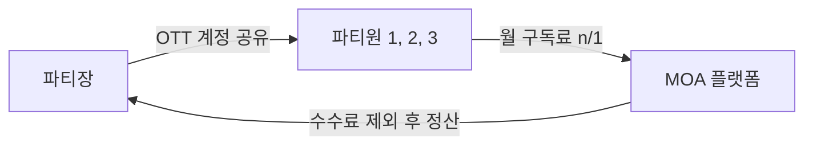
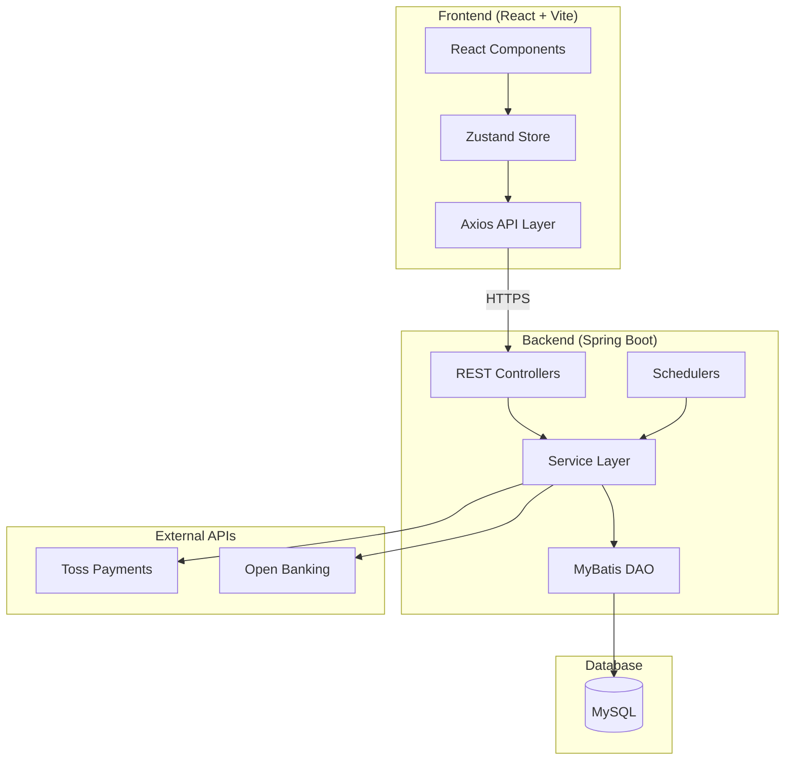
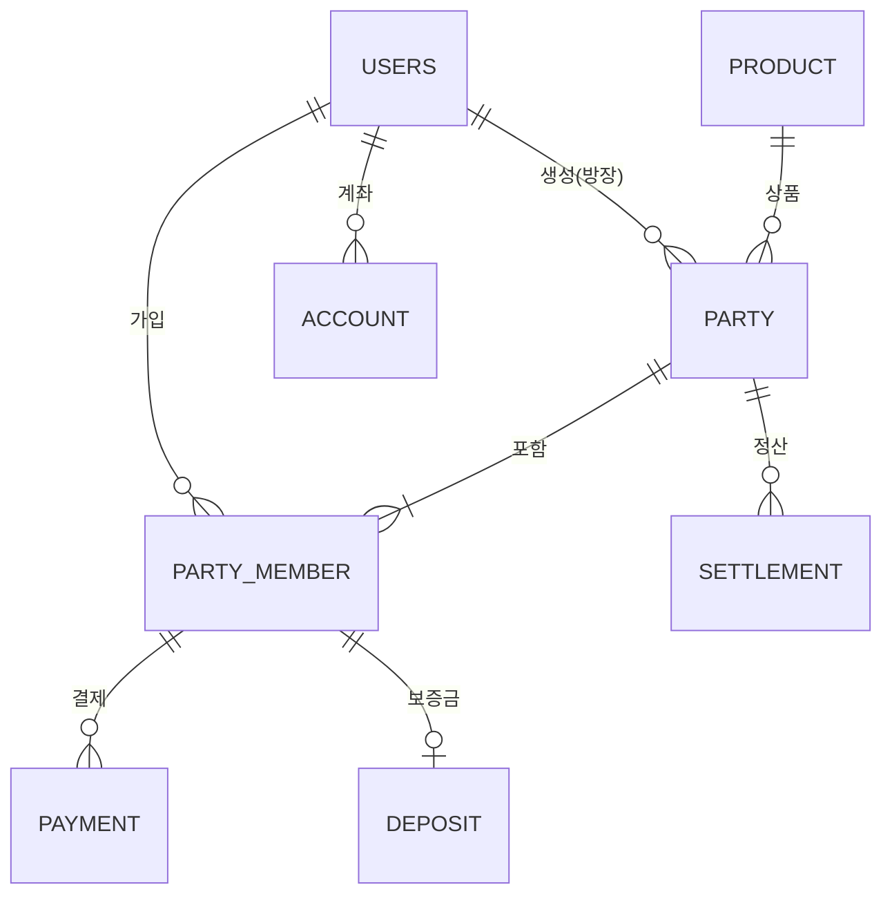
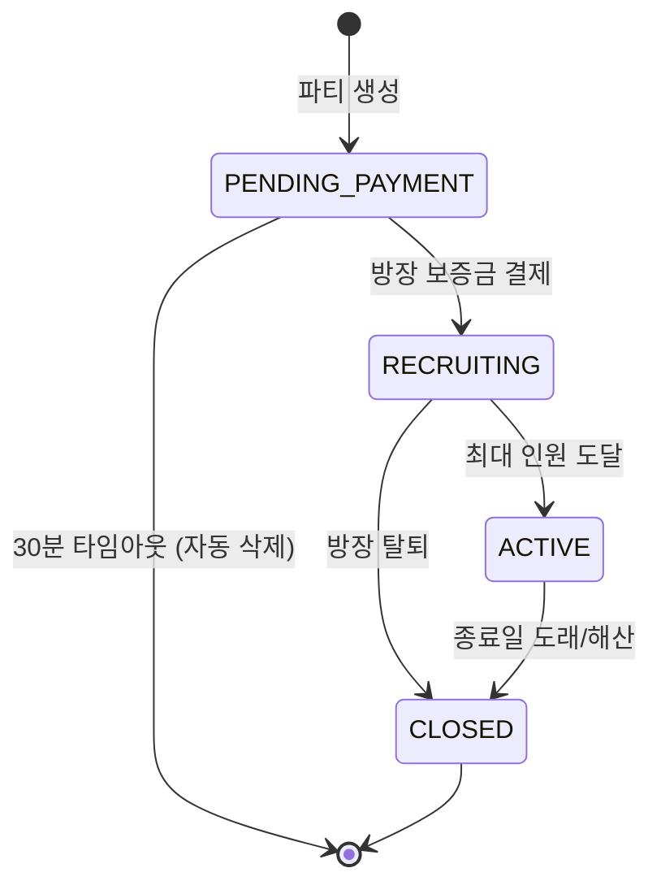
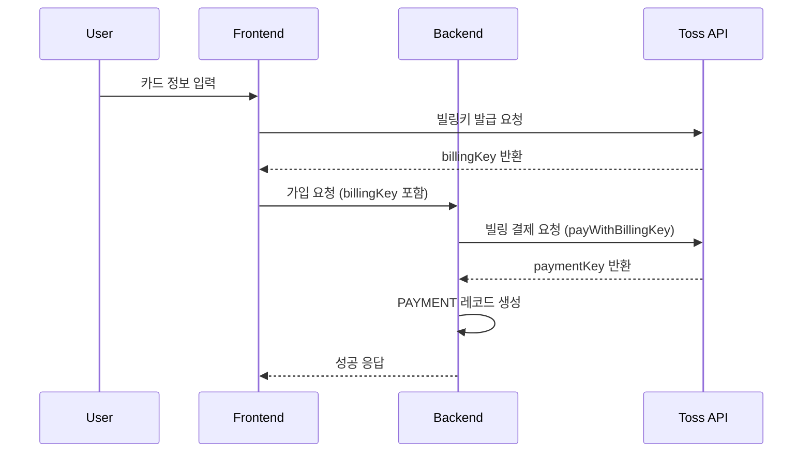
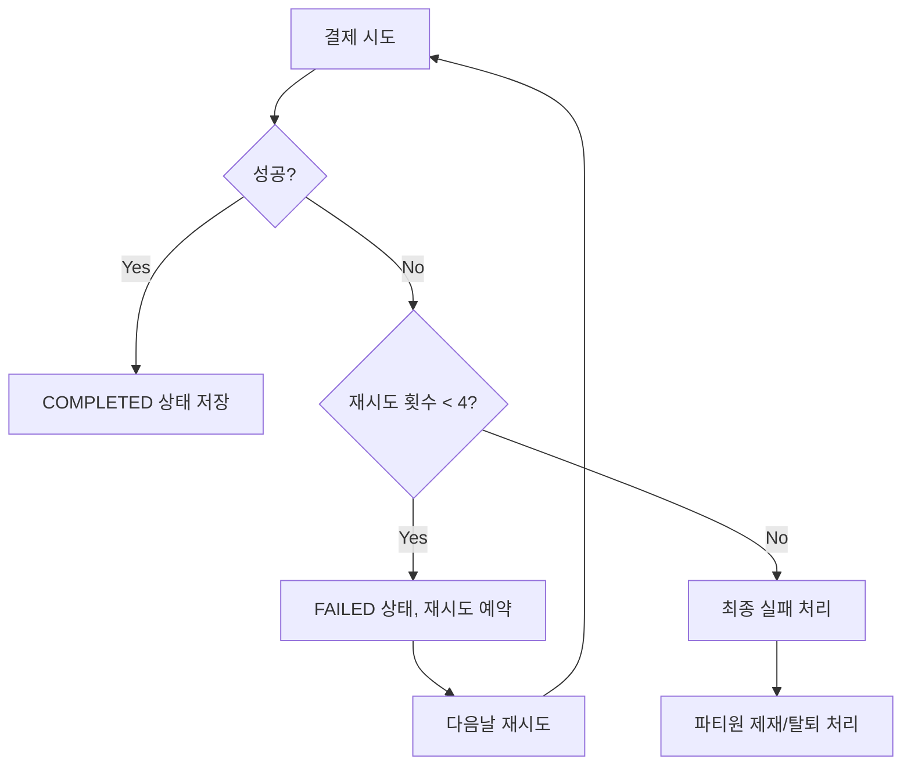
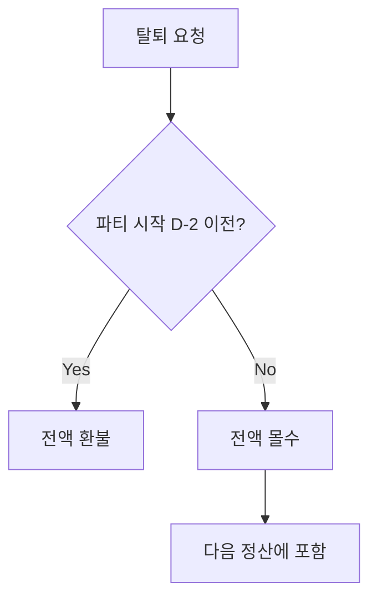
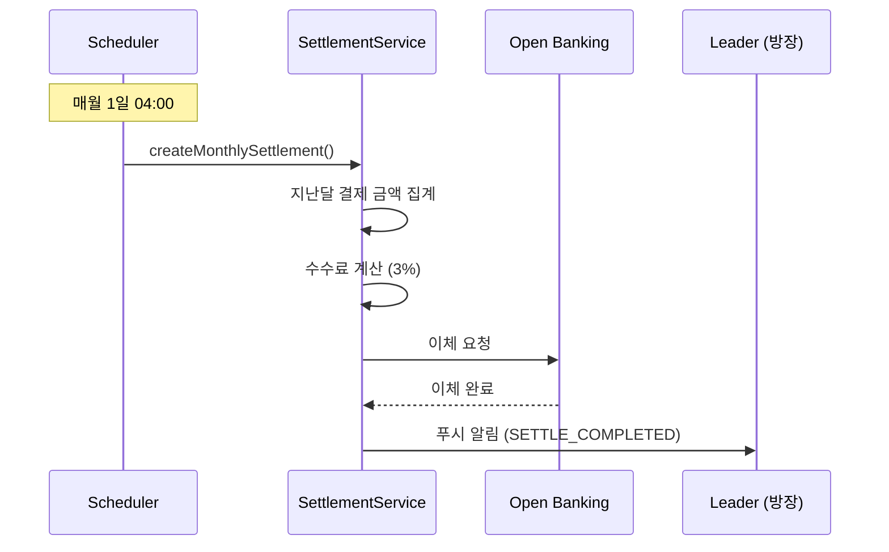

# MOA 프로젝트 로직 설명서

> **OTT 계정 공유 및 비용 자동 분담 플랫폼**
> 
> 버전: 1.0 | 작성일: 2025-12-11 | 대상: 개발자

---

## 목차

1. [프로젝트 개요](#1-프로젝트-개요)
2. [기술 스택](#2-기술-스택)
3. [시스템 아키텍처](#3-시스템-아키텍처)
4. [파티 (Party) 도메인](#4-파티-party-도메인)
5. [결제 (Payment) 도메인](#5-결제-payment-도메인)
6. [보증금 (Deposit) 도메인](#6-보증금-deposit-도메인)
7. [정산 (Settlement) 도메인](#7-정산-settlement-도메인)
8. [스케줄러 (Scheduler)](#8-스케줄러-scheduler)
9. [푸시 알림 시스템](#9-푸시-알림-시스템)
10. [보안](#10-보안)

---

## 1. 프로젝트 개요

### 서비스 소개

MOA는 넷플릭스, 왓챠 등 OTT 계정을 여러 사용자가 함께 **'파티'**를 만들어 공유하고, 비용을 자동으로 n분의 1로 나누어 결제하는 플랫폼입니다.

### 핵심 비즈니스 모델



- **파티장(Leader)**: OTT 계정을 제공하고, 매월 정산금을 받습니다.
- **파티원(Member)**: 매월 자동으로 구독료를 결제하고, OTT 계정을 이용합니다.
- **MOA 플랫폼**: 결제, 정산, 보증금 관리를 자동화합니다.

---

## 2. 기술 스택

### Frontend

| 기술 | 버전 | 용도 |
|:---|:---|:---|
| **React** | 19.2.0 | UI 프레임워크 |
| **Vite** | 7.2.4 | 번들러 및 개발 서버 |
| **Tailwind CSS** | 4.1.17 | 스타일링 |
| **shadcn/ui (Radix)** | 다수 | UI 컴포넌트 라이브러리 |
| **Zustand** | 5.0.9 | 전역 상태 관리 |
| **React Router** | 7.9.6 | 클라이언트 라우팅 |
| **Axios** | 1.13.2 | HTTP 클라이언트 |
| **Framer Motion** | 12.23.25 | 애니메이션 |
| **React Hook Form + Zod** | - | 폼 관리 및 유효성 검증 |
| **Recharts / Chart.js** | - | 데이터 시각화 |

**프론트엔드 디렉토리 구조:**
```
src/
├── api/          # API 호출 함수 (14개 모듈)
├── components/   # 재사용 가능한 컴포넌트 (81개)
├── hooks/        # 커스텀 훅 (32개)
├── pages/        # 페이지 컴포넌트 (106개)
├── store/        # Zustand 스토어 (19개)
├── utils/        # 유틸리티 함수 (8개)
└── App.jsx       # 라우팅 설정
```

### Backend

| 기술 | 버전 | 용도 |
|:---|:---|:---|
| **Spring Boot** | 3.5.5 | 웹 프레임워크 |
| **Java** | 17 | 프로그래밍 언어 |
| **MyBatis** | 3.0.3 | SQL 매퍼 |
| **MySQL** | - | 데이터베이스 |
| **Spring Security** | 6.5.3 | 인증/인가 |
| **JWT (jjwt)** | 0.11.5 | 토큰 기반 인증 |
| **Lombok** | - | 보일러플레이트 코드 생성 |
| **Spring AOP** | - | 로깅, 트랜잭션 |
| **TOTP** | 1.7.1 | 이중 인증 (OTP) |

**백엔드 디렉토리 구조:**
```
com.moa/
├── auth/         # JWT 필터, 인증 관련
├── common/       # 공통 유틸, 예외 처리, 이벤트 (22개)
├── config/       # 설정 클래스 (11개)
├── dao/          # MyBatis DAO 인터페이스 (25개)
├── domain/       # 엔티티 및 Enum (37개)
├── dto/          # Request/Response DTO (66개)
├── scheduler/    # 스케줄러 (8개)
├── service/      # 비즈니스 로직 (54개)
└── web/          # REST 컨트롤러 (20개)
```

### 외부 연동

| 서비스 | 용도 |
|:---|:---|
| **Toss Payments** | 카드 결제, 빌링키 발급, 자동 결제 |
| **Open Banking API** | 계좌 인증 (1원 인증), 정산 이체 |
| **Resend** | 이메일 발송 |

---

## 3. 시스템 아키텍처

### 전체 시스템 다이어그램



### 핵심 ERD (테이블 관계)



---

## 4. 파티 (Party) 도메인

> **핵심 파일:** [PartyServiceImpl.java](file:///c:/sol/React/4beans-moa-front/4beans-moa-backend/src/main/java/com/moa/service/party/impl/PartyServiceImpl.java) (618줄, 22개 메서드)

### 4.1 파티 생명주기 (Lifecycle)



| 상태 | 설명 | 트리거 |
|:---|:---|:---|
| `PENDING_PAYMENT` | 결제 대기 | 파티 생성 시 |
| `RECRUITING` | 모집 중 | 방장 보증금 결제 완료 |
| `ACTIVE` | 이용 중 | `currentMembers == maxMembers` |
| `CLOSED` | 종료 | 종료일 도래 또는 해산 |

### 4.2 파티 생성 흐름

```java
// PartyServiceImpl.createParty() - 80~137줄
@Transactional
public PartyDetailResponse createParty(String userId, PartyCreateRequest request) {
    // 1. 요청 유효성 검증
    validateCreateRequest(request);

    // 2. 인당 요금 계산 (월구독료 / 최대인원, 마지막 멤버는 나머지 금액)
    int perMemberFee = request.getMonthlyFee() / request.getMaxMembers();
    int lastMemberFee = calculateLastMemberFee(request.getMonthlyFee(), request.getMaxMembers());

    // 3. OTT 계정 정보 암호화 (AES-256)
    String encryptedOttId = AESUtil.encrypt(request.getOttId());
    String encryptedOttPassword = AESUtil.encrypt(request.getOttPassword());

    // 4. Party 엔티티 생성 (상태: PENDING_PAYMENT)
    Party party = Party.builder()
        .partyLeaderId(userId)
        .productId(request.getProductId())
        .partyStatus(PartyStatus.PENDING_PAYMENT)
        .maxMembers(request.getMaxMembers())
        .currentMembers(1)  // 방장 포함
        .monthlyFee(perMemberFee)
        .startDate(request.getStartDate())
        .endDate(request.getEndDate())
        .ottId(encryptedOttId)
        .ottPassword(encryptedOttPassword)
        .paymentDay(request.getStartDate().getDayOfMonth())
        .build();
    
    partyDao.create(party);

    // 5. 방장을 PARTY_MEMBER에 추가 (상태: PENDING_PAYMENT)
    partyMemberDao.createLeaderMember(party.getPartyId(), userId);

    return getPartyDetail(party.getPartyId(), userId);
}
```

### 4.3 방장 보증금 결제 흐름

```java
// PartyServiceImpl.processLeaderDeposit() - 139~213줄
@Transactional
public void processLeaderDeposit(Integer partyId, String userId, PaymentRequest paymentRequest) {
    // 1. 권한 검증 (방장만 가능)
    Party party = partyDao.findById(partyId).orElseThrow();
    if (!party.getPartyLeaderId().equals(userId)) {
        throw new BusinessException(ErrorCode.FORBIDDEN);
    }

    // 2. Toss 결제 승인 & 보증금 생성
    PartyMember leader = partyMemberDao.findByPartyIdAndUserId(partyId, userId);
    depositService.createDeposit(partyId, leader.getPartyMemberId(), userId, 
                                  party.getMonthlyFee() * party.getMaxMembers(), // 전체 월구독료
                                  paymentRequest);

    // 3. 상태 전이: PARTY_MEMBER → ACTIVE, PARTY → RECRUITING
    partyMemberDao.updateMemberStatus(leader.getPartyMemberId(), MemberStatus.ACTIVE);
    partyDao.updatePartyStatus(partyId, PartyStatus.RECRUITING);
}
```

### 4.4 파티원 가입 흐름 (동시성 제어)

```java
// PartyServiceImpl.joinParty() - 308~435줄
@Transactional
public void joinParty(Integer partyId, String userId, PaymentRequest request) {
    // 1. 정원 증가 (동시성 제어) - Toss 호출 전에 먼저 실행 ⭐
    int updatedRows = partyMemberDao.incrementMemberCountIfAvailable(partyId);
    if (updatedRows == 0) {
        throw new BusinessException(ErrorCode.PARTY_FULL);
    }

    try {
        // 2. PARTY_MEMBER 생성
        PartyMember member = PartyMember.builder()
            .partyId(partyId)
            .userId(userId)
            .memberRole(MemberRole.MEMBER)
            .memberStatus(MemberStatus.ACTIVE)
            .billingKey(request.getBillingKey())
            .build();
        partyMemberDao.create(member);

        // 3. 보증금 결제 (Toss 연동)
        depositService.createDeposit(partyId, member.getPartyMemberId(), userId,
                                      party.getMonthlyFee(), request);

        // 4. 첫 달 요금 결제 (Toss 연동)
        paymentService.createInitialPayment(partyId, member.getPartyMemberId(), userId,
                                             party.getMonthlyFee(), targetMonth, request);

        // 5. 정원 도달 시 상태 전이: RECRUITING → ACTIVE
        Party updated = partyDao.findById(partyId).orElseThrow();
        if (updated.getCurrentMembers() >= updated.getMaxMembers()) {
            partyDao.updatePartyStatus(partyId, PartyStatus.ACTIVE);
            sendPartyStartPushToAllMembers(partyId, updated);
        }

    } catch (Exception e) {
        // 실패 시 정원 복구 (보상 트랜잭션)
        partyMemberDao.decrementMemberCount(partyId);
        throw e;
    }
}
```

> [!IMPORTANT]
> **동시성 제어**: 정원 증가를 Toss API 호출 전에 먼저 수행하여, 결제 중 다른 사용자가 가입하는 Race Condition을 방지합니다.

### 4.5 파티 탈퇴/해체 흐름

```java
// PartyServiceImpl.leaveParty() - 447~507줄
@Transactional
public void leaveParty(Integer partyId, String userId) {
    Party party = partyDao.findById(partyId).orElseThrow();
    PartyMember member = partyMemberDao.findByPartyIdAndUserId(partyId, userId);

    if (member.getMemberRole() == MemberRole.LEADER) {
        // 방장 탈퇴 → 파티 전체 해체
        closeParty(partyId, "방장 탈퇴");
    } else {
        // 파티원 탈퇴
        // 1. 보증금 처리 (환불 or 몰수)
        Deposit deposit = depositService.findByPartyIdAndUserId(partyId, userId);
        depositService.processWithdrawalRefund(deposit.getDepositId(), party);

        // 2. PARTY_MEMBER 상태 변경
        partyMemberDao.updateMemberStatus(member.getPartyMemberId(), MemberStatus.LEFT);

        // 3. 정원 감소
        partyDao.decrementMemberCount(partyId);

        // 4. 푸시 알림
        safeSendPush(() -> pushService.sendPartyWithdrawPush(...));
    }
}
```

---

## 5. 결제 (Payment) 도메인

> **핵심 파일:** [PaymentServiceImpl.java](file:///c:/sol/React/4beans-moa-front/4beans-moa-backend/src/main/java/com/moa/service/payment/impl/PaymentServiceImpl.java) (649줄, 22개 메서드)

### 5.1 결제 유형

| 유형 | 시점 | 처리 메서드 |
|:---|:---|:---|
| **초기 결제** | 파티 가입 시 | `createInitialPayment()` |
| **월간 자동 결제** | 매월 결제일 | `processMonthlyPayment()` |
| **보증금 결제** | 파티 생성/가입 시 | `createDepositPayment()` |

### 5.2 Toss Payments 빌링 연동



**빌링 결제 코드:**
```java
// TossPaymentService.payWithBillingKey()
public String payWithBillingKey(String billingKey, String orderId, 
                                 Integer amount, String orderName, String customerKey) {
    String url = "https://api.tosspayments.com/v1/billing/" + billingKey;
    
    Map<String, Object> body = Map.of(
        "amount", amount,
        "orderId", orderId,
        "orderName", orderName,
        "customerKey", customerKey
    );

    ResponseEntity<Map<String, Object>> response = restTemplate.exchange(...);
    return (String) response.getBody().get("paymentKey");
}
```

### 5.3 결제 실패 및 재시도 로직



**재시도 스케줄:**

| 시도 | 간격 | 푸시 알림 |
|:---|:---|:---|
| 1차 | 즉시 | - |
| 2차 | +1일 | `PAY_FAILED_RETRY` |
| 3차 | +2일 | `PAY_FAILED_RETRY` |
| 4차 | +3일 | `PAY_FINAL_FAILED` (최종 실패) |

**에러 핸들링 코드:**
```java
// PaymentServiceImpl.handlePaymentFailure() - 363~409줄
private void handlePaymentFailure(Payment payment, int attemptNumber, BusinessException e) {
    String errorCode = e.getErrorCode().getCode();
    
    if (attemptNumber < 4) {
        // 재시도 예약
        LocalDateTime nextRetry = calculateNextRetryTime(attemptNumber);
        retryService.scheduleRetry(payment.getPaymentId(), nextRetry);
        paymentDao.updatePaymentStatus(payment.getPaymentId(), PaymentStatus.FAILED);
        
        // 에러 코드별 푸시 발송
        PushCodeType pushCode = determinePushCodeByError(errorCode);
        sendPaymentFailedRetryPush(payment, attemptNumber, errorCode, e.getMessage(), nextRetry);
    } else {
        // 최종 실패
        paymentDao.updatePaymentStatus(payment.getPaymentId(), PaymentStatus.FINAL_FAILED);
        sendPaymentFinalFailedPush(payment, attemptNumber, e.getMessage());
        
        // 이벤트 발행 (파티원 제재 처리 트리거)
        eventPublisher.publishEvent(new MonthlyPaymentFailedEvent(...));
    }
}
```

---

## 6. 보증금 (Deposit) 도메인

> **핵심 파일:** [DepositServiceImpl.java](file:///c:/sol/React/4beans-moa-front/4beans-moa-backend/src/main/java/com/moa/service/deposit/impl/DepositServiceImpl.java) (384줄, 15개 메서드)

### 6.1 보증금 규칙

| 역할 | 보증금 금액 | 환불 조건 |
|:---|:---|:---|
| **방장** | 월구독료 전액 (예: 17,000원) | 파티 정상 종료 시 |
| **파티원** | 인당 요금 (예: 4,250원) | 파티 정상 종료 시 |

### 6.2 탈퇴 시 환불 정책



**환불 처리 코드:**
```java
// DepositServiceImpl.processWithdrawalRefund() - 246~278줄
public void processWithdrawalRefund(Integer depositId, Party party) {
    Deposit deposit = depositDao.findById(depositId).orElseThrow();
    
    LocalDate today = LocalDate.now();
    LocalDate refundDeadline = party.getStartDate().minusDays(2);
    
    if (today.isBefore(refundDeadline) || today.isEqual(refundDeadline)) {
        // 전액 환불
        refundDeposit(depositId, "정상 탈퇴");
    } else {
        // 전액 몰수
        forfeitDeposit(depositId, "탈퇴 기한 초과");
    }
}
```

### 6.3 환불 재시도 로직

환불 실패 시 `RefundRetryService`를 통해 자동 재시도됩니다.

---

## 7. 정산 (Settlement) 도메인

> **핵심 파일:** [SettlementServiceImpl.java](file:///c:/sol/React/4beans-moa-front/4beans-moa-backend/src/main/java/com/moa/service/settlement/impl/SettlementServiceImpl.java) (242줄, 6개 메서드)

### 7.1 정산 프로세스



### 7.2 수수료 계산

```java
// SettlementServiceImpl.createMonthlySettlement() - 48~160줄
int totalAmount = completedPayments.stream()
    .mapToInt(Payment::getPaymentAmount)
    .sum();

// 수수료 3%
int commission = (int) (totalAmount * 0.03);
int netAmount = totalAmount - commission;

Settlement settlement = Settlement.builder()
    .partyId(partyId)
    .targetMonth(targetMonth)
    .totalAmount(totalAmount)
    .commission(commission)
    .netAmount(netAmount)
    .status(SettlementStatus.PENDING)
    .build();
```

---

## 8. 스케줄러 (Scheduler)

> **위치:** `com.moa.scheduler/` (8개 파일)

### 8.1 스케줄러 목록

| 스케줄러 | 실행 시간 | 역할 | 중요도 |
|:---|:---|:---|:---|
| **PaymentScheduler** | 매일 02:00 | 월간 자동 결제 + 재시도 | ⭐⭐⭐⭐⭐ |
| **SettlementScheduler** | 매월 1일 04:00 | 월별 정산 생성 및 이체 | ⭐⭐⭐⭐⭐ |
| **SettlementTransferScheduler** | - | 정산 이체 처리 | ⭐⭐⭐⭐ |
| **PartyCloseScheduler** | 매일 03:00 | 종료일 도래 파티 종료 | ⭐⭐⭐⭐ |
| **RefundScheduler** | 매 시간 | 환불 실패 건 재시도 | ⭐⭐⭐ |
| **PaymentTimeoutScheduler** | 5분마다 | 30분 경과 결제대기 파티 삭제 | ⭐⭐ |
| **ExpiredPartyCleanupScheduler** | - | 만료 파티 정리 | ⭐⭐ |
| **PendingDepositCleanupScheduler** | - | 미결제 보증금 정리 | ⭐⭐ |

### 8.2 PaymentScheduler 상세

```java
// PaymentScheduler.java - 42~72줄
@Scheduled(cron = "0 0 2 * * *")  // 매일 02:00
public void runDailyPayments() {
    LocalDate today = LocalDate.now();
    String targetMonth = today.format(DateTimeFormatter.ofPattern("yyyy-MM"));

    // 1. 오늘 결제일인 파티 처리
    processNewMonthlyPayments(today, targetMonth);

    // 2. 재시도 대상 처리
    processRetryPayments(today, targetMonth);
}

@Scheduled(cron = "0 0 18 * * *")  // 매일 18:00
public void sendPaymentUpcomingNotifications() {
    // 내일 결제 예정인 파티원에게 PAY_UPCOMING 푸시 발송
}
```

### 8.3 SettlementScheduler 상세

```java
// SettlementScheduler.java - 42~84줄
@Scheduled(cron = "0 0 4 1 * *")  // 매월 1일 04:00
public void runMonthlySettlement() {
    LocalDate lastMonth = LocalDate.now().minusMonths(1);
    String targetMonth = lastMonth.format(DateTimeFormatter.ofPattern("yyyy-MM"));

    List<Party> activeParties = partyDao.findActiveParties();
    
    for (Party party : activeParties) {
        // 1. 정산 생성
        Settlement settlement = settlementService.createMonthlySettlement(party.getPartyId(), targetMonth);
        
        // 2. 이체 실행
        settlementService.completeSettlement(settlement.getSettlementId());
        
        // 3. 이벤트 발행 (푸시 알림 트리거)
        eventPublisher.publishEvent(new SettlementCompletedEvent(...));
    }
}

@Scheduled(cron = "0 0 * * * *")  // 매 시간
public void retryFailedSettlements() {
    // 실패한 정산 재시도 (24시간 이내 건만)
}
```

---

## 9. 푸시 알림 시스템

### 9.1 푸시 코드 (27종)

| 카테고리 | 코드 | 설명 |
|:---|:---|:---|
| **파티** | `PARTY_JOIN` | 파티 가입 완료 |
| | `PARTY_WITHDRAW` | 파티 탈퇴 완료 |
| | `PARTY_START` | 파티 시작 |
| | `PARTY_CLOSED` | 파티 종료 |
| | `PARTY_MEMBER_JOIN` | 새 파티원 참여 (방장에게) |
| | `PARTY_MEMBER_WITHDRAW` | 파티원 탈퇴 (방장에게) |
| **결제** | `PAY_UPCOMING` | 결제 예정 (D-1) |
| | `PAY_SUCCESS` | 결제 완료 |
| | `PAY_FAILED_RETRY` | 결제 실패 (재시도 예정) |
| | `PAY_FINAL_FAILED` | 결제 최종 실패 |
| | ... | (총 10종) |
| **보증금** | `DEPOSIT_REFUNDED` | 보증금 환불 완료 |
| | `DEPOSIT_FORFEITED` | 보증금 몰수 |
| | `REFUND_SUCCESS` | 환불 처리 완료 |
| **정산** | `SETTLE_COMPLETED` | 정산 입금 완료 |
| | `SETTLE_FAILED` | 정산 실패 |
| | `ACCOUNT_REQUIRED` | 계좌 등록 필요 |
| **오픈뱅킹** | `VERIFY_REQUESTED` | 1원 인증 요청 |
| | `ACCOUNT_VERIFIED` | 계좌 등록 완료 |
| | ... | (총 4종) |

### 9.2 이벤트 기반 알림

```java
// NotificationEventListener.java
@EventListener
public void handleSettlementCompleted(SettlementCompletedEvent event) {
    pushService.addTemplatePush(TemplatePushRequest.builder()
        .receiverId(event.getLeaderId())
        .pushCode(PushCodeType.SETTLE_COMPLETED.getCode())
        .params(Map.of(
            "settlementMonth", event.getTargetMonth(),
            "netAmount", String.valueOf(event.getNetAmount())
        ))
        .build());
}
```

---

## 10. 보안

### 10.1 JWT 인증

- **Access Token**: 30분 유효
- **Refresh Token**: 7일 유효
- **저장 위치**: LocalStorage (Frontend)

### 10.2 AES 암호화

OTT 계정 정보(ID, Password)는 AES-256으로 암호화되어 DB에 저장됩니다.

```java
// AESUtil.java
public static String encrypt(String plainText) {
    SecretKeySpec keySpec = new SecretKeySpec(SECRET_KEY.getBytes(), "AES");
    Cipher cipher = Cipher.getInstance("AES/CBC/PKCS5Padding");
    cipher.init(Cipher.ENCRYPT_MODE, keySpec, new IvParameterSpec(IV.getBytes()));
    return Base64.getEncoder().encodeToString(cipher.doFinal(plainText.getBytes()));
}
```

---

## 부록: 주요 파일 링크

| 파일 | 용도 |
|:---|:---|
| [PartyServiceImpl.java](file:///c:/sol/React/4beans-moa-front/4beans-moa-backend/src/main/java/com/moa/service/party/impl/PartyServiceImpl.java) | 파티 비즈니스 로직 |
| [PaymentServiceImpl.java](file:///c:/sol/React/4beans-moa-front/4beans-moa-backend/src/main/java/com/moa/service/payment/impl/PaymentServiceImpl.java) | 결제 비즈니스 로직 |
| [DepositServiceImpl.java](file:///c:/sol/React/4beans-moa-front/4beans-moa-backend/src/main/java/com/moa/service/deposit/impl/DepositServiceImpl.java) | 보증금 비즈니스 로직 |
| [SettlementServiceImpl.java](file:///c:/sol/React/4beans-moa-front/4beans-moa-backend/src/main/java/com/moa/service/settlement/impl/SettlementServiceImpl.java) | 정산 비즈니스 로직 |
| [PaymentScheduler.java](file:///c:/sol/React/4beans-moa-front/4beans-moa-backend/src/main/java/com/moa/scheduler/PaymentScheduler.java) | 결제 스케줄러 |
| [SettlementScheduler.java](file:///c:/sol/React/4beans-moa-front/4beans-moa-backend/src/main/java/com/moa/scheduler/SettlementScheduler.java) | 정산 스케줄러 |
| [TossPaymentService.java](file:///c:/sol/React/4beans-moa-front/4beans-moa-backend/src/main/java/com/moa/service/payment/TossPaymentService.java) | Toss API 연동 |

---

*문서 끝*

