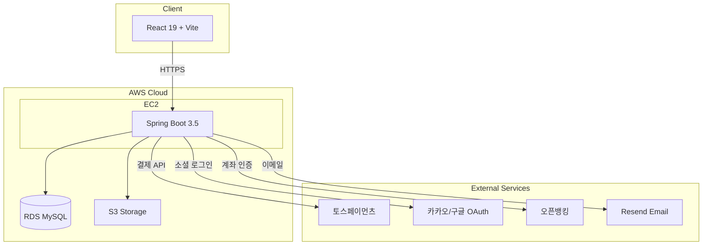
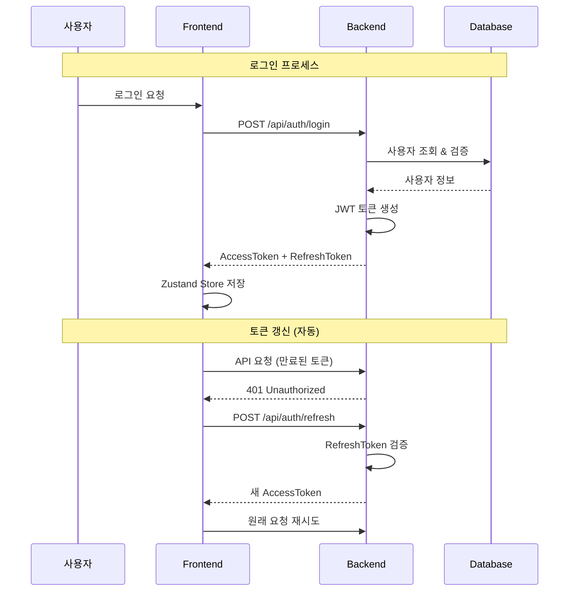
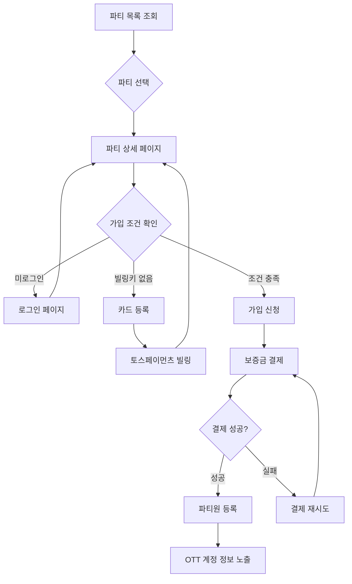
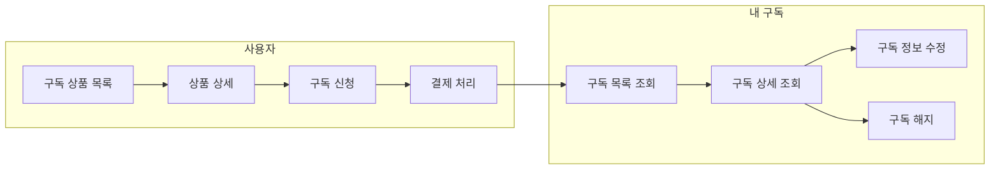
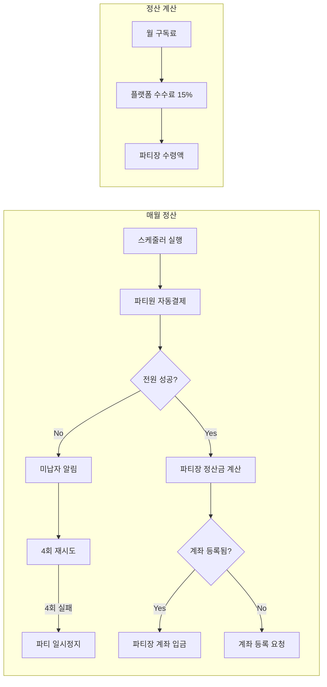
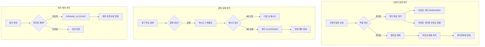
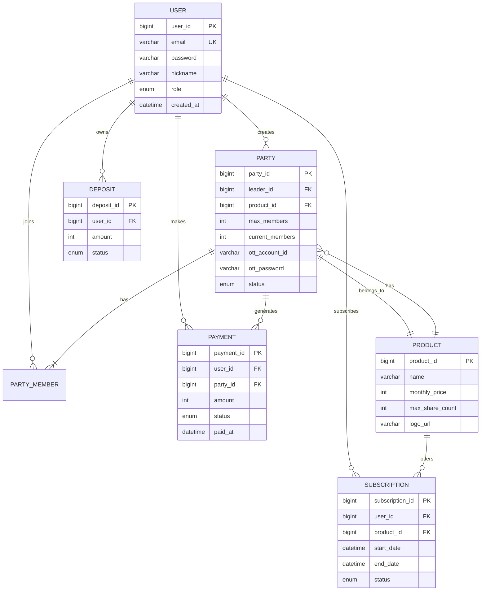

# 4beans-moa

> **OTT 구독 공유 플랫폼** - 함께 나누면 더 저렴하게!

[](https://www.moamoa.cloud/)
[](https://react.dev/)
[](https://spring.io/)

**Live Demo**: [https://www.moamoa.cloud/](https://www.moamoa.cloud/)

Netflix, Disney+, Wavve 등 OTT 서비스를 파티원들과 함께 공유하여
**월 구독료를 최대 75% 절감**할 수 있는 매칭 플랫폼입니다.

<br>

## 프로젝트 소개

### 개발 배경
- OTT 서비스 구독료 부담 증가 (넷플릭스 프리미엄 17,000원/월)
- 계정 공유 시 **신뢰 문제** (정산, 탈퇴 등)
- 기존 공유 서비스의 **보안 취약점** 해결 필요

### 해결 방안
| 문제 | 해결책 |
|------|--------|
| 정산 불이행 | 자동 빌링 시스템 |
| 무단 탈퇴 | 보증금 제도 |
| 계정 노출 | 암호화 저장 + 권한 기반 노출 |
| 신뢰 부족 | 파티장/파티원 평점 시스템 |

### 타겟 사용자
- OTT 비용을 절감하고 싶은 20~30대
- 1인 가구 또는 소규모 가정
- 다양한 OTT를 이용하고 싶은 사용자

<br>

---

## 시스템 아키텍처



<br>

---

## 인증 플로우



<br>

---

## 파티 가입 플로우



<br>

---

## 구독 관리 플로우



<br>

---

## 정산 시스템



<br>

---

## 예외 처리 시스템



<br>

---

## ERD (핵심 테이블)



<br>

---

## 주요 기능

### 1. 파티 매칭 시스템
| 기능 | 설명 |
|------|------|
| 파티 생성 | OTT 선택 → 인원 설정 → 계정 정보 입력 |
| 파티 검색 | OTT별 필터링, 가격순/인원순 정렬 |
| 파티 가입 | 보증금 결제 → 자동 승인 |
| 파티 탈퇴 | 보증금 환불 (위약 시 차감) |

### 2. 구독 관리 시스템
| 기능 | 설명 |
|------|------|
| 상품 조회 | OTT 구독 상품 목록/상세 |
| 구독 신청 | 상품 선택 → 결제 → 구독 시작 |
| 내 구독 관리 | 구독 현황 조회, 정보 수정 |
| 구독 해지 | 해지 신청 → 잔여 기간 후 종료 |

### 3. 결제 시스템
| 기능 | 설명 |
|------|------|
| 빌링키 등록 | 토스페이먼츠 카드 자동결제 |
| 월간 자동결제 | 매월 결제일 자동 청구 (파티 상태 검증 포함) |
| 결제 실패 처리 | 4회 재시도 → 파티 일시정지 (SUSPENDED) |
| 보증금 관리 | 가입 시 납부, 탈퇴 시 환불/몰수 처리 |
| 환불 에러 분류 | 재시도 가능/불가능 에러 자동 분류 |

### 4. 보안 기능
| 기능 | 설명 |
|------|------|
| JWT 인증 | Access + Refresh Token |
| OAuth 2.0 | 카카오, 구글 소셜 로그인 |
| 2FA | TOTP 기반 2단계 인증 |
| 계정 암호화 | OTT 계정 정보 암호화 저장 |

### 5. 고객센터 & 알림
| 기능 | 설명 |
|------|------|
| 공지사항 | 서비스 공지 관리 |
| FAQ | 자주 묻는 질문 |
| 1:1 문의 | 문의 등록 및 답변 |
| 이메일 알림 | 결제, 정산, 공지 알림 |

<br>

---

## 기술 스택

### Frontend
| 기술 | 버전 | 선정 이유 |
|------|------|-----------|
| **React** | 19.2 | 컴포넌트 기반 개발, 대규모 생태계 |
| **Vite** | 7.2 | 빠른 HMR, ESM 기반 번들링 |
| **Tailwind CSS** | 4.1 | 유틸리티 우선, 일관된 디자인 |
| **shadcn/ui** | - | Radix 기반 접근성, 커스터마이징 용이 |
| **Zustand** | 5.0 | 경량 상태관리, Redux 대비 보일러플레이트 감소 |
| **Framer Motion** | 12.x | 선언적 애니메이션, 복잡한 인터랙션 구현 |

### Backend
| 기술 | 버전 | 선정 이유 |
|------|------|-----------|
| **Spring Boot** | 3.5.5 | 엔터프라이즈 표준, 보안 기능 내장 |
| **Java** | 17 | LTS 버전, Record/Pattern Matching 등 |
| **MyBatis** | 3.0 | SQL 직접 제어, 복잡한 쿼리 최적화 |
| **MySQL** | 8.0 | 안정성, 트랜잭션 지원 |
| **JWT** | - | Stateless 인증, 수평 확장 용이 |

### Infrastructure (AWS)
| 서비스 | 용도 |
|--------|------|
| **EC2** | Spring Boot 애플리케이션 서버 |
| **RDS** | MySQL 데이터베이스 |
| **S3** | 정적 파일 저장 (이미지 등) |
| **Route 53** | 도메인 관리 (moamoa.cloud) |

### External Services
| 서비스 | 용도 |
|--------|------|
| 토스페이먼츠 | 결제 처리, 빌링키 발급 |
| Resend | 이메일 발송 (인증, 알림) |
| 오픈뱅킹 | 계좌 인증, 정산 이체 |
| 카카오/구글 | OAuth 소셜 로그인 |

<br>

---

## 프로젝트 구조

```
4beans-moa/
│
├── 4beans-moa-front/                 # Frontend
│   └── src/
│       ├── api/                      # API 통신 (Axios)
│       │   ├── httpClient.js         # 인터셉터, 토큰 갱신
│       │   ├── authApi.js
│       │   ├── partyApi.js
│       │   └── paymentApi.js
│       │
│       ├── components/
│       │   ├── common/               # Header, Footer
│       │   ├── ui/                   # shadcn/ui 컴포넌트
│       │   └── party/                # 파티 관련 컴포넌트
│       │
│       ├── pages/
│       │   ├── party/                # 파티 CRUD
│       │   ├── subscription/         # 구독 관리
│       │   ├── payment/              # 결제 페이지
│       │   ├── user/                 # 회원 관리
│       │   ├── admin/                # 관리자
│       │   ├── community/            # 고객센터
│       │   └── landing/              # 랜딩 페이지
│       │
│       ├── store/                    # Zustand 스토어
│       │   └── authStore.js          # 인증 상태
│       │
│       └── hooks/                    # 커스텀 훅
│
└── 4beans-moa-backend/               # Backend
    └── src/main/java/com/moa/
        ├── web/                      # Controllers
        │   ├── auth/
        │   ├── party/
        │   ├── subscription/
        │   ├── payment/
        │   ├── settlement/
        │   └── community/
        │
        ├── service/                  # Business Logic
        ├── dao/                      # MyBatis Mappers
        ├── domain/                   # Entity
        ├── dto/                      # Request/Response DTO
        ├── config/                   # Security, CORS 등
        └── scheduler/                # 정산 스케줄러
```

<br>

---

## 팀 구성

| 이름 | 역할 | 담당 기능 | GitHub |
|------|------|-----------|--------|
| **육주영** | 팀장 | 회원관리, 어드민, 인증 | [@github](https://github.com/) |
| **박한솔** | Git 관리자 | 파티, 결제, 보증금, 정산 | [@github](https://github.com/) |
| **김진원** | 클라우드 관리자 | 구독상품, AWS 인프라 | [@github](https://github.com/) |
| **김이서** | DBA | 커뮤니티(공지/FAQ/문의), Push 알림 시스템, DB 설계 | [@yiseoes](https://github.com/yiseoes) |

<br>

---

## 담당 기능 상세

### 박한솔 - 파티 / 결제 / 보증금 / 정산

#### 구현 기능
- 파티 생성/목록/상세/가입/탈퇴 CRUD
- 토스페이먼츠 빌링키 연동
- 보증금 결제 및 환불 처리
- 월간 자동결제 스케줄러
- 파티장 정산 시스템
- **예외 처리 시스템 (v2.0)**
  - 사용자 탈퇴 이벤트 핸들러
  - 결제 4회 실패 시 파티 SUSPENDED 처리
  - 정산 계좌 미등록 시 PENDING_ACCOUNT 처리
  - 환불 API 에러 분류 및 재시도 로직

#### 기술적 챌린지
- 동시 토큰 갱신 시 Promise Queue 패턴 적용
- 결제 실패 시 재시도 로직 및 파티 일시정지 처리
- Spring Event 기반 사용자 탈퇴 이벤트 처리
- 토스페이먼츠 에러 코드별 재시도 가능 여부 분류

---

### 육주영 - 회원관리 / 어드민

#### 구현 기능
- 회원가입/로그인/로그아웃
- JWT + Refresh Token 인증
- OAuth 2.0 (카카오, 구글)
- 2FA (TOTP) 2단계 인증
- 관리자 대시보드

---

### 김진원 - 구독상품 / AWS 인프라

#### 구현 기능
- 구독 상품 CRUD
- 내 구독 관리 (조회/수정/해지)
- AWS EC2/RDS/S3 구성
- 도메인 연결 (Route 53)

---

### 김이서 - 커뮤니티 / Push 알림 시스템 / DB 설계

#### 1. DB 설계 및 데이터 관리
| 항목 | 상세 내용 |
|------|-----------|
| **ERD 설계** | 도메인 기반 ERD 설계 논의 참여 및 테이블 구조 정의 |
| **샘플 데이터** | 테스트용 시드 스크립트 작성 (사용자 50명, 구독/결제/문의 등 500+건) |
| **인덱스 설계** | 쿼리 성능 최적화를 위한 인덱스 설계 기준 수립 |
| **버전 관리** | DB 스키마 변경 이력 Git 기반 버전 관리 |

#### 2. 커뮤니티 도메인 (공지/FAQ/문의) - Full Stack
| 기능 | 상세 구현 |
|------|-----------|
| **공지사항** | CRUD, 검색/필터, 페이징, 관리자 등록/수정 |
| **FAQ** | 카테고리별 조회, 검색, 관리자 CRUD |
| **1:1 문의** | 등록/수정/삭제, 파일 첨부, 관리자 답변 시스템 |
| **권한 분기** | JWT 기반 사용자/관리자 권한에 따른 화면 및 기능 분기 처리 |

#### 3. Push 알림 시스템 - **전담 설계/구현** (Full Stack)

> **Push 알림 25종** 전체 로직 설계, 백엔드 구현, 프론트엔드 UI까지 전담 개발

**Backend 구현 - SSE 기반 실시간 알림**
```java
// SSE 기반 실시간 알림 시스템
@Service
public class NotificationService {
    // ConcurrentHashMap으로 사용자별 SSE 연결 관리
    private final Map<Long, SseEmitter> emitters = new ConcurrentHashMap<>();

    // 실시간 알림 전송
    public void sendNotification(Long userId, NotificationDto notification) {
        SseEmitter emitter = emitters.get(userId);
        if (emitter != null) {
            emitter.send(notification);
        }
    }
}

// 트랜잭션 커밋 후 알림 발송 (데이터 정합성 보장)
TransactionSynchronizationManager.registerSynchronization(
    new TransactionSynchronization() {
        @Override
        public void afterCommit() {
            notificationService.sendNotification(userId, notification);
        }
    }
);
```

**Push 알림 25종 이벤트**
| 카테고리 | 알림 종류 |
|----------|-----------|
| **결제** | 결제 성공, 결제 실패, 결제 재시도, 결제 예정 |
| **정산** | 정산 완료, 정산 대기, 계좌 등록 요청 |
| **파티** | 파티 가입, 파티 탈퇴, 파티 해산, 파티 일시정지 |
| **보증금** | 보증금 결제, 보증금 환불, 보증금 차감 |
| **문의** | 문의 등록, 답변 완료 |
| **공지** | 새 공지사항 |
| **기타** | 회원가입 환영, 비밀번호 변경 등 |

**Frontend 구현**
- SSE 연결 관리 및 자동 재연결 로직
- 실시간 알림 토스트 UI
- 알림 목록 페이지 (읽음/안읽음 처리)
- 알림 설정 (알림 종류별 ON/OFF)

#### 4. API 테스트
| 도구 | 활용 |
|------|------|
| **JUnit** | 단위 테스트 작성 (Service, DAO 계층) |
| **Postman** | REST API 기능 테스트 수행 |

#### 기술적 챌린지
- **SSE 연결 관리**: 서버 재시작/네트워크 끊김 시 자동 재연결 구현
- **트랜잭션 동기화**: `TransactionSynchronization` 활용하여 DB 커밋 후 알림 발송
- **동시성 처리**: `ConcurrentHashMap`으로 멀티스레드 환경에서 안전한 연결 관리

<br>

---

## 트러블슈팅

### 1. 동시 토큰 갱신 문제

**문제 상황**
- Access Token 만료 시 여러 API 요청이 동시에 refresh 호출
- 중복 갱신으로 인한 토큰 불일치 발생

**해결 방법**
```javascript
// Promise Queue 패턴 적용
let isTokenRefreshing = false;
let failedQueue = [];

const processQueue = (error, token = null) => {
  failedQueue.forEach((prom) => {
    if (error) prom.reject(error);
    else prom.resolve(token);
  });
  failedQueue = [];
};
```

**결과**
- 동시 요청 시에도 단일 refresh 호출 보장
- 대기 중인 요청들은 새 토큰으로 자동 재시도

---

### 2. 결제 실패 처리 및 파티 일시정지

**문제 상황**
- 카드 한도 초과, 잔액 부족 등으로 월간 자동결제 실패
- 실패한 결제에 대한 체계적인 처리 로직 필요
- 결제 전 파티 상태 검증 필요 (해산/일시정지 파티 결제 방지)

**해결 방법**
```java
// 1. 결제 전 파티 상태 검증
private boolean isPartyPaymentEligible(Party party) {
    return switch (party.getPartyStatus()) {
        case ACTIVE -> true;  // 정상 이용 중인 파티만 결제
        case RECRUITING, PENDING_PAYMENT, SUSPENDED, DISBANDED, CLOSED -> false;
    };
}

// 2. 4회 결제 실패 시 파티 일시정지
public void suspendPartyOnPaymentFailure(Integer partyId) {
    partyDao.updatePartyStatus(partyId, PartyStatus.SUSPENDED.name());
    // 파티장 및 모든 멤버에게 PARTY_SUSPENDED 푸시 알림
}

// 3. 환불 API 에러 분류 (재시도 가능 여부 판단)
private boolean isRetryableError(String errorCode) {
    return switch (errorCode) {
        case "ALREADY_CANCELED", "INVALID_CANCEL_AMOUNT" -> false;  // 영구 실패
        default -> true;  // 재시도 가능
    };
}
```

**결과**
- 4회 재시도 후에도 실패 시 파티 자동 일시정지
- 결제 처리 중 파티 상태 실시간 검증
- 토스페이먼츠 에러 코드별 자동 분류 및 처리

---

### 3. 사용자 탈퇴 시 파티 처리

**문제 상황**
- 파티장이 탈퇴하면 파티원들은 어떻게 되는가?
- 파티원이 탈퇴하면 보증금은 어떻게 처리되는가?

**해결 방법**
```java
// Spring Event 기반 비동기 처리
@EventListener
@Async
@Transactional
public void handleUserDeleted(UserDeletedEvent event) {
    // 1. 파티장으로서의 파티 처리 (DISBANDED로 변경)
    handleLeaderParties(event.getUserId());

    // 2. 파티원으로서의 멤버십 처리 (보증금 환불)
    handleMemberParties(event.getUserId());
}
```

**결과**
- 파티장 탈퇴 시 파티 자동 해산 + 전체 멤버 보증금 환불
- 파티원 탈퇴 시 보증금 환불 + 파티장에게 알림
- 이벤트 기반 처리로 서비스 간 결합도 감소

<br>

---

## 배운 점

### 기술적 성장
- JWT 기반 인증 시스템의 토큰 갱신 전략 이해
- 결제 시스템 연동 및 빌링키 관리 경험
- Zustand를 활용한 전역 상태 관리 패턴
- AWS 클라우드 인프라 구축 경험

### 협업 경험
- Git Flow 브랜치 전략
- PR 기반 코드 리뷰
- 컴포넌트 설계 시 충돌 방지 규칙 수립
- 역할 분담을 통한 효율적인 협업

<br>

---

## 실행 방법

### 사전 요구사항
- Node.js 18+
- Java 17+
- MySQL 8.0+

### 환경 변수 설정

**Frontend** (`.env`)
```env
VITE_API_BASE_URL=http://localhost:8080
VITE_TOSS_CLIENT_KEY=your_toss_client_key
```

**Backend** (`application.yml`)
```yaml
spring:
  datasource:
    url: jdbc:mysql://localhost:3306/moa
    username: root
    password: your_password

jwt:
  secret: your_jwt_secret

toss:
  secret-key: your_toss_secret_key
```

### 로컬 실행

```bash
# Frontend
cd 4beans-moa-front
npm install
npm run dev

# Backend
cd 4beans-moa-backend
./mvnw spring-boot:run
```

### 배포 환경
- **URL**: [https://www.moamoa.cloud/](https://www.moamoa.cloud/)
- **Infrastructure**: AWS (EC2, RDS, S3, Route 53)

<br>

---

## 라이선스

This project is licensed under the MIT License.
